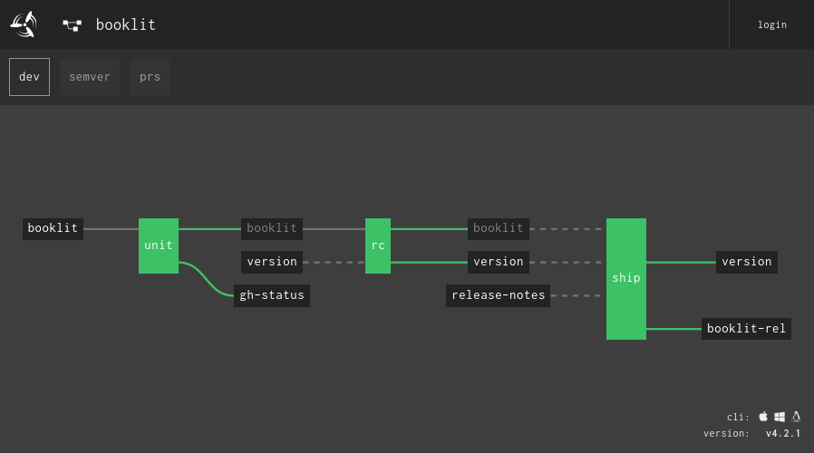

# Concourse: the continuous thing-doer.

Concourse is an automation system written in Go. It is most commonly used for
CI/CD, and is built to scale to any kind of automation pipeline, from simple to
complex.



Concourse is very opinionated about a few things: idempotency, immutability,
declarative config, stateless workers, and reproducible builds.

## Installation

Concourse is distributed as a single `concourse` binary, available on the [Downloads page](https://concourse-ci.org/download.html).

If you want to just kick the tires, jump ahead to the [Quick Start](#quick-start).

In addition to the `concourse` binary, there are a few other supported formats.
Consult their GitHub repos for more information:

* [Docker image](https://github.com/concourse/concourse-docker)
* [BOSH release](https://github.com/concourse/concourse-bosh-release)
* [Kubernetes Helm chart](https://github.com/helm/charts/tree/master/stable/concourse)


## Quick Start

```sh
$ wget https://concourse-ci.org/docker-compose.yml
$ docker-compose up
Creating docs_concourse-db_1 ... done
Creating docs_concourse_1    ... done
```

Concourse will be running at [127.0.0.1:8080](http://127.0.0.1:8080). You can
log in with the username/password as `test`/`test`.

Next, install `fly` by downloading it from the web UI and target your local
Concourse as the `test` user:

```sh
$ fly -t ci login -c http://127.0.0.1:8080 -u test -p test
logging in to team 'main'

target saved
```

### Configuring a Pipeline

There is no GUI for configuring Concourse. Instead, pipelines are configured as
declarative YAML files:

```yaml
resources:
- name: booklit
  type: git
  source: {uri: "https://github.com/vito/booklit"}

jobs:
- name: unit
  plan:
  - get: booklit
    trigger: true
  - task: test
    file: booklit/ci/test.yml
```

Most operations are done via the accompanying `fly` CLI. If you've got Concourse
[installed](https://concourse-ci.org/install.html), try saving the above example
as `booklit.yml`, [target your Concourse
instance](https://concourse-ci.org/fly.html#fly-login), and then run:

```sh
fly -t $target set-pipeline -p booklit -c booklit.yml
```

These pipeline files are self-contained, maximizing portability from one
Concourse instance to the next.


### Learn More

* The [Official Site](https://concourse-ci.org) for documentation and
  reference material.
* The [Concourse Tutorial](https://concoursetutorial.com) by Stark & Wayne is
  great for a guided introduction to all the core concepts.
* See Concourse in action with our [production pipelines](https://ci.concourse-ci.org/)
* Hang around in the [forums](https://discuss.concourse-ci.org) or in
  [Discord](https://discord.gg/MeRxXKW).
* See what we're working on on the [project board](https://github.com/orgs/concourse/projects). 


## Contributing

Our user base is basically everyone that develops software (and wants it to
work).

It's a lot of work, and we need your help! If you're interested, check out our
[contributing docs](CONTRIBUTING.md).
