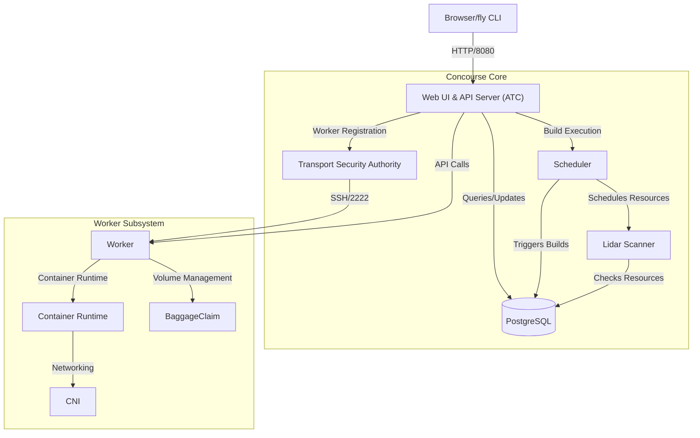
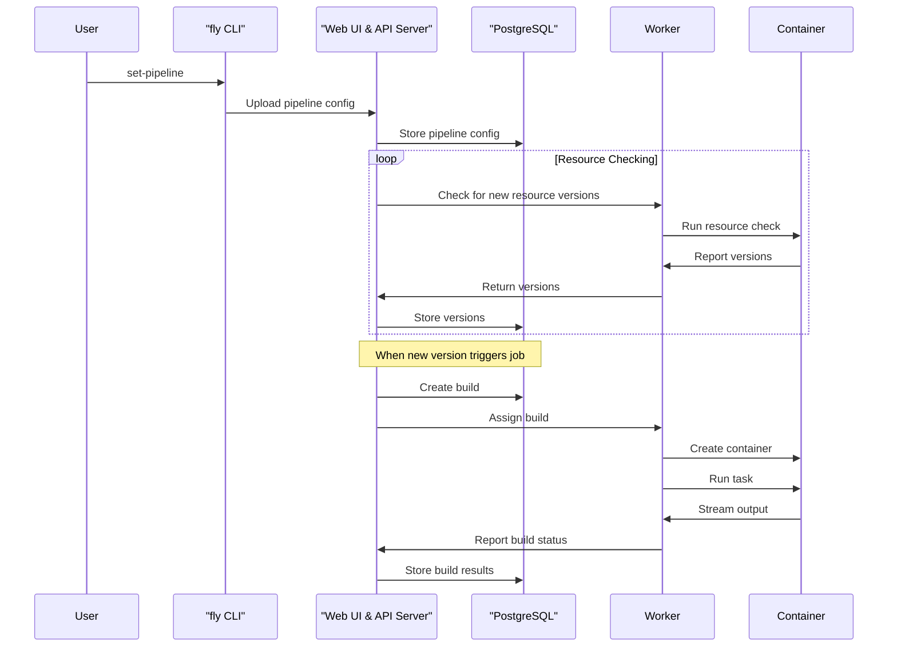
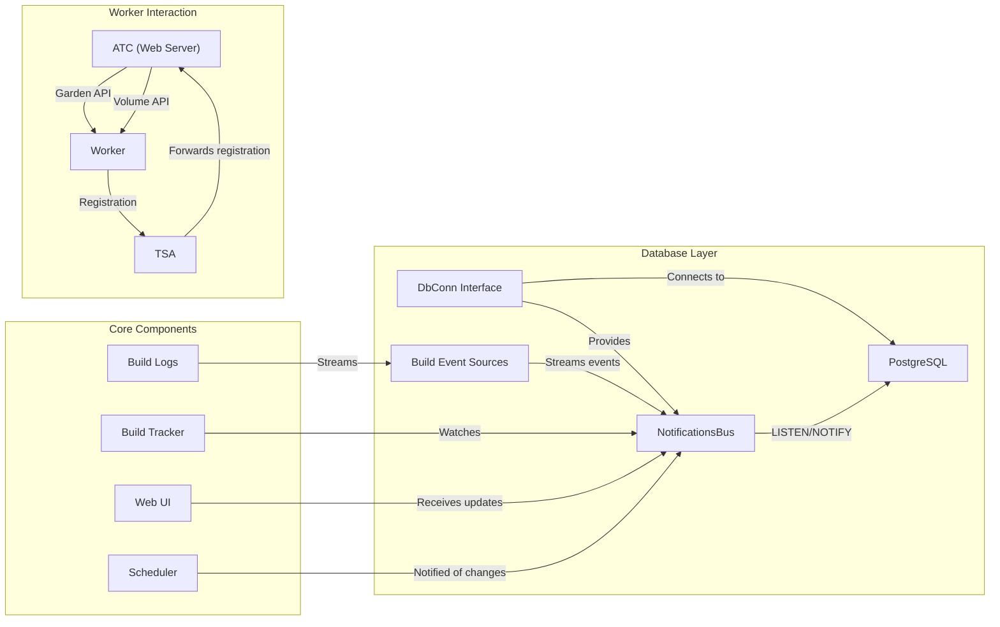

# Overview

<details>
<summary>Relevant source files</summary>

The following files were used as context for generating this wiki page:

- [.github/ISSUE_TEMPLATE/bug-report.md](https://github.com/concourse/concourse/blob/301f8064/.github/ISSUE_TEMPLATE/bug-report.md)
- [.github/ISSUE_TEMPLATE/config.yml](https://github.com/concourse/concourse/blob/301f8064/.github/ISSUE_TEMPLATE/config.yml)
- [.github/ISSUE_TEMPLATE/project-backlog.md](https://github.com/concourse/concourse/blob/301f8064/.github/ISSUE_TEMPLATE/project-backlog.md)
- [.github/pull_request_template.md](https://github.com/concourse/concourse/blob/301f8064/.github/pull_request_template.md)
- [.gitignore](https://github.com/concourse/concourse/blob/301f8064/.gitignore)
- [.yarnrc.yml](https://github.com/concourse/concourse/blob/301f8064/.yarnrc.yml)
- [CODE_OF_CONDUCT.md](https://github.com/concourse/concourse/blob/301f8064/CODE_OF_CONDUCT.md)
- [CONTRIBUTING.md](https://github.com/concourse/concourse/blob/301f8064/CONTRIBUTING.md)
- [LICENSE.md](https://github.com/concourse/concourse/blob/301f8064/LICENSE.md)
- [NOTICE.md](https://github.com/concourse/concourse/blob/301f8064/NOTICE.md)
- [README.md](https://github.com/concourse/concourse/blob/301f8064/README.md)
- [SECURITY.md](https://github.com/concourse/concourse/blob/301f8064/SECURITY.md)
- [atc/scheduler/algorithm/suite_test.go](https://github.com/concourse/concourse/blob/301f8064/atc/scheduler/algorithm/suite_test.go)
- [hack/otel-collector/otel-collector-config.yml](https://github.com/concourse/concourse/blob/301f8064/hack/otel-collector/otel-collector-config.yml)
- [hack/overrides/guardian.yml](https://github.com/concourse/concourse/blob/301f8064/hack/overrides/guardian.yml)
- [hack/overrides/jaeger.yml](https://github.com/concourse/concourse/blob/301f8064/hack/overrides/jaeger.yml)
- [hack/overrides/prometheus.yml](https://github.com/concourse/concourse/blob/301f8064/hack/overrides/prometheus.yml)
- [integration/worker/config/garden.ini](https://github.com/concourse/concourse/blob/301f8064/integration/worker/config/garden.ini)
- [integration/worker/gdn_test.go](https://github.com/concourse/concourse/blob/301f8064/integration/worker/gdn_test.go)
- [integration/worker/overrides/garden_config.yml](https://github.com/concourse/concourse/blob/301f8064/integration/worker/overrides/garden_config.yml)
- [integration/worker/overrides/garden_max_containers.yml](https://github.com/concourse/concourse/blob/301f8064/integration/worker/overrides/garden_max_containers.yml)
- [integration/worker/overrides/guardian.yml](https://github.com/concourse/concourse/blob/301f8064/integration/worker/overrides/guardian.yml)
- [screenshots/booklit-pipeline.png](https://github.com/concourse/concourse/blob/301f8064/screenshots/booklit-pipeline.png)
- [tracing/attrs.go](https://github.com/concourse/concourse/blob/301f8064/tracing/attrs.go)
- [tracing/doc.go](https://github.com/concourse/concourse/blob/301f8064/tracing/doc.go)
- [tracing/honeycomb.go](https://github.com/concourse/concourse/blob/301f8064/tracing/honeycomb.go)
- [tracing/jaeger.go](https://github.com/concourse/concourse/blob/301f8064/tracing/jaeger.go)
- [tracing/otlp.go](https://github.com/concourse/concourse/blob/301f8064/tracing/otlp.go)
- [tracing/stackdriver.go](https://github.com/concourse/concourse/blob/301f8064/tracing/stackdriver.go)
- [tracing/tracer.go](https://github.com/concourse/concourse/blob/301f8064/tracing/tracer.go)
- [tracing/tracer_test.go](https://github.com/concourse/concourse/blob/301f8064/tracing/tracer_test.go)
- [tracing/tracing_suite_test.go](https://github.com/concourse/concourse/blob/301f8064/tracing/tracing_suite_test.go)
- [vars/NOTICE.md](https://github.com/concourse/concourse/blob/301f8064/vars/NOTICE.md)
- [worker/runtime/killer.go](https://github.com/concourse/concourse/blob/301f8064/worker/runtime/killer.go)
- [worker/runtime/libcontainerd/client.go](https://github.com/concourse/concourse/blob/301f8064/worker/runtime/libcontainerd/client.go)
- [worker/runtime/libcontainerd/container.go](https://github.com/concourse/concourse/blob/301f8064/worker/runtime/libcontainerd/container.go)
- [worker/runtime/libcontainerd/helper.go](https://github.com/concourse/concourse/blob/301f8064/worker/runtime/libcontainerd/helper.go)
- [worker/runtime/libcontainerd/libcontainerdfakes/fake_container.go](https://github.com/concourse/concourse/blob/301f8064/worker/runtime/libcontainerd/libcontainerdfakes/fake_container.go)
- [worker/runtime/libcontainerd/libcontainerdfakes/fake_task.go](https://github.com/concourse/concourse/blob/301f8064/worker/runtime/libcontainerd/libcontainerdfakes/fake_task.go)

</details>


Concourse is an open-source automation system written in Go that provides continuous integration and continuous delivery (CI/CD) capabilities. It's designed to scale from simple to complex automation pipelines while adhering to principles of idempotency, immutability, declarative configuration, stateless workers, and reproducible builds.

This overview page introduces the core concepts and architecture of Concourse. For detailed information on specific components, please refer to the corresponding documentation pages referenced throughout this document.

## System Architecture



Concourse consists of several key components that work together to provide a robust CI/CD platform:

### Core Components

- **Web UI & API Server (ATC)**: The central component providing both the user interface and API endpoints. The ATC (Air Traffic Controller) is the "brain" of Concourse that handles pipeline scheduling, build tracking, and resource checking.

- **Transport Security Authority (TSA)**: A specialized SSH server responsible for securely authenticating and registering workers with the ATC.

- **Scheduler**: Manages job scheduling and build execution based on pipeline configurations and triggered events.

- **Lidar Scanner**: Periodically checks resources for new versions that might trigger new builds.

- **PostgreSQL Database**: Stores all persistent data, including pipeline configurations, build history, and resource versions.

Sources: [README.md:8-10](https://github.com/concourse/concourse/blob/301f8064/README.md#L8-L10), [CONTRIBUTING.md:207-217](https://github.com/concourse/concourse/blob/301f8064/CONTRIBUTING.md#L207-L217)

### Worker Subsystem

- **Workers**: Execute tasks in isolated containers. Workers are stateless and register with the TSA to receive work.

- **Container Runtimes**: Concourse supports multiple container runtimes:
  - containerd (default): A modern, lightweight container runtime
  - Guardian: A Linux container runtime (Garden's successor)
  - Houdini: For Windows environments

- **BaggageClaim**: Handles volume management for sharing data between tasks.

- **CNI (Container Network Interface)**: Manages networking for containers.

Sources: [worker/runtime/killer.go:1-227](https://github.com/concourse/concourse/blob/301f8064/worker/runtime/killer.go#L1-L227), [CONTRIBUTING.md:207-217](https://github.com/concourse/concourse/blob/301f8064/CONTRIBUTING.md#L207-L217)

## Data Flow



This diagram illustrates how data flows through the system when a user sets up a pipeline and a build is executed.

Sources: [README.md:137-165](https://github.com/concourse/concourse/blob/301f8064/README.md#L137-L165), [CONTRIBUTING.md:210-213](https://github.com/concourse/concourse/blob/301f8064/CONTRIBUTING.md#L210-L213)

## Key Design Principles

Concourse is built around several core design principles that influence its architecture and functionality:

| Principle | Description |
|-----------|-------------|
| **Idempotency** | Running the same pipeline with the same inputs produces the same outputs, allowing for reliable rebuilds and retries. |
| **Immutability** | Resources and build environments are treated as immutable, preventing side effects and ensuring consistency. |
| **Declarative Configuration** | Pipelines are defined in declarative YAML files, making them easy to understand, version, and share. |
| **Stateless Workers** | Workers don't maintain state between builds, ensuring isolation and preventing contamination. |
| **Reproducible Builds** | Environments are explicitly defined, ensuring builds can be reproduced across different environments and times. |

Sources: [README.md:14-15](https://github.com/concourse/concourse/blob/301f8064/README.md#L14-L15)

## Pipeline Configuration

Pipelines in Concourse are defined in YAML files that specify:

- **Resources**: External artifacts or services that are used as inputs or outputs (e.g., Git repositories, Docker images).
- **Jobs**: Units of work that describe what actions to take when certain conditions are met.
- **Tasks**: The smallest unit of work, defining the actual commands to run in a container.

Example pipeline configuration:

```yaml
resources:
- name: booklit
  type: git
  source: {uri: "https://github.com/vito/booklit"}

jobs:
- name: unit
  plan:
  - get: booklit
    trigger: true
  - task: test
    file: booklit/ci/test.yml
```

Pipelines are typically managed using the `fly` CLI, which communicates with the ATC to upload or update pipeline configurations.

Sources: [README.md:142-154](https://github.com/concourse/concourse/blob/301f8064/README.md#L142-L154), [README.md:161-163](https://github.com/concourse/concourse/blob/301f8064/README.md#L161-L163)

## Deployment and Distribution

Concourse is distributed as a single `concourse` binary that can run both the web server and worker components. There are several deployment options:

- **Docker**: Using the official Docker image and docker-compose for local development or small deployments.
- **BOSH**: For production-grade deployments with high availability and scaling.
- **Kubernetes**: Using the Helm chart for deployment on Kubernetes clusters.

For local development or testing, the quickest way to get started is using the provided docker-compose configuration:

```sh
$ wget https://concourse-ci.org/docker-compose.yml
$ docker-compose up -d
```

This starts Concourse with a local PostgreSQL instance and a single worker.

Sources: [README.md:89-95](https://github.com/concourse/concourse/blob/301f8064/README.md#L89-L95), [README.md:104-109](https://github.com/concourse/concourse/blob/301f8064/README.md#L104-L109)

## Extending Concourse

Concourse can be extended through:

1. **Resource Types**: Custom resources for interacting with external systems
2. **Task Images**: Custom Docker images for task execution environments
3. **OAuth Integration**: For authentication with external providers

For more advanced features like distributed tracing, Concourse supports integration with systems like Jaeger, allowing for detailed performance monitoring and troubleshooting.

Sources: [hack/overrides/jaeger.yml:1-66](https://github.com/concourse/concourse/blob/301f8064/hack/overrides/jaeger.yml#L1-L66), [tracing/tracer.go:1-230](https://github.com/concourse/concourse/blob/301f8064/tracing/tracer.go#L1-L230)

## Component Communication



This diagram illustrates how different components of Concourse communicate with each other, highlighting the central role of the PostgreSQL database and its notification system in enabling real-time updates throughout the system.

Sources: [tracing/tracer.go:1-230](https://github.com/concourse/concourse/blob/301f8064/tracing/tracer.go#L1-L230), [CONTRIBUTING.md:208-215](https://github.com/concourse/concourse/blob/301f8064/CONTRIBUTING.md#L208-L215)

## Next Steps

For more detailed information about specific aspects of Concourse, refer to these pages:

- [Architecture (1.1)](#1.1): Detailed overview of Concourse's architecture
- [Core Components (1.2)](#1.2): In-depth information about each core component
- [Database Layer (2)](#2): How Concourse manages persistent data
- [Web UI (3)](#3): Details about the web interface
- [Pipeline Execution (4)](#4): How pipelines, builds, and jobs are executed
- [Worker System (5)](#5): The worker subsystem in detail