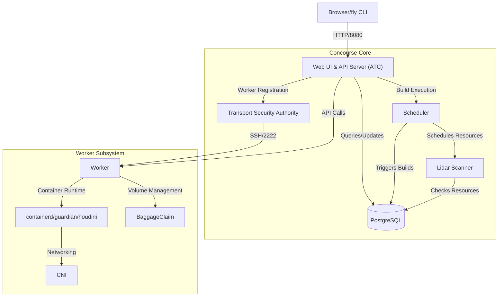
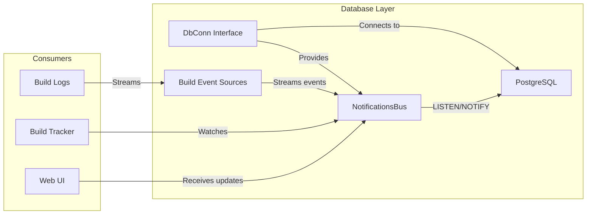
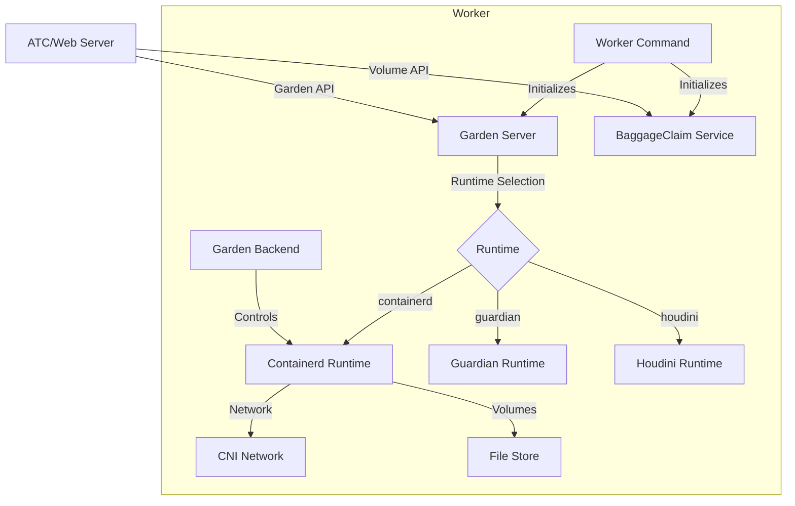
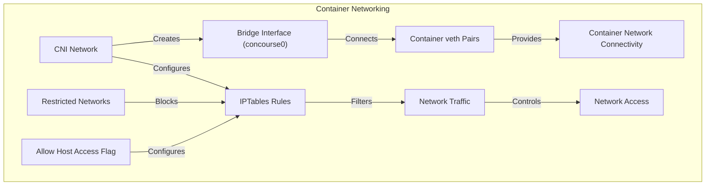
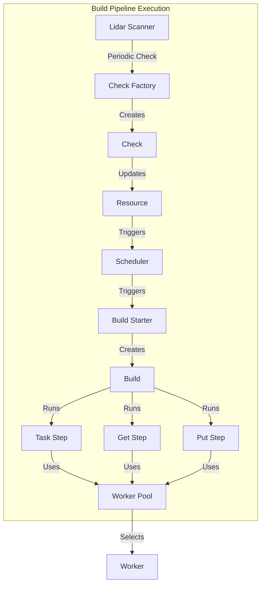
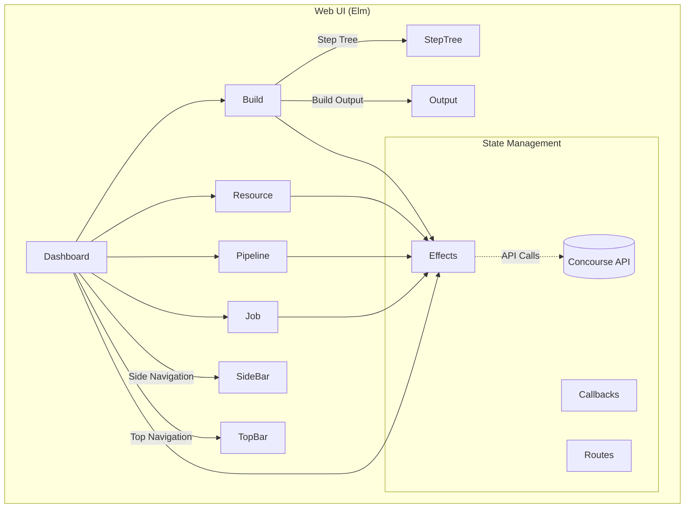
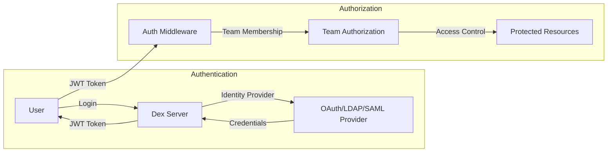
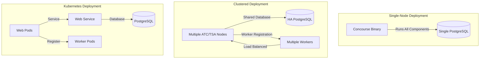

# Architecture

Relevant source files

The following files were used as context for generating this wiki page:

- [.github/ISSUE_TEMPLATE/bug-report.md](https://github.com/concourse/concourse/blob/301f8064/.github/ISSUE_TEMPLATE/bug-report.md)
- [.github/ISSUE_TEMPLATE/config.yml](https://github.com/concourse/concourse/blob/301f8064/.github/ISSUE_TEMPLATE/config.yml)
- [.github/ISSUE_TEMPLATE/project-backlog.md](https://github.com/concourse/concourse/blob/301f8064/.github/ISSUE_TEMPLATE/project-backlog.md)
- [.github/pull_request_template.md](https://github.com/concourse/concourse/blob/301f8064/.github/pull_request_template.md)
- [.github/workflows/codeql-analysis.yml](https://github.com/concourse/concourse/blob/301f8064/.github/workflows/codeql-analysis.yml)
- [.gitignore](https://github.com/concourse/concourse/blob/301f8064/.gitignore)
- [.yarnrc.yml](https://github.com/concourse/concourse/blob/301f8064/.yarnrc.yml)
- [CODE_OF_CONDUCT.md](https://github.com/concourse/concourse/blob/301f8064/CODE_OF_CONDUCT.md)
- [LICENSE.md](https://github.com/concourse/concourse/blob/301f8064/LICENSE.md)
- [NOTICE.md](https://github.com/concourse/concourse/blob/301f8064/NOTICE.md)
- [README.md](https://github.com/concourse/concourse/blob/301f8064/README.md)
- [SECURITY.md](https://github.com/concourse/concourse/blob/301f8064/SECURITY.md)
- [atc/atccmd/command.go](https://github.com/concourse/concourse/blob/301f8064/atc/atccmd/command.go)
- [atc/db/build_being_watched_marker.go](https://github.com/concourse/concourse/blob/301f8064/atc/db/build_being_watched_marker.go)
- [atc/db/build_being_watched_marker_test.go](https://github.com/concourse/concourse/blob/301f8064/atc/db/build_being_watched_marker_test.go)
- [atc/db/build_event_source.go](https://github.com/concourse/concourse/blob/301f8064/atc/db/build_event_source.go)
- [atc/db/connection_tracker.go](https://github.com/concourse/concourse/blob/301f8064/atc/db/connection_tracker.go)
- [atc/db/dbfakes/fake_executor.go](https://github.com/concourse/concourse/blob/301f8064/atc/db/dbfakes/fake_executor.go)
- [atc/db/dbfakes/fake_listener.go](https://github.com/concourse/concourse/blob/301f8064/atc/db/dbfakes/fake_listener.go)
- [atc/db/dbfakes/fake_tx.go](https://github.com/concourse/concourse/blob/301f8064/atc/db/dbfakes/fake_tx.go)
- [atc/db/keepalive_dialer.go](https://github.com/concourse/concourse/blob/301f8064/atc/db/keepalive_dialer.go)
- [atc/db/listener.go](https://github.com/concourse/concourse/blob/301f8064/atc/db/listener.go)
- [atc/db/listener_test.go](https://github.com/concourse/concourse/blob/301f8064/atc/db/listener_test.go)
- [atc/db/migration/migrations/1653924132_int_to_bigint.down.sql](https://github.com/concourse/concourse/blob/301f8064/atc/db/migration/migrations/1653924132_int_to_bigint.down.sql)
- [atc/db/migration/migrations/1653924132_int_to_bigint.up.sql](https://github.com/concourse/concourse/blob/301f8064/atc/db/migration/migrations/1653924132_int_to_bigint.up.sql)
- [atc/db/notifications_bus.go](https://github.com/concourse/concourse/blob/301f8064/atc/db/notifications_bus.go)
- [atc/db/notifications_bus_test.go](https://github.com/concourse/concourse/blob/301f8064/atc/db/notifications_bus_test.go)
- [atc/db/open.go](https://github.com/concourse/concourse/blob/301f8064/atc/db/open.go)
- [atc/hijack_payload.go](https://github.com/concourse/concourse/blob/301f8064/atc/hijack_payload.go)
- [atc/integration/team_migration_test.go](https://github.com/concourse/concourse/blob/301f8064/atc/integration/team_migration_test.go)
- [cmd/cmd_suite_test.go](https://github.com/concourse/concourse/blob/301f8064/cmd/cmd_suite_test.go)
- [cmd/discover_asset.go](https://github.com/concourse/concourse/blob/301f8064/cmd/discover_asset.go)
- [cmd/logging_runner.go](https://github.com/concourse/concourse/blob/301f8064/cmd/logging_runner.go)
- [cmd/logging_runner_test.go](https://github.com/concourse/concourse/blob/301f8064/cmd/logging_runner_test.go)
- [go.mod](https://github.com/concourse/concourse/blob/301f8064/go.mod)
- [go.sum](https://github.com/concourse/concourse/blob/301f8064/go.sum)
- [integration/worker/config/garden.ini](https://github.com/concourse/concourse/blob/301f8064/integration/worker/config/garden.ini)
- [integration/worker/gdn_test.go](https://github.com/concourse/concourse/blob/301f8064/integration/worker/gdn_test.go)
- [integration/worker/overrides/garden_config.yml](https://github.com/concourse/concourse/blob/301f8064/integration/worker/overrides/garden_config.yml)
- [integration/worker/overrides/garden_max_containers.yml](https://github.com/concourse/concourse/blob/301f8064/integration/worker/overrides/garden_max_containers.yml)
- [integration/worker/overrides/guardian.yml](https://github.com/concourse/concourse/blob/301f8064/integration/worker/overrides/guardian.yml)
- [screenshots/booklit-pipeline.png](https://github.com/concourse/concourse/blob/301f8064/screenshots/booklit-pipeline.png)
- [skymarshal/dexserver/dexserver.go](https://github.com/concourse/concourse/blob/301f8064/skymarshal/dexserver/dexserver.go)
- [skymarshal/dexserver/dexserver_test.go](https://github.com/concourse/concourse/blob/301f8064/skymarshal/dexserver/dexserver_test.go)
- [skymarshal/storage/storage.go](https://github.com/concourse/concourse/blob/301f8064/skymarshal/storage/storage.go)
- [tsa/random_atc_endpoint_picker.go](https://github.com/concourse/concourse/blob/301f8064/tsa/random_atc_endpoint_picker.go)
- [vars/NOTICE.md](https://github.com/concourse/concourse/blob/301f8064/vars/NOTICE.md)
- [worker/baggageclaim/baggageclaimcmd/baggageclaimcmd_suite_test.go](https://github.com/concourse/concourse/blob/301f8064/worker/baggageclaim/baggageclaimcmd/baggageclaimcmd_suite_test.go)
- [worker/baggageclaim/baggageclaimcmd/command.go](https://github.com/concourse/concourse/blob/301f8064/worker/baggageclaim/baggageclaimcmd/command.go)
- [worker/baggageclaim/baggageclaimcmd/command_linux.go](https://github.com/concourse/concourse/blob/301f8064/worker/baggageclaim/baggageclaimcmd/command_linux.go)
- [worker/baggageclaim/baggageclaimcmd/command_nonlinux.go](https://github.com/concourse/concourse/blob/301f8064/worker/baggageclaim/baggageclaimcmd/command_nonlinux.go)
- [worker/baggageclaim/cmd/baggageclaim/main.go](https://github.com/concourse/concourse/blob/301f8064/worker/baggageclaim/cmd/baggageclaim/main.go)
- [worker/baggageclaim/integration/baggageclaim/suite_test.go](https://github.com/concourse/concourse/blob/301f8064/worker/baggageclaim/integration/baggageclaim/suite_test.go)
- [worker/baggageclaim/integration/fs_mounter/suite_test.go](https://github.com/concourse/concourse/blob/301f8064/worker/baggageclaim/integration/fs_mounter/suite_test.go)
- [worker/runtime/backend.go](https://github.com/concourse/concourse/blob/301f8064/worker/runtime/backend.go)
- [worker/runtime/backend_test.go](https://github.com/concourse/concourse/blob/301f8064/worker/runtime/backend_test.go)
- [worker/runtime/cni_network.go](https://github.com/concourse/concourse/blob/301f8064/worker/runtime/cni_network.go)
- [worker/runtime/cni_network_test.go](https://github.com/concourse/concourse/blob/301f8064/worker/runtime/cni_network_test.go)
- [worker/runtime/file_store.go](https://github.com/concourse/concourse/blob/301f8064/worker/runtime/file_store.go)
- [worker/runtime/integration/integration_test.go](https://github.com/concourse/concourse/blob/301f8064/worker/runtime/integration/integration_test.go)
- [worker/runtime/integration/sample/main.go](https://github.com/concourse/concourse/blob/301f8064/worker/runtime/integration/sample/main.go)
- [worker/runtime/integration/suite_test.go](https://github.com/concourse/concourse/blob/301f8064/worker/runtime/integration/suite_test.go)
- [worker/runtime/iptables/iptables.go](https://github.com/concourse/concourse/blob/301f8064/worker/runtime/iptables/iptables.go)
- [worker/runtime/iptables/iptablesfakes/fake_iptables.go](https://github.com/concourse/concourse/blob/301f8064/worker/runtime/iptables/iptablesfakes/fake_iptables.go)
- [worker/runtime/killer.go](https://github.com/concourse/concourse/blob/301f8064/worker/runtime/killer.go)
- [worker/runtime/libcontainerd/client.go](https://github.com/concourse/concourse/blob/301f8064/worker/runtime/libcontainerd/client.go)
- [worker/runtime/libcontainerd/container.go](https://github.com/concourse/concourse/blob/301f8064/worker/runtime/libcontainerd/container.go)
- [worker/runtime/libcontainerd/helper.go](https://github.com/concourse/concourse/blob/301f8064/worker/runtime/libcontainerd/helper.go)
- [worker/runtime/libcontainerd/libcontainerdfakes/fake_container.go](https://github.com/concourse/concourse/blob/301f8064/worker/runtime/libcontainerd/libcontainerdfakes/fake_container.go)
- [worker/runtime/libcontainerd/libcontainerdfakes/fake_task.go](https://github.com/concourse/concourse/blob/301f8064/worker/runtime/libcontainerd/libcontainerdfakes/fake_task.go)
- [worker/runtime/network.go](https://github.com/concourse/concourse/blob/301f8064/worker/runtime/network.go)
- [worker/runtime/runtimefakes/fake_file_store.go](https://github.com/concourse/concourse/blob/301f8064/worker/runtime/runtimefakes/fake_file_store.go)
- [worker/runtime/runtimefakes/fake_network.go](https://github.com/concourse/concourse/blob/301f8064/worker/runtime/runtimefakes/fake_network.go)
- [worker/workercmd/cmd_runner.go](https://github.com/concourse/concourse/blob/301f8064/worker/workercmd/cmd_runner.go)
- [worker/workercmd/containerd.go](https://github.com/concourse/concourse/blob/301f8064/worker/workercmd/containerd.go)
- [worker/workercmd/garden_server_runner.go](https://github.com/concourse/concourse/blob/301f8064/worker/workercmd/garden_server_runner.go)
- [worker/workercmd/guardian.go](https://github.com/concourse/concourse/blob/301f8064/worker/workercmd/guardian.go)
- [worker/workercmd/houdini.go](https://github.com/concourse/concourse/blob/301f8064/worker/workercmd/houdini.go)
- [worker/workercmd/worker.go](https://github.com/concourse/concourse/blob/301f8064/worker/workercmd/worker.go)
- [worker/workercmd/worker_linux.go](https://github.com/concourse/concourse/blob/301f8064/worker/workercmd/worker_linux.go)
- [worker/workercmd/worker_nonlinux.go](https://github.com/concourse/concourse/blob/301f8064/worker/workercmd/worker_nonlinux.go)

This document provides a comprehensive overview of Concourse CI's system architecture, its major components, and how they interact. It serves as a technical reference for understanding the internals of Concourse and how the various pieces work together.

## Core Components Overview

Concourse is designed with a distributed architecture consisting of several key components that work together to provide a scalable CI/CD platform.

The three main components of Concourse are:

1. **ATC (Air Traffic Controller)** - The brain of Concourse:
   - Web UI and API server
   - Build scheduler
   - Resource checker
   - Database interface

2. **TSA (Transport Security Authority)** - The gatekeeper for workers:
   - Handles worker registration and authorization
   - Creates SSH tunnels for secure communication
   - Forwards ATC requests to appropriate workers

3. **Worker** - The execution engine:
   - Executes build steps in containers
   - Manages container lifecycle
   - Handles volume management
   - Implements networking for containers

Sources: [worker/workercmd/worker.go:79-169](https://github.com/concourse/concourse/blob/301f8064/worker/workercmd/worker.go#L79-L169). [atc/atccmd/command.go:104-274](https://github.com/concourse/concourse/blob/301f8064/atc/atccmd/command.go#L104-L274). [worker/workercmd/worker_linux.go:82-134](https://github.com/concourse/concourse/blob/301f8064/worker/workercmd/worker_linux.go#L82-L134).

## Database Architecture

Concourse uses PostgreSQL not just as a relational database but also as a real-time event distribution system:

The database layer consists of:

1. **DbConn Interface**: Acts as an abstraction over the PostgreSQL database connection, providing transaction management and query execution methods.

2. **NotificationsBus**: Leverages PostgreSQL's LISTEN/NOTIFY feature to implement a publish-subscribe pattern for real-time updates.

3. **Build Event Sources**: Streams build events to clients, allowing real-time logging and status updates.

The notification bus architecture enables real-time updates across multiple ATC instances, enabling horizontal scaling.

Sources: [atc/db/open.go:22-49](https://github.com/concourse/concourse/blob/301f8064/atc/db/open.go#L22-L49). [atc/db/notifications_bus.go:32-92](https://github.com/concourse/concourse/blob/301f8064/atc/db/notifications_bus.go#L32-L92). [atc/db/build_event_source.go:18-22](https://github.com/concourse/concourse/blob/301f8064/atc/db/build_event_source.go#L18-L22).

## Worker Architecture

The worker component is responsible for executing tasks in isolated containers and managing data volumes:

Key components of the worker architecture:

1. **Garden Server**: Provides a Garden API endpoint that abstracts the underlying container runtime implementation. This allows the ATC to make container-related requests without knowing the specific runtime details.

2. **BaggageClaim**: Manages data volumes that can be mounted into containers for persistent storage between builds.

3. **Container Runtime**: One of three supported runtimes:
   - **containerd**: Industry-standard runtime used by Kubernetes and Docker (default)
   - **guardian**: Cloud Foundry's container runtime (wrapper around runc)
   - **houdini**: Simpler runtime for development, with no isolation (useful for M-series Macs)

4. **CNI Network**: Configures container networking using the Container Network Interface standard.

### Container Runtime Selection

The worker supports three container runtimes, each with its own characteristics:

| Runtime | Description | Use Case | Isolation Level |
|---------|-------------|----------|----------------|
| containerd | Industry-standard runtime | Production | Full |
| guardian | Cloud Foundry's runtime | Production | Full |
| houdini | Simplified runtime | Development | None |

The runtime is selected when starting the worker with the `--runtime` flag:

Sources: [worker/workercmd/worker_linux.go:28-75](https://github.com/concourse/concourse/blob/301f8064/worker/workercmd/worker_linux.go#L28-L75). [worker/workercmd/containerd.go:162-259](https://github.com/concourse/concourse/blob/301f8064/worker/workercmd/containerd.go#L162-L259). [worker/workercmd/guardian.go:49-155](https://github.com/concourse/concourse/blob/301f8064/worker/workercmd/guardian.go#L49-L155).

## Container Networking

Concourse uses CNI (Container Network Interface) to configure networking for containers:

Key networking features:

1. **Network Isolation**: Containers are placed in their own network namespace with a dedicated IP address.

2. **Restricted Networks**: Ability to block container access to specific networks.

3. **Host Access Control**: Option to allow or deny container access to the host network.

4. **DNS Configuration**: Custom DNS settings can be configured for containers.

5. **IPv6 Support**: Optional support for IPv6 networking.

Sources: [worker/runtime/cni_network.go:70-95](https://github.com/concourse/concourse/blob/301f8064/worker/runtime/cni_network.go#L70-L95). [worker/runtime/cni_network.go:135-167](https://github.com/concourse/concourse/blob/301f8064/worker/runtime/cni_network.go#L135-L167). [worker/runtime/cni_network.go:380-394](https://github.com/concourse/concourse/blob/301f8064/worker/runtime/cni_network.go#L380-L394).

## Build Execution Flow

The build execution process involves several components working together:

The build execution process follows these steps:

1. **Resource Checking**: The Lidar Scanner periodically checks resources for new versions according to the configured intervals.

2. **Build Triggering**: When new resource versions are detected, the Scheduler determines if any jobs should be triggered based on the pipeline configuration.

3. **Build Creation**: The BuildStarter creates a new build with the appropriate steps.

4. **Step Execution**: The build consists of three types of steps:
   - **Get Step**: Fetches resources from external systems
   - **Put Step**: Uploads resources to external systems
   - **Task Step**: Runs commands in containers

5. **Worker Selection**: Each step is assigned to a worker based on the configured placement strategy.

Sources: [atc/atccmd/command.go:148-170](https://github.com/concourse/concourse/blob/301f8064/atc/atccmd/command.go#L148-L170). [worker/runtime/backend.go:31-52](https://github.com/concourse/concourse/blob/301f8064/worker/runtime/backend.go#L31-L52).

## Web UI and API Architecture

The web UI is built with Elm and communicates with the backend API:

The API follows RESTful principles and provides endpoints for:

1. **Pipeline Management**: Creating, updating, and deleting pipelines
2. **Build Management**: Triggering and monitoring builds
3. **Resource Management**: Checking and managing resources
4. **Team Management**: Creating and managing teams and their permissions
5. **Worker Management**: Listing and managing registered workers

The API is secured through OAuth authentication provided by Dex.

Sources: [skymarshal/dexserver/dexserver.go:21-46](https://github.com/concourse/concourse/blob/301f8064/skymarshal/dexserver/dexserver.go#L21-L46).

## Authentication and Authorization

Concourse integrates with Dex for authentication and implements a team-based authorization model:

Key aspects of the authentication system:

1. **Dex Integration**: Concourse uses Dex to integrate with various identity providers like OAuth, LDAP, and SAML.

2. **JWT Tokens**: Authentication is token-based, with JWTs provided to authenticated users.

3. **Team-Based Authorization**: Resources are organized by team, with different permission levels:
   - Owner: Full control over team and resources
   - Member: Can configure pipelines and manage resources
   - Viewer: Read-only access to team resources

4. **Main Team**: The special "main" team has additional privileges for system-wide operations.

Sources: [skymarshal/dexserver/dexserver.go:36-44](https://github.com/concourse/concourse/blob/301f8064/skymarshal/dexserver/dexserver.go#L36-L44).

## Deployment Configurations

Concourse can be deployed in various configurations, depending on the scale and requirements:

Common deployment patterns:

1. **Docker Compose**: Simple single-node deployment for development and small teams.

2. **BOSH**: Full clustered deployment with HA features.

3. **Kubernetes**: Containerized deployment using Helm charts.

4. **Standalone Binaries**: Manual deployment of individual components.

Sources: [README.md:87-102](https://github.com/concourse/concourse/blob/301f8064/README.md#L87-L102).

## Scaling Considerations

Concourse is designed to scale horizontally:

1. **Multiple ATC Instances**: The ATC can be scaled horizontally, with a load balancer distributing API and web UI traffic.

2. **Distributed Workers**: Workers can be added dynamically to increase build capacity.

3. **Database Scaling**: PostgreSQL can be configured for high availability and performance.

4. **Notification Bus**: The notification system based on PostgreSQL's LISTEN/NOTIFY enables coordination between multiple ATC instances.

Sources: [atc/db/notifications_bus.go:56-66](https://github.com/concourse/concourse/blob/301f8064/atc/db/notifications_bus.go#L56-L66).

## Conclusion

Concourse is architected as a distributed system with clear separation of concerns between the ATC (control plane), TSA (worker registration), and workers (execution). The use of PostgreSQL as both a database and a real-time notification system enables horizontal scaling and coordination between components. The containerized execution model ensures isolation and reproducibility of builds.