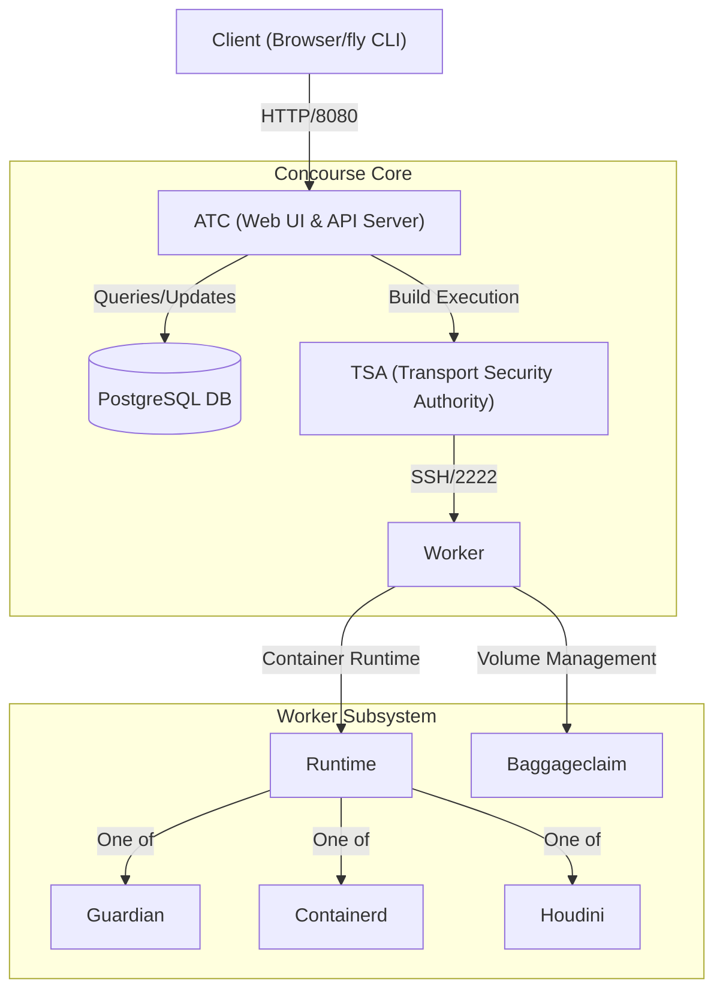
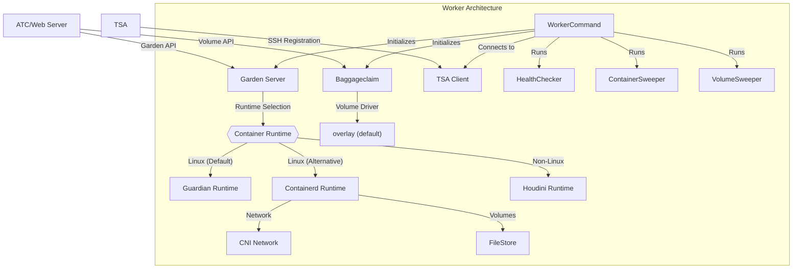
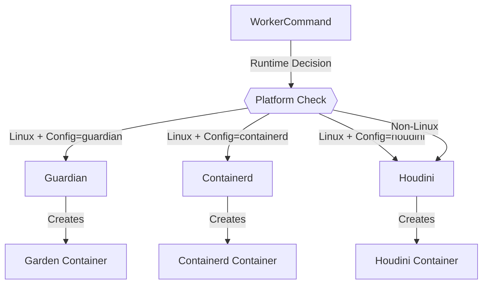
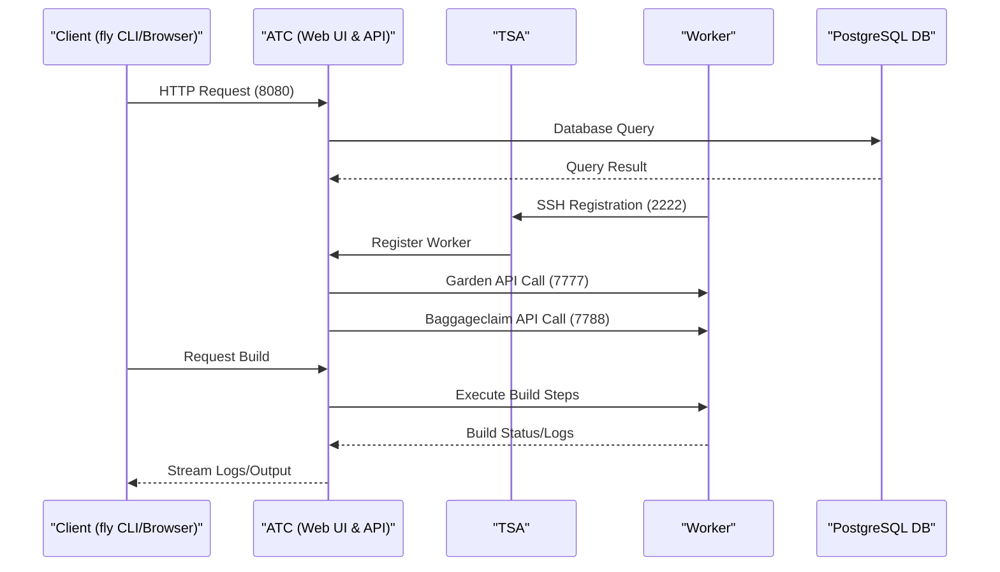

# Core Components

<details>
<summary>Relevant source files</summary>

The following files were used as context for generating this wiki page:

- [.github/ISSUE_TEMPLATE/bug-report.md](https://github.com/concourse/concourse/blob/301f8064/.github/ISSUE_TEMPLATE/bug-report.md)
- [.github/ISSUE_TEMPLATE/config.yml](https://github.com/concourse/concourse/blob/301f8064/.github/ISSUE_TEMPLATE/config.yml)
- [.github/ISSUE_TEMPLATE/project-backlog.md](https://github.com/concourse/concourse/blob/301f8064/.github/ISSUE_TEMPLATE/project-backlog.md)
- [.github/pull_request_template.md](https://github.com/concourse/concourse/blob/301f8064/.github/pull_request_template.md)
- [.gitignore](https://github.com/concourse/concourse/blob/301f8064/.gitignore)
- [.yarnrc.yml](https://github.com/concourse/concourse/blob/301f8064/.yarnrc.yml)
- [CODE_OF_CONDUCT.md](https://github.com/concourse/concourse/blob/301f8064/CODE_OF_CONDUCT.md)
- [Dockerfile](https://github.com/concourse/concourse/blob/301f8064/Dockerfile)
- [LICENSE.md](https://github.com/concourse/concourse/blob/301f8064/LICENSE.md)
- [NOTICE.md](https://github.com/concourse/concourse/blob/301f8064/NOTICE.md)
- [README.md](https://github.com/concourse/concourse/blob/301f8064/README.md)
- [SECURITY.md](https://github.com/concourse/concourse/blob/301f8064/SECURITY.md)
- [atc/creds/conjur/conjur_suite_test.go](https://github.com/concourse/concourse/blob/301f8064/atc/creds/conjur/conjur_suite_test.go)
- [atc/creds/conjur/manager_test.go](https://github.com/concourse/concourse/blob/301f8064/atc/creds/conjur/manager_test.go)
- [atc/creds/vault/vault_kvhelpers.go](https://github.com/concourse/concourse/blob/301f8064/atc/creds/vault/vault_kvhelpers.go)
- [atc/hijack_payload.go](https://github.com/concourse/concourse/blob/301f8064/atc/hijack_payload.go)
- [atc/integration/team_migration_test.go](https://github.com/concourse/concourse/blob/301f8064/atc/integration/team_migration_test.go)
- [cmd/cmd_suite_test.go](https://github.com/concourse/concourse/blob/301f8064/cmd/cmd_suite_test.go)
- [cmd/discover_asset.go](https://github.com/concourse/concourse/blob/301f8064/cmd/discover_asset.go)
- [cmd/logging_runner.go](https://github.com/concourse/concourse/blob/301f8064/cmd/logging_runner.go)
- [cmd/logging_runner_test.go](https://github.com/concourse/concourse/blob/301f8064/cmd/logging_runner_test.go)
- [docker-compose.yml](https://github.com/concourse/concourse/blob/301f8064/docker-compose.yml)
- [hack/overrides/with-fly.yml](https://github.com/concourse/concourse/blob/301f8064/hack/overrides/with-fly.yml)
- [integration/creds/overrides/vault.yml](https://github.com/concourse/concourse/blob/301f8064/integration/creds/overrides/vault.yml)
- [integration/creds/tasks/basic.yml](https://github.com/concourse/concourse/blob/301f8064/integration/creds/tasks/basic.yml)
- [integration/docker-compose.yml](https://github.com/concourse/concourse/blob/301f8064/integration/docker-compose.yml)
- [integration/worker/config/garden.ini](https://github.com/concourse/concourse/blob/301f8064/integration/worker/config/garden.ini)
- [integration/worker/gdn_test.go](https://github.com/concourse/concourse/blob/301f8064/integration/worker/gdn_test.go)
- [integration/worker/overrides/garden_config.yml](https://github.com/concourse/concourse/blob/301f8064/integration/worker/overrides/garden_config.yml)
- [integration/worker/overrides/garden_max_containers.yml](https://github.com/concourse/concourse/blob/301f8064/integration/worker/overrides/garden_max_containers.yml)
- [integration/worker/overrides/guardian.yml](https://github.com/concourse/concourse/blob/301f8064/integration/worker/overrides/guardian.yml)
- [screenshots/booklit-pipeline.png](https://github.com/concourse/concourse/blob/301f8064/screenshots/booklit-pipeline.png)
- [skymarshal/dexserver/dexserver.go](https://github.com/concourse/concourse/blob/301f8064/skymarshal/dexserver/dexserver.go)
- [skymarshal/dexserver/dexserver_test.go](https://github.com/concourse/concourse/blob/301f8064/skymarshal/dexserver/dexserver_test.go)
- [skymarshal/storage/storage.go](https://github.com/concourse/concourse/blob/301f8064/skymarshal/storage/storage.go)
- [tsa/random_atc_endpoint_picker.go](https://github.com/concourse/concourse/blob/301f8064/tsa/random_atc_endpoint_picker.go)
- [vars/NOTICE.md](https://github.com/concourse/concourse/blob/301f8064/vars/NOTICE.md)
- [worker/baggageclaim/baggageclaimcmd/baggageclaimcmd_suite_test.go](https://github.com/concourse/concourse/blob/301f8064/worker/baggageclaim/baggageclaimcmd/baggageclaimcmd_suite_test.go)
- [worker/baggageclaim/baggageclaimcmd/command.go](https://github.com/concourse/concourse/blob/301f8064/worker/baggageclaim/baggageclaimcmd/command.go)
- [worker/baggageclaim/baggageclaimcmd/command_linux.go](https://github.com/concourse/concourse/blob/301f8064/worker/baggageclaim/baggageclaimcmd/command_linux.go)
- [worker/baggageclaim/baggageclaimcmd/command_nonlinux.go](https://github.com/concourse/concourse/blob/301f8064/worker/baggageclaim/baggageclaimcmd/command_nonlinux.go)
- [worker/baggageclaim/cmd/baggageclaim/main.go](https://github.com/concourse/concourse/blob/301f8064/worker/baggageclaim/cmd/baggageclaim/main.go)
- [worker/baggageclaim/integration/baggageclaim/suite_test.go](https://github.com/concourse/concourse/blob/301f8064/worker/baggageclaim/integration/baggageclaim/suite_test.go)
- [worker/baggageclaim/integration/fs_mounter/suite_test.go](https://github.com/concourse/concourse/blob/301f8064/worker/baggageclaim/integration/fs_mounter/suite_test.go)
- [worker/runtime/backend.go](https://github.com/concourse/concourse/blob/301f8064/worker/runtime/backend.go)
- [worker/runtime/backend_test.go](https://github.com/concourse/concourse/blob/301f8064/worker/runtime/backend_test.go)
- [worker/runtime/cni_network.go](https://github.com/concourse/concourse/blob/301f8064/worker/runtime/cni_network.go)
- [worker/runtime/cni_network_test.go](https://github.com/concourse/concourse/blob/301f8064/worker/runtime/cni_network_test.go)
- [worker/runtime/file_store.go](https://github.com/concourse/concourse/blob/301f8064/worker/runtime/file_store.go)
- [worker/runtime/integration/integration_test.go](https://github.com/concourse/concourse/blob/301f8064/worker/runtime/integration/integration_test.go)
- [worker/runtime/integration/sample/main.go](https://github.com/concourse/concourse/blob/301f8064/worker/runtime/integration/sample/main.go)
- [worker/runtime/integration/suite_test.go](https://github.com/concourse/concourse/blob/301f8064/worker/runtime/integration/suite_test.go)
- [worker/runtime/iptables/iptables.go](https://github.com/concourse/concourse/blob/301f8064/worker/runtime/iptables/iptables.go)
- [worker/runtime/iptables/iptablesfakes/fake_iptables.go](https://github.com/concourse/concourse/blob/301f8064/worker/runtime/iptables/iptablesfakes/fake_iptables.go)
- [worker/runtime/killer.go](https://github.com/concourse/concourse/blob/301f8064/worker/runtime/killer.go)
- [worker/runtime/libcontainerd/client.go](https://github.com/concourse/concourse/blob/301f8064/worker/runtime/libcontainerd/client.go)
- [worker/runtime/libcontainerd/container.go](https://github.com/concourse/concourse/blob/301f8064/worker/runtime/libcontainerd/container.go)
- [worker/runtime/libcontainerd/helper.go](https://github.com/concourse/concourse/blob/301f8064/worker/runtime/libcontainerd/helper.go)
- [worker/runtime/libcontainerd/libcontainerdfakes/fake_container.go](https://github.com/concourse/concourse/blob/301f8064/worker/runtime/libcontainerd/libcontainerdfakes/fake_container.go)
- [worker/runtime/libcontainerd/libcontainerdfakes/fake_task.go](https://github.com/concourse/concourse/blob/301f8064/worker/runtime/libcontainerd/libcontainerdfakes/fake_task.go)
- [worker/runtime/network.go](https://github.com/concourse/concourse/blob/301f8064/worker/runtime/network.go)
- [worker/runtime/runtimefakes/fake_file_store.go](https://github.com/concourse/concourse/blob/301f8064/worker/runtime/runtimefakes/fake_file_store.go)
- [worker/runtime/runtimefakes/fake_network.go](https://github.com/concourse/concourse/blob/301f8064/worker/runtime/runtimefakes/fake_network.go)
- [worker/workercmd/cmd_runner.go](https://github.com/concourse/concourse/blob/301f8064/worker/workercmd/cmd_runner.go)
- [worker/workercmd/containerd.go](https://github.com/concourse/concourse/blob/301f8064/worker/workercmd/containerd.go)
- [worker/workercmd/garden_server_runner.go](https://github.com/concourse/concourse/blob/301f8064/worker/workercmd/garden_server_runner.go)
- [worker/workercmd/guardian.go](https://github.com/concourse/concourse/blob/301f8064/worker/workercmd/guardian.go)
- [worker/workercmd/houdini.go](https://github.com/concourse/concourse/blob/301f8064/worker/workercmd/houdini.go)
- [worker/workercmd/worker.go](https://github.com/concourse/concourse/blob/301f8064/worker/workercmd/worker.go)
- [worker/workercmd/worker_linux.go](https://github.com/concourse/concourse/blob/301f8064/worker/workercmd/worker_linux.go)
- [worker/workercmd/worker_nonlinux.go](https://github.com/concourse/concourse/blob/301f8064/worker/workercmd/worker_nonlinux.go)

</details>


This document describes the key components that make up the Concourse CI system, their responsibilities, and how they interact. For information about the overall architecture, see [Architecture](#1.1).

## Overview

Concourse consists of three main components that work together to provide continuous integration and deployment functionality:

1. **Web Server (ATC)** - The API server and web UI component
2. **TSA (Transport Security Authority)** - Handles worker registration and authentication
3. **Worker** - Executes tasks in containers

These components work together to form the complete Concourse system, enabling pipeline execution, resource management, and job running.



Sources:
- [README.md:8-15](https://github.com/concourse/concourse/blob/301f8064/README.md#L8-L15)
- [docker-compose.yml:25-56](https://github.com/concourse/concourse/blob/301f8064/docker-compose.yml#L25-L56)
- [worker/workercmd/worker.go:23-67](https://github.com/concourse/concourse/blob/301f8064/worker/workercmd/worker.go#L23-L67)

## ATC (Air Traffic Controller)

The ATC is the heart of Concourse, serving as both the web UI and the API server. It's responsible for:

- Providing the web interface for viewing and managing pipelines
- Handling API requests from the `fly` CLI
- Orchestrating builds across registered workers
- Managing pipeline state and resources
- Storing and retrieving data from the PostgreSQL database

In the development setup, the ATC is configured with environment variables in the docker-compose file, including database connection settings, authentication settings, and feature flags.

Sources:
- [docker-compose.yml:25-56](https://github.com/concourse/concourse/blob/301f8064/docker-compose.yml#L25-L56)
- [README.md:132-144](https://github.com/concourse/concourse/blob/301f8064/README.md#L132-L144)
- [skymarshal/dexserver/dexserver.go:21-44](https://github.com/concourse/concourse/blob/301f8064/skymarshal/dexserver/dexserver.go#L21-L44)

## TSA (Transport Security Authority)

The TSA is responsible for worker registration and security. Key responsibilities include:

- Authenticating workers using SSH keypairs
- Securely forwarding worker API endpoints to the ATC
- Rebalancing workers across multiple ATC instances
- Managing worker lifecycle

The TSA listens on port 2222 (by default) for worker registrations. Workers identify themselves to the TSA using SSH keypairs, which provides mutual authentication.

Sources:
- [worker/workercmd/worker.go:109-118](https://github.com/concourse/concourse/blob/301f8064/worker/workercmd/worker.go#L109-L118)
- [docker-compose.yml:39-41](https://github.com/concourse/concourse/blob/301f8064/docker-compose.yml#L39-L41)
- [docker-compose.yml:76-77](https://github.com/concourse/concourse/blob/301f8064/docker-compose.yml#L76-L77)
- [tsa/random_atc_endpoint_picker.go:1-15](https://github.com/concourse/concourse/blob/301f8064/tsa/random_atc_endpoint_picker.go#L1-L15)

## Worker

Workers are the execution engines of Concourse. They are responsible for running tasks and managing resources in isolated containers. The worker component consists of several subcomponents:



Sources:
- [worker/workercmd/worker.go:77-219](https://github.com/concourse/concourse/blob/301f8064/worker/workercmd/worker.go#L77-L219)
- [worker/workercmd/worker_linux.go:82-134](https://github.com/concourse/concourse/blob/301f8064/worker/workercmd/worker_linux.go#L82-L134)
- [worker/runtime/backend.go:30-133](https://github.com/concourse/concourse/blob/301f8064/worker/runtime/backend.go#L30-L133)

### Container Runtimes

Concourse workers support three container runtimes:

1. **Guardian** (Default on Linux): Uses Garden to manage containers with a simplified interface.
2. **Containerd** (Alternative on Linux): Uses the containerd runtime directly with CNI for networking.
3. **Houdini** (Non-Linux): A simple container emulation for macOS and Windows (not recommended for production).

The runtime is selected when the worker starts based on configuration or platform:



Each container runtime provides the same Garden API interface to the ATC, ensuring consistent behavior regardless of the underlying technology.

#### Guardian Runtime

Guardian is the default container runtime on Linux. It uses Garden to provide a simplified container interface built on top of various container technologies.

```
CONCOURSE_RUNTIME=guardian
```

Sources:
- [worker/workercmd/guardian.go:22-236](https://github.com/concourse/concourse/blob/301f8064/worker/workercmd/guardian.go#L22-L236)
- [worker/workercmd/worker_linux.go:73-76](https://github.com/concourse/concourse/blob/301f8064/worker/workercmd/worker_linux.go#L73-L76)
- [worker/workercmd/worker_linux.go:123-125](https://github.com/concourse/concourse/blob/301f8064/worker/workercmd/worker_linux.go#L123-L125)

#### Containerd Runtime

Containerd is an alternative container runtime for Linux that interfaces directly with containerd, using CNI for networking.

```
CONCOURSE_RUNTIME=containerd
```

Containerd offers more features and is the preferred runtime for production environments on Linux.

Sources:
- [worker/workercmd/containerd.go:24-285](https://github.com/concourse/concourse/blob/301f8064/worker/workercmd/containerd.go#L24-L285)
- [worker/workercmd/worker_linux.go:73-76](https://github.com/concourse/concourse/blob/301f8064/worker/workercmd/worker_linux.go#L73-L76)
- [worker/workercmd/worker_linux.go:121-122](https://github.com/concourse/concourse/blob/301f8064/worker/workercmd/worker_linux.go#L121-L122)
- [worker/runtime/cni_network.go:20-594](https://github.com/concourse/concourse/blob/301f8064/worker/runtime/cni_network.go#L20-L594)

#### Houdini Runtime

Houdini is a simple container emulation for non-Linux platforms. It doesn't provide actual container isolation and should not be used in production.

```
CONCOURSE_RUNTIME=houdini
```

Sources:
- [worker/workercmd/houdini.go:1-35](https://github.com/concourse/concourse/blob/301f8064/worker/workercmd/houdini.go#L1-L35)
- [worker/workercmd/worker_linux.go:73-76](https://github.com/concourse/concourse/blob/301f8064/worker/workercmd/worker_linux.go#L73-L76)
- [worker/workercmd/worker_linux.go:119-120](https://github.com/concourse/concourse/blob/301f8064/worker/workercmd/worker_linux.go#L119-L120)
- [worker/workercmd/worker_nonlinux.go:45-48](https://github.com/concourse/concourse/blob/301f8064/worker/workercmd/worker_nonlinux.go#L45-L48)

### Baggageclaim (Volume Management)

Baggageclaim is the volume management component of the worker. It is responsible for:

- Creating, mounting, and cleaning up volumes
- Supporting volume caching for performance
- Managing COW (copy-on-write) layers for efficient storage
- Providing an API for the ATC to manage volumes

Baggageclaim supports different volume drivers, with `overlay` being the default for production use.

```
CONCOURSE_BAGGAGECLAIM_DRIVER=overlay
```

Sources:
- [worker/workercmd/worker.go:97-103](https://github.com/concourse/concourse/blob/301f8064/worker/workercmd/worker.go#L97-L103)
- [worker/workercmd/worker_linux.go:265-280](https://github.com/concourse/concourse/blob/301f8064/worker/workercmd/worker_linux.go#L265-L280)
- [worker/baggageclaim/integration/baggageclaim/suite_test.go:68-105](https://github.com/concourse/concourse/blob/301f8064/worker/baggageclaim/integration/baggageclaim/suite_test.go#L68-L105)
- [worker/baggageclaim/baggageclaimcmd/command.go:1-50](https://github.com/concourse/concourse/blob/301f8064/worker/baggageclaim/baggageclaimcmd/command.go#L1-L50)
- [docker-compose.yml:83-86](https://github.com/concourse/concourse/blob/301f8064/docker-compose.yml#L83-L86)

### Worker Networking

Workers use CNI (Container Network Interface) to set up networking for containers. This provides:

- Network isolation between containers
- Ability to connect to external resources
- DNS resolution for containers
- Traffic control through iptables rules

The network setup includes:

- Creating a bridge network for containers
- Setting up DNS configuration
- Managing iptables rules for security
- Supporting IPv4 and optionally IPv6

Sources:
- [worker/runtime/cni_network.go:20-594](https://github.com/concourse/concourse/blob/301f8064/worker/runtime/cni_network.go#L20-L594)
- [worker/runtime/backend.go:341-373](https://github.com/concourse/concourse/blob/301f8064/worker/runtime/backend.go#L341-L373)
- [worker/runtime/integration/integration_test.go:209-282](https://github.com/concourse/concourse/blob/301f8064/worker/runtime/integration/integration_test.go#L209-L282)
- [docker-compose.yml:88-89](https://github.com/concourse/concourse/blob/301f8064/docker-compose.yml#L88-L89)

## Component Communication

The Concourse components communicate with each other using a combination of protocols:

1. **ATC to Database**: PostgreSQL protocol over TCP
2. **Client to ATC**: HTTP/HTTPS (REST API and Web UI)
3. **TSA to Worker**: SSH for secure registration
4. **ATC to Worker**: HTTP for Garden API and Baggageclaim API calls

This communication architecture allows Concourse to be scaled horizontally, with multiple ATC/TSA instances and many workers.



Sources:
- [docker-compose.yml:10-90](https://github.com/concourse/concourse/blob/301f8064/docker-compose.yml#L10-L90)
- [integration/docker-compose.yml:1-68](https://github.com/concourse/concourse/blob/301f8064/integration/docker-compose.yml#L1-L68)
- [worker/workercmd/worker.go:232-237](https://github.com/concourse/concourse/blob/301f8064/worker/workercmd/worker.go#L232-L237)
- [worker/workercmd/garden_server_runner.go:20-66](https://github.com/concourse/concourse/blob/301f8064/worker/workercmd/garden_server_runner.go#L20-L66)

## Worker Lifecycle

The lifecycle of a worker in Concourse follows these steps:

1. **Startup**: The worker process starts and initializes its components (Garden, Baggageclaim)
2. **Registration**: The worker registers with the TSA using SSH keypairs
3. **Operation**: The worker accepts and runs tasks from the ATC
4. **Heartbeat**: The worker periodically heartbeats to the TSA to indicate it's still alive
5. **Rebalancing**: Optionally, the worker may rebalance to another ATC instance for load balancing
6. **Retirement**: When the worker is shutting down, it drains existing connections
7. **Cleanup**: The worker cleans up containers and volumes before exiting

During operation, the worker runs several background processes:

- **Container Sweeper**: Periodically cleans up unused containers
- **Volume Sweeper**: Periodically cleans up unused volumes
- **Health Checker**: Monitors the health of Garden and Baggageclaim

Sources:
- [worker/workercmd/worker.go:140-216](https://github.com/concourse/concourse/blob/301f8064/worker/workercmd/worker.go#L140-L216)
- [worker/workercmd/worker.go:48-52](https://github.com/concourse/concourse/blob/301f8064/worker/workercmd/worker.go#L48-L52)