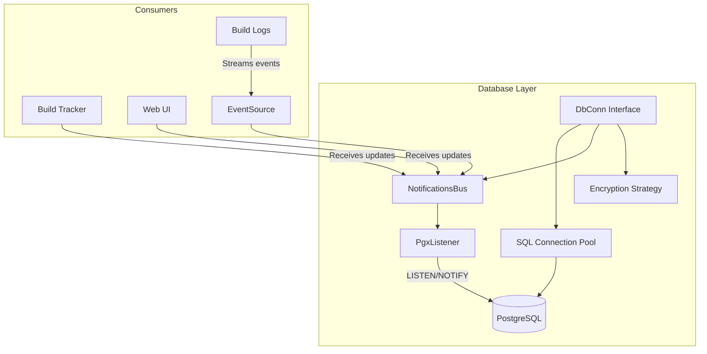
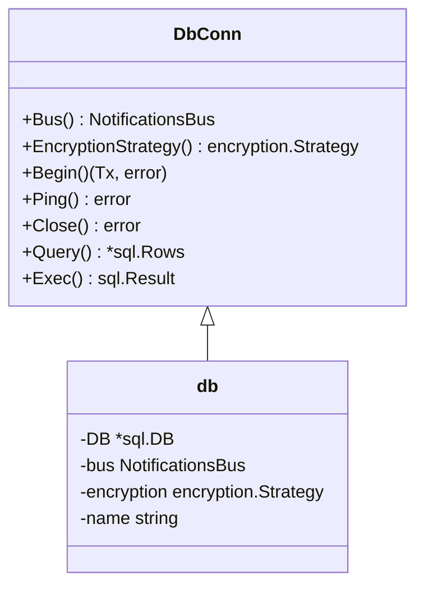
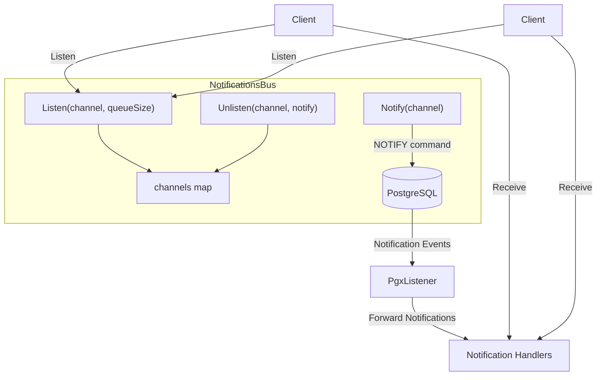
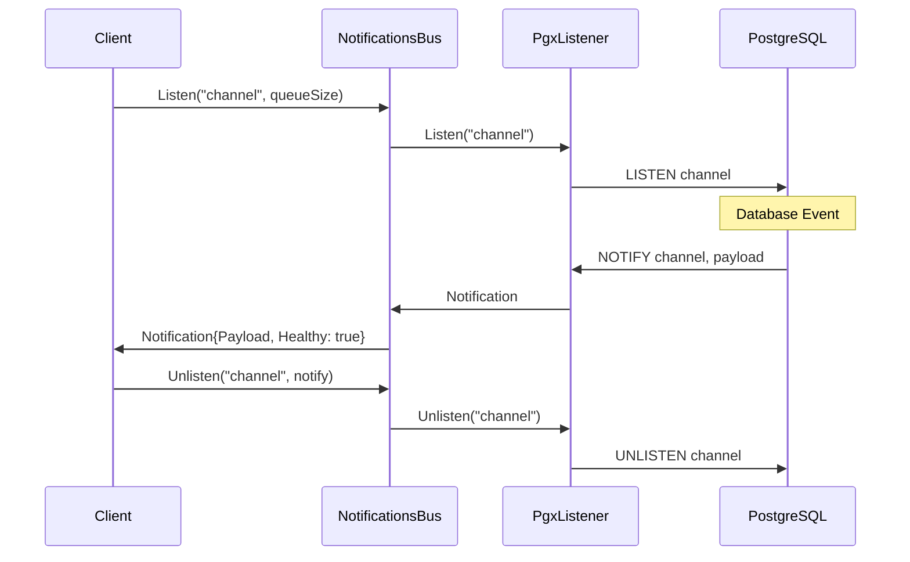
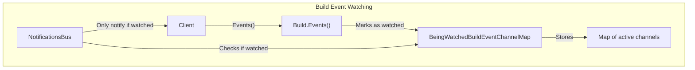

# Database Layer

<details>
<summary>Relevant source files</summary>

The following files were used as context for generating this wiki page:

- [.github/workflows/codeql-analysis.yml](https://github.com/concourse/concourse/blob/301f8064/.github/workflows/codeql-analysis.yml)
- [atc/atccmd/command.go](https://github.com/concourse/concourse/blob/301f8064/atc/atccmd/command.go)
- [atc/db/build_being_watched_marker.go](https://github.com/concourse/concourse/blob/301f8064/atc/db/build_being_watched_marker.go)
- [atc/db/build_being_watched_marker_test.go](https://github.com/concourse/concourse/blob/301f8064/atc/db/build_being_watched_marker_test.go)
- [atc/db/build_event_source.go](https://github.com/concourse/concourse/blob/301f8064/atc/db/build_event_source.go)
- [atc/db/connection_tracker.go](https://github.com/concourse/concourse/blob/301f8064/atc/db/connection_tracker.go)
- [atc/db/dbfakes/fake_executor.go](https://github.com/concourse/concourse/blob/301f8064/atc/db/dbfakes/fake_executor.go)
- [atc/db/dbfakes/fake_listener.go](https://github.com/concourse/concourse/blob/301f8064/atc/db/dbfakes/fake_listener.go)
- [atc/db/dbfakes/fake_tx.go](https://github.com/concourse/concourse/blob/301f8064/atc/db/dbfakes/fake_tx.go)
- [atc/db/keepalive_dialer.go](https://github.com/concourse/concourse/blob/301f8064/atc/db/keepalive_dialer.go)
- [atc/db/listener.go](https://github.com/concourse/concourse/blob/301f8064/atc/db/listener.go)
- [atc/db/listener_test.go](https://github.com/concourse/concourse/blob/301f8064/atc/db/listener_test.go)
- [atc/db/migration/migrations/1653924132_int_to_bigint.down.sql](https://github.com/concourse/concourse/blob/301f8064/atc/db/migration/migrations/1653924132_int_to_bigint.down.sql)
- [atc/db/migration/migrations/1653924132_int_to_bigint.up.sql](https://github.com/concourse/concourse/blob/301f8064/atc/db/migration/migrations/1653924132_int_to_bigint.up.sql)
- [atc/db/notifications_bus.go](https://github.com/concourse/concourse/blob/301f8064/atc/db/notifications_bus.go)
- [atc/db/notifications_bus_test.go](https://github.com/concourse/concourse/blob/301f8064/atc/db/notifications_bus_test.go)
- [atc/db/open.go](https://github.com/concourse/concourse/blob/301f8064/atc/db/open.go)
- [go.mod](https://github.com/concourse/concourse/blob/301f8064/go.mod)
- [go.sum](https://github.com/concourse/concourse/blob/301f8064/go.sum)

</details>


The Database Layer in Concourse provides the foundation for data persistence, real-time event notifications, and streaming capabilities. This component manages connections to PostgreSQL, handles encrypted data storage, and implements the notification system that powers real-time updates throughout the system.

For information about how build events are processed and streamed, see [Build Events](#2.3).

## Architecture Overview

The Database Layer consists of several key components that work together to provide database connectivity, notifications, and event streaming capabilities to other parts of Concourse.



Sources: [atc/db/open.go:22-48](https://github.com/concourse/concourse/blob/301f8064/atc/db/open.go#L22-L48), [atc/db/notifications_bus.go:32-37](https://github.com/concourse/concourse/blob/301f8064/atc/db/notifications_bus.go#L32-L37)

## Connection Management

The Database Layer uses a connection pooling mechanism to efficiently manage PostgreSQL connections. The core of this system is the `DbConn` interface, which provides an abstraction layer over the standard SQL operations.

### DbConn Interface

`DbConn` serves as the primary interface for all database operations in Concourse. It extends the standard SQL operations with additional functionality like notification support and encryption.



Sources: [atc/db/open.go:22-48](https://github.com/concourse/concourse/blob/301f8064/atc/db/open.go#L22-L48), [atc/db/open.go:83-106](https://github.com/concourse/concourse/blob/301f8064/atc/db/open.go#L83-L106)

### Connection Creation

Connections are established using the `Open` function, which handles database connection retries and migration checks. Each connection is associated with a notifications bus and an encryption strategy.

The sample code demonstrates how a new database connection is created:

```go
func NewConn(name string, sqlDB *sql.DB, dsn string, oldKey, newKey *encryption.Key) (DbConn, error) {
    pool, err := pgxpool.New(context.Background(), dsn)
    if err != nil {
        return nil, err
    }

    listener := NewPgxListener(pool)

    var strategy encryption.Strategy
    if newKey != nil {
        strategy = newKey
    } else {
        strategy = encryption.NewNoEncryption()
    }

    return &db{
        DB: sqlDB,
        bus: NewNotificationsBus(listener, sqlDB),
        encryption: strategy,
        name: name,
    }, nil
}
```

Sources: [atc/db/open.go:83-106](https://github.com/concourse/concourse/blob/301f8064/atc/db/open.go#L83-L106)

## Notifications System

The Notifications System is a key component that powers real-time updates in Concourse. It leverages PostgreSQL's built-in LISTEN/NOTIFY mechanism to deliver messages across connected clients.

### NotificationsBus

The `NotificationsBus` component serves as the central hub for notifications. It provides methods to listen for and send notifications on specific channels.



Sources: [atc/db/notifications_bus.go:32-37](https://github.com/concourse/concourse/blob/301f8064/atc/db/notifications_bus.go#L32-L37), [atc/db/notifications_bus.go:69-92](https://github.com/concourse/concourse/blob/301f8064/atc/db/notifications_bus.go#L69-L92)

### Implementation Details

The NotificationsBus uses a concurrent map to track channel subscriptions and dispatches notifications to the appropriate listeners. It handles PostgreSQL reconnection events and maintains notification queues for each listener.

Key features of the notification system:

- **Channel-based messaging**: Clients can subscribe to specific notification channels
- **Queued notifications**: Configurable queue size for each listener
- **Reconnection handling**: Automatic recovery from database connection issues

Sources: [atc/db/notifications_bus.go:105-248](https://github.com/concourse/concourse/blob/301f8064/atc/db/notifications_bus.go#L105-L248), [atc/db/listener.go:12-167](https://github.com/concourse/concourse/blob/301f8064/atc/db/listener.go#L12-L167)

### Notification Flow

The diagram below illustrates how notifications flow through the system:



Sources: [atc/db/notifications_bus.go:105-120](https://github.com/concourse/concourse/blob/301f8064/atc/db/notifications_bus.go#L105-L120), [atc/db/notifications_bus.go:222-233](https://github.com/concourse/concourse/blob/301f8064/atc/db/notifications_bus.go#L222-L233)

## Build Event Tracking

Concourse uses a special mechanism to track which builds are currently being watched by clients, enabling optimization of notification delivery.

### BeingWatchedBuildEventChannelMap

This component maintains a map of build event channels that are actively being watched. This allows the system to avoid sending unnecessary notifications for builds that no one is watching.



A periodic cleanup process removes entries for completed builds or those that haven't been watched for a configured duration.

Sources: [atc/db/build_being_watched_marker.go:24-100](https://github.com/concourse/concourse/blob/301f8064/atc/db/build_being_watched_marker.go#L24-L100), [atc/db/build_being_watched_marker.go:131-225](https://github.com/concourse/concourse/blob/301f8064/atc/db/build_being_watched_marker.go#L131-L225)

## Database Encryption

The Database Layer supports encryption of sensitive information stored in the database. This is implemented through the `encryption.Strategy` interface.

Key aspects of the encryption system:

- **Pluggable encryption**: Support for different encryption strategies
- **Key rotation**: Ability to migrate from old keys to new keys
- **Transparent usage**: Encrypted transparently to application code

Sources: [atc/db/open.go:83-106](https://github.com/concourse/concourse/blob/301f8064/atc/db/open.go#L83-L106), [atc/db/open.go:128-130](https://github.com/concourse/concourse/blob/301f8064/atc/db/open.go#L128-L130)

## Usage Patterns

The Database Layer is used throughout Concourse for:

1. **Persistent storage** - Storing configuration, build history, and resources
2. **Real-time notifications** - Enabling live updates in the web UI
3. **Event streaming** - Providing real-time build logs
4. **Transactional operations** - Ensuring data consistency

### Typical Database Interaction

Below is a typical pattern for interacting with the database:

```go
// Get a database connection
dbConn := ...

// Begin a transaction
tx, err := dbConn.Begin()
if err != nil {
    return err
}
defer db.Rollback(tx)

// Perform database operations
result, err := tx.Exec("SQL STATEMENT", args...)
if err != nil {
    return err
}

// Commit the transaction
return tx.Commit()
```

For notifications, a typical pattern is:

```go
// Listen for notifications
notifications, err := dbConn.Bus().Listen("channel-name", queueSize)
if err != nil {
    return err
}

// Process notifications
for notification := range notifications {
    if !notification.Healthy {
        // Handle reconnection
        continue
    }
    
    // Process notification payload
    handlePayload(notification.Payload)
}
```

Sources: [atc/db/open.go:153-160](https://github.com/concourse/concourse/blob/301f8064/atc/db/open.go#L153-L160), [atc/db/notifications_bus.go:123-136](https://github.com/concourse/concourse/blob/301f8064/atc/db/notifications_bus.go#L123-L136)

## Summary