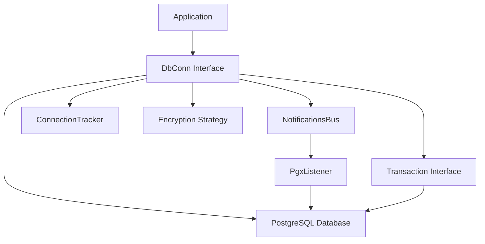
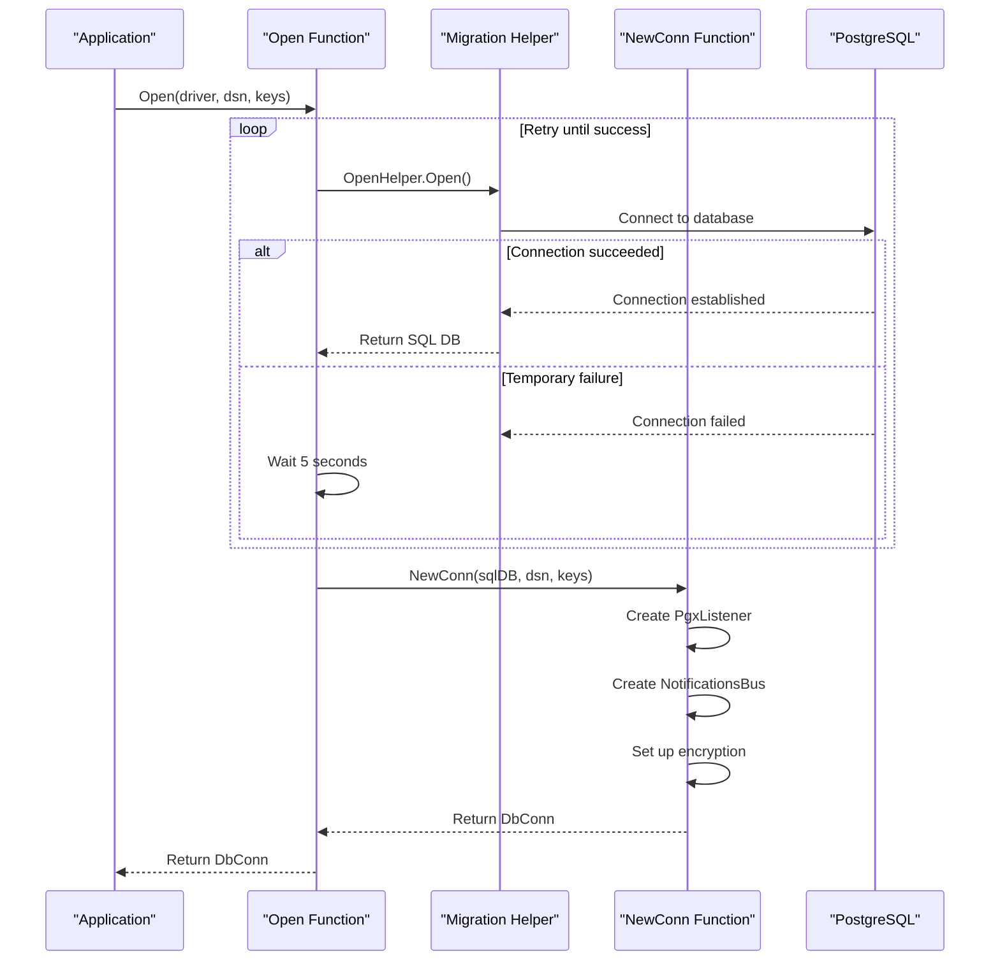
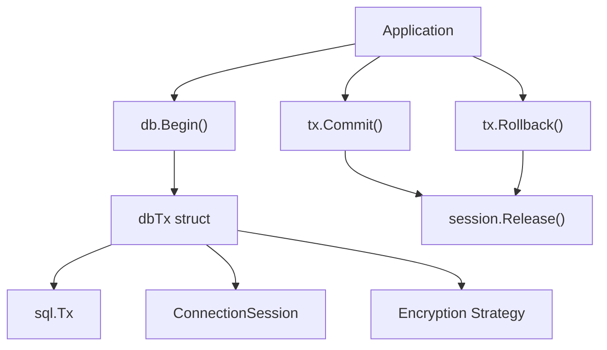
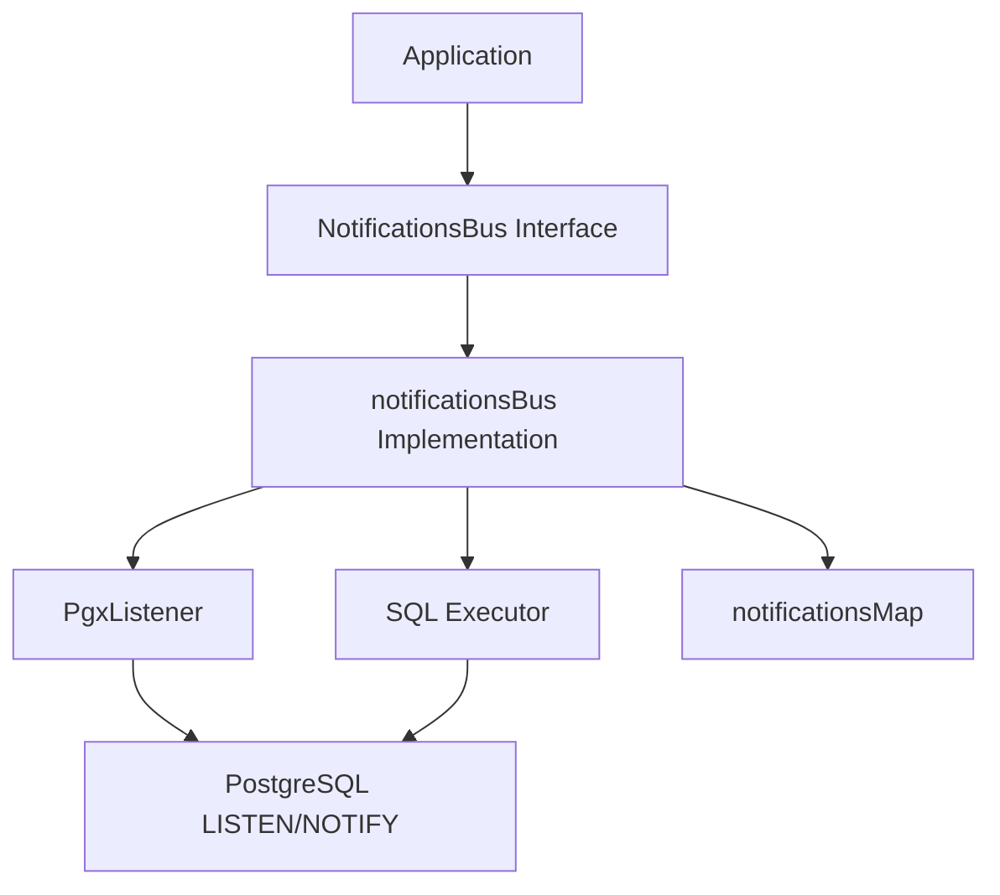
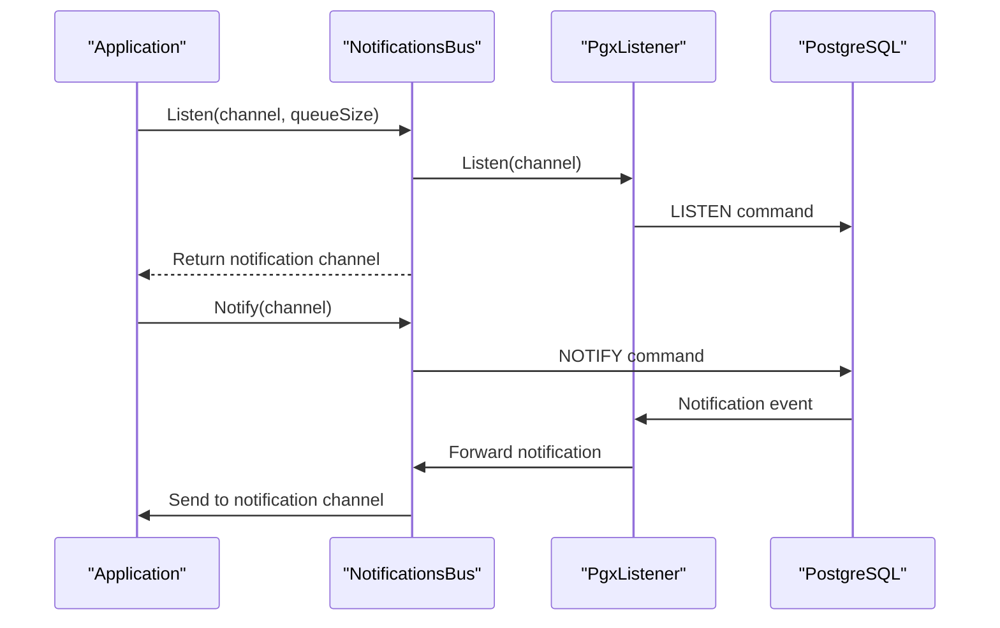
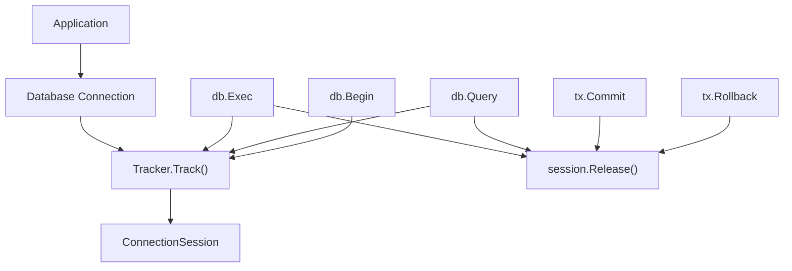
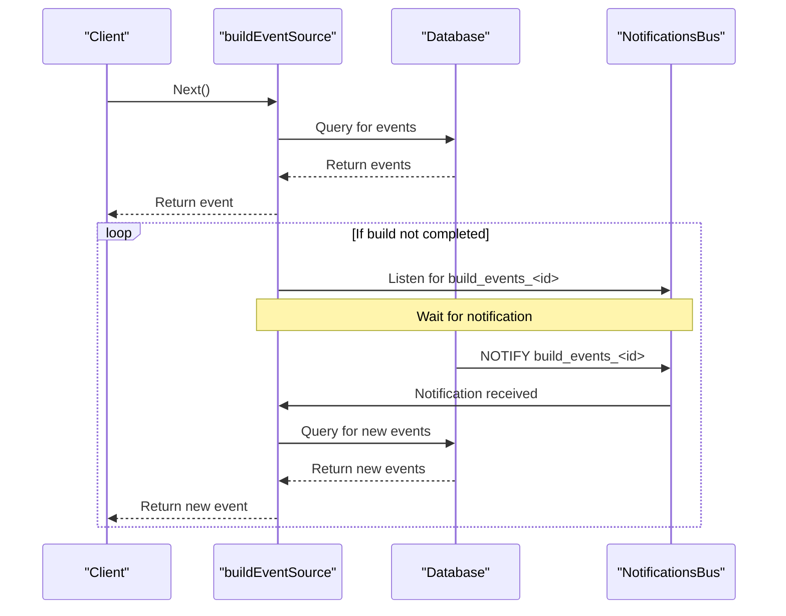

# Connection Management

<details>
<summary>Relevant source files</summary>

The following files were used as context for generating this wiki page:

- [.github/workflows/codeql-analysis.yml](https://github.com/concourse/concourse/blob/301f8064/.github/workflows/codeql-analysis.yml)
- [atc/atccmd/command.go](https://github.com/concourse/concourse/blob/301f8064/atc/atccmd/command.go)
- [atc/db/build_being_watched_marker.go](https://github.com/concourse/concourse/blob/301f8064/atc/db/build_being_watched_marker.go)
- [atc/db/build_being_watched_marker_test.go](https://github.com/concourse/concourse/blob/301f8064/atc/db/build_being_watched_marker_test.go)
- [atc/db/build_event_source.go](https://github.com/concourse/concourse/blob/301f8064/atc/db/build_event_source.go)
- [atc/db/connection_tracker.go](https://github.com/concourse/concourse/blob/301f8064/atc/db/connection_tracker.go)
- [atc/db/dbfakes/fake_executor.go](https://github.com/concourse/concourse/blob/301f8064/atc/db/dbfakes/fake_executor.go)
- [atc/db/dbfakes/fake_listener.go](https://github.com/concourse/concourse/blob/301f8064/atc/db/dbfakes/fake_listener.go)
- [atc/db/dbfakes/fake_tx.go](https://github.com/concourse/concourse/blob/301f8064/atc/db/dbfakes/fake_tx.go)
- [atc/db/keepalive_dialer.go](https://github.com/concourse/concourse/blob/301f8064/atc/db/keepalive_dialer.go)
- [atc/db/listener.go](https://github.com/concourse/concourse/blob/301f8064/atc/db/listener.go)
- [atc/db/listener_test.go](https://github.com/concourse/concourse/blob/301f8064/atc/db/listener_test.go)
- [atc/db/migration/migrations/1653924132_int_to_bigint.down.sql](https://github.com/concourse/concourse/blob/301f8064/atc/db/migration/migrations/1653924132_int_to_bigint.down.sql)
- [atc/db/migration/migrations/1653924132_int_to_bigint.up.sql](https://github.com/concourse/concourse/blob/301f8064/atc/db/migration/migrations/1653924132_int_to_bigint.up.sql)
- [atc/db/notifications_bus.go](https://github.com/concourse/concourse/blob/301f8064/atc/db/notifications_bus.go)
- [atc/db/notifications_bus_test.go](https://github.com/concourse/concourse/blob/301f8064/atc/db/notifications_bus_test.go)
- [atc/db/open.go](https://github.com/concourse/concourse/blob/301f8064/atc/db/open.go)
- [go.mod](https://github.com/concourse/concourse/blob/301f8064/go.mod)
- [go.sum](https://github.com/concourse/concourse/blob/301f8064/go.sum)

</details>


## Purpose and Scope

This document explains how Concourse manages database connections to PostgreSQL. It covers connection pooling, the notification system using PostgreSQL's LISTEN/NOTIFY mechanism, and connection tracking for debugging purposes. Understanding this system is crucial for developers working on features that interact with the database, especially real-time components like build event streaming.

For information about database schema management and migrations, see the Database Layer (#2) page.

## Architecture Overview

Concourse uses a layered approach to database connection management:



The main components are:

1. **DbConn**: The primary interface for database operations
2. **NotificationsBus**: Manages real-time notifications using PostgreSQL's LISTEN/NOTIFY
3. **PgxListener**: Handles low-level interaction with the PostgreSQL notification system
4. **ConnectionTracker**: Tracks connections for debugging purposes
5. **Tx**: Interface for managing database transactions
6. **Encryption Strategy**: Handles data encryption/decryption

Sources:
- `atc/db/open.go`
- `atc/db/notifications_bus.go`
- `atc/db/listener.go`
- `atc/db/connection_tracker.go`

## Database Connection Management

### Opening Connections

The entry point for creating database connections is the `Open` function in `atc/db/open.go`. This function includes retry logic to handle temporary connection failures:



Sources:
- `atc/db/open.go:66-81`
- `atc/db/open.go:83-106`

### Connection Interface

The `DbConn` interface provides a comprehensive API for database operations:

```go
type DbConn interface {
    // Access to subsystems
    Bus() NotificationsBus
    EncryptionStrategy() encryption.Strategy

    // Standard operations
    Begin() (Tx, error)
    Exec(string, ...any) (sql.Result, error)
    Query(string, ...any) (*sql.Rows, error)
    
    // Context-aware operations
    BeginTx(context.Context, *sql.TxOptions) (Tx, error)
    ExecContext(context.Context, string, ...any) (sql.Result, error)
    QueryContext(context.Context, string, ...any) (*sql.Rows, error)
    
    // Connection pool management
    SetMaxIdleConns(int)
    SetMaxOpenConns(int)
    Stats() sql.DBStats
    
    // Resource management
    Close() error
    Name() string
}
```

This interface extends the standard Go `sql.DB` functionality with Concourse-specific features.

Sources:
- `atc/db/open.go:22-48`

### Connection Implementation

The database connection is implemented by the `db` struct:

```go
type db struct {
    *sql.DB
    bus        NotificationsBus
    encryption encryption.Strategy
    name       string
}
```

This struct embeds a standard `sql.DB` connection and adds Concourse-specific functionality.

Sources:
- `atc/db/open.go:112-118`

## Transaction Management

Transactions are managed through the `Tx` interface and its implementation `dbTx`:



Each transaction is tracked using the ConnectionTracker system, which helps identify connection leaks.

Sources:
- `atc/db/open.go:50-64`
- `atc/db/open.go:213-241`

### Transaction Interface

The `Tx` interface provides methods for executing queries within a transaction:

```go
type Tx interface {
    Commit() error
    Rollback() error
    
    // Query methods
    Exec(string, ...any) (sql.Result, error)
    Prepare(string) (*sql.Stmt, error)
    Query(string, ...any) (*sql.Rows, error)
    QueryRow(string, ...any) squirrel.RowScanner
    
    // Context-aware methods
    ExecContext(context.Context, string, ...any) (sql.Result, error)
    PrepareContext(context.Context, string) (*sql.Stmt, error)
    QueryContext(context.Context, string, ...any) (*sql.Rows, error)
    QueryRowContext(context.Context, string, ...any) squirrel.RowScanner
    
    // Additional methods
    Stmt(*sql.Stmt) *sql.Stmt
    EncryptionStrategy() encryption.Strategy
}
```

Sources:
- `atc/db/open.go:50-64`

## Notification System

The notification system uses PostgreSQL's LISTEN/NOTIFY mechanism to provide real-time updates between different Concourse components. This is a critical component that enables features like build event streaming.



Sources:
- `atc/db/notifications_bus.go`
- `atc/db/listener.go`

### Notification Bus Interface

The `NotificationsBus` interface defines the API for sending and receiving notifications:

```go
type NotificationsBus interface {
    Notify(channel string) error
    Listen(channel string, queueSize int) (chan Notification, error)
    Unlisten(channel string, notify chan Notification) error
    Close() error
}
```

Sources:
- `atc/db/notifications_bus.go:32-37`

### Notification Implementation

The `notificationsBus` struct implements the notification bus:

```go
type notificationsBus struct {
    sync.Mutex

    listener Listener
    executor Executor

    notifications *notificationsMap

    notifyChan      chan string
    notifyCache     map[string]struct{}
    notifyCacheLock sync.Mutex
    notifyDoneChan  chan struct{}
    watchedMap      *beingWatchedBuildEventChannelMap

    wg *sync.WaitGroup
}
```

This struct is responsible for managing a map of listeners for different notification channels and handling the notification flow.

Sources:
- `atc/db/notifications_bus.go:39-54`

### PostgreSQL Listener

The `PgxListener` struct implements a listener for PostgreSQL's LISTEN/NOTIFY:

```go
type PgxListener struct {
    notify chan *pgconn.Notification
    pool   *pgxpool.Pool
    conn   *pgxpool.Conn
    channels map[string]struct{}
    cancelFunc context.CancelFunc
    comms   chan struct{}
}
```

It maintains a dedicated connection to the database specifically for receiving notifications.

Sources:
- `atc/db/listener.go:15-23`

### Notification Flow

The notification system follows this flow:



Sources:
- `atc/db/notifications_bus.go:95-150`
- `atc/db/listener.go:64-81`

### Notification Queue Size

The notification bus queue size is configurable through the `db-notification-bus-queue-size` parameter (default: 10000). This affects the buffer size of the notification channel:

```go
var notificationBusQueueSize = 10000

func SetNotificationBusQueueSize(size int) error {
    if size <= 0 {
        return nil
    }
    if size < 1000 || size > 1000000 {
        return fmt.Errorf("db notification bus size out of range of [1000, 1000000]")
    }
    notificationBusQueueSize = size
    return nil
}
```

When the queue is full, notifications will be dropped, which can impact real-time features like build event streaming.

Sources:
- `atc/db/notifications_bus.go:56-67`

## Connection Tracking

The connection tracker is used for debugging and resource management, particularly for identifying connection leaks:



Sources:
- `atc/db/connection_tracker.go`
- `atc/db/open.go:153-211`

### Connection Tracker Interface

The `ConnectionTracker` interface defines the API for tracking connections:

```go
type ConnectionTracker interface {
    Track() ConnectionSession
    Current() []string
}
```

Sources:
- `atc/db/connection_tracker.go:14-17`

### Connection Tracker Implementation

The `connectionTracker` struct implements the tracker:

```go
type connectionTracker struct {
    sessions  map[*connectionSession]struct{}
    sessionsL *sync.Mutex
}
```

It maintains a map of active connection sessions, which can be used to identify connection leaks.

Sources:
- `atc/db/connection_tracker.go:23-27`

### Connection Session

Each tracked connection is represented by a `ConnectionSession`:

```go
type connectionSession struct {
    tracker *connectionTracker
    stack   string
}
```

The `stack` field stores the stack trace where the connection was created, which is invaluable for debugging connection leaks.

Sources:
- `atc/db/connection_tracker.go:72-75`

## Build Event Streaming

One of the primary uses of the notification system is for streaming build events in real-time:



The build event source uses the notification bus to listen for updates to a specific build. When new events are available, it queries the database and sends them to the client.

Sources:
- `atc/db/build_event_source.go:26-245`

## Configuration Options

Database connection management can be configured through command line parameters:

| Parameter | Description | Default |
|-----------|-------------|---------|
| `--postgres-host` | Host name of the PostgreSQL server | |
| `--postgres-port` | Port number of the PostgreSQL server | |
| `--postgres-user` | Username for PostgreSQL connection | |
| `--postgres-password` | Password for PostgreSQL connection | |
| `--postgres-database` | Database name for PostgreSQL connection | |
| `--api-max-conns` | Maximum open connections for the API connection pool | 10 |
| `--backend-max-conns` | Maximum open connections for the backend connection pool | 50 |
| `--db-notification-bus-queue-size` | DB notification bus queue size | 10000 |

The `api-max-conns` parameter controls the connection pool size for API requests, while `backend-max-conns` controls the pool size for background processes like the scheduler.

Sources:
- `atc/atccmd/command.go:132-133`
- `atc/atccmd/command.go:273`

## Keepalive Connections

To maintain long-running connections, Concourse uses a `keepAliveDialer`:

```go
type keepAliveDialer struct {}

func (d keepAliveDialer) Dial(network, address string) (net.Conn, error) {
    dialer := &net.Dialer{
        KeepAlive: 15 * time.Second,
    }
    return dialer.Dial(network, address)
}
```

This ensures that connections don't time out during periods of inactivity, which is especially important for long-running processes.

Sources: