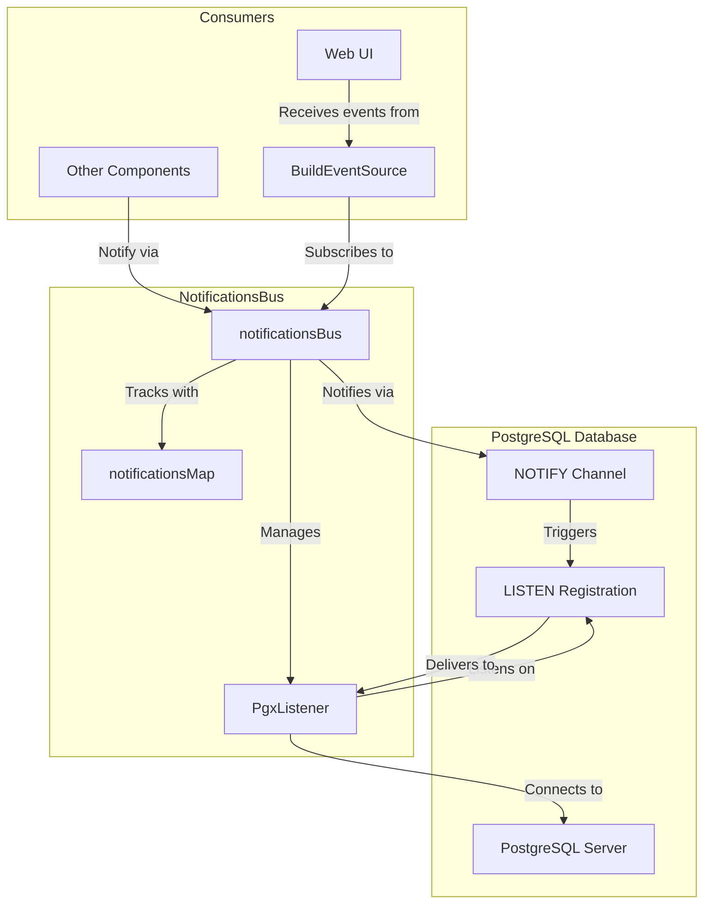
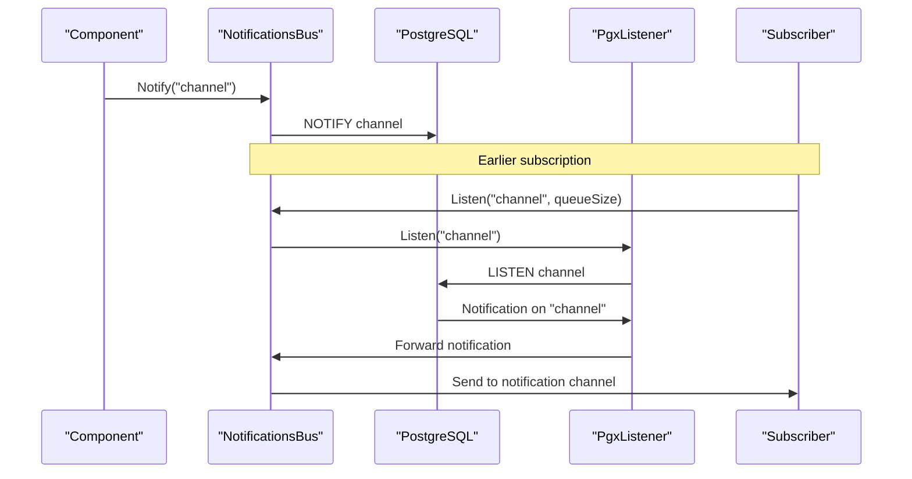
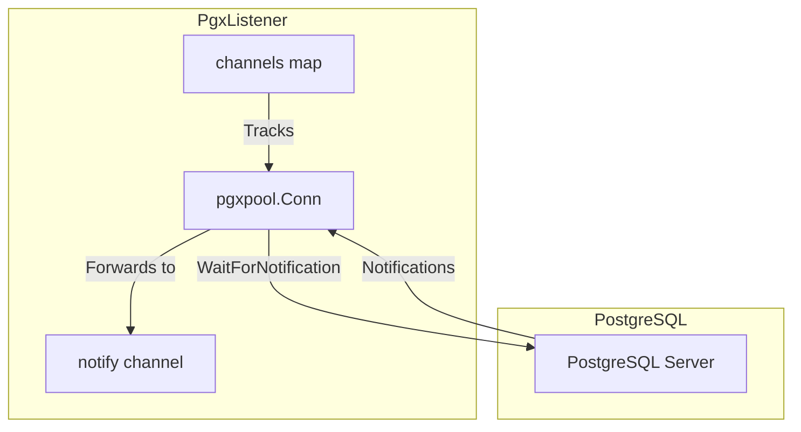
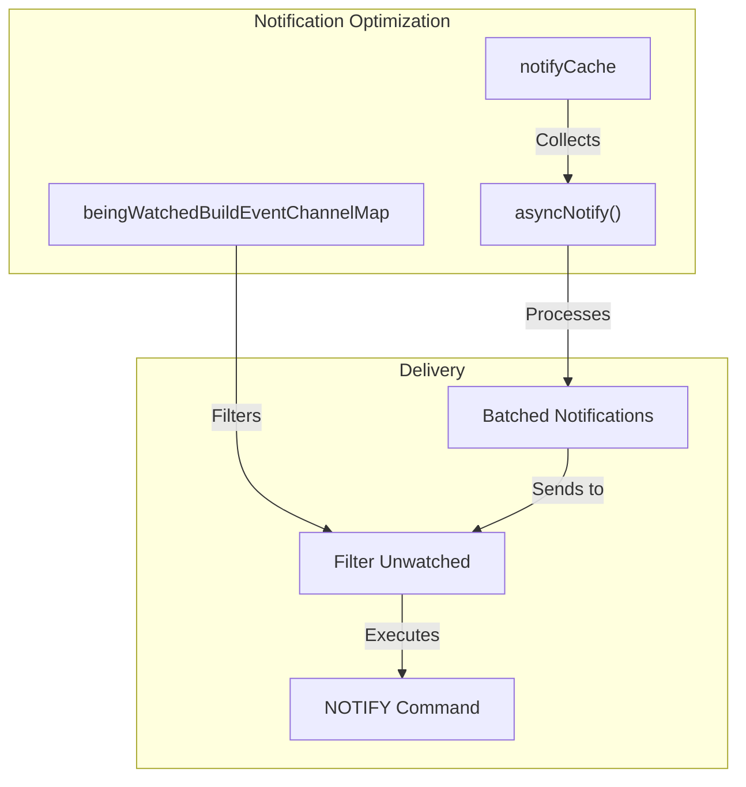
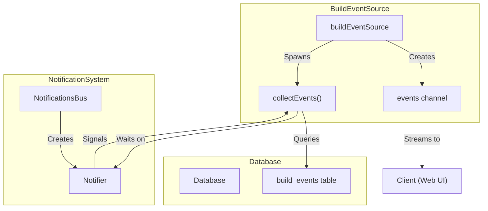
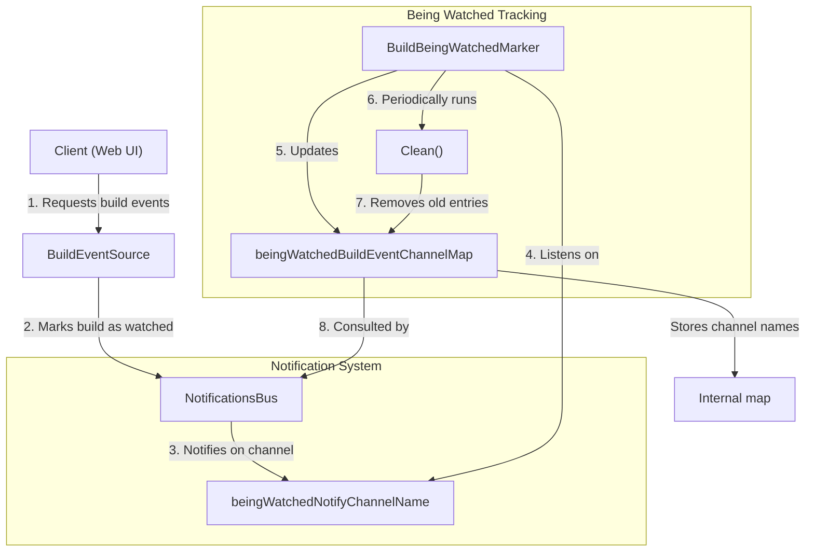
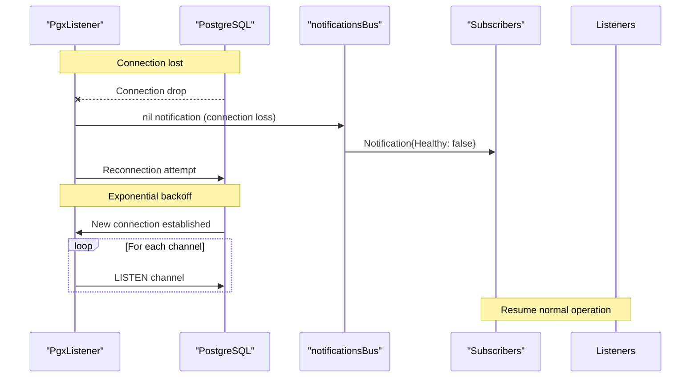

# Notifications System

<details>
<summary>Relevant source files</summary>

The following files were used as context for generating this wiki page:

- [.github/workflows/codeql-analysis.yml](https://github.com/concourse/concourse/blob/301f8064/.github/workflows/codeql-analysis.yml)
- [atc/atccmd/command.go](https://github.com/concourse/concourse/blob/301f8064/atc/atccmd/command.go)
- [atc/db/build_being_watched_marker.go](https://github.com/concourse/concourse/blob/301f8064/atc/db/build_being_watched_marker.go)
- [atc/db/build_being_watched_marker_test.go](https://github.com/concourse/concourse/blob/301f8064/atc/db/build_being_watched_marker_test.go)
- [atc/db/build_event_source.go](https://github.com/concourse/concourse/blob/301f8064/atc/db/build_event_source.go)
- [atc/db/connection_tracker.go](https://github.com/concourse/concourse/blob/301f8064/atc/db/connection_tracker.go)
- [atc/db/dbfakes/fake_executor.go](https://github.com/concourse/concourse/blob/301f8064/atc/db/dbfakes/fake_executor.go)
- [atc/db/dbfakes/fake_listener.go](https://github.com/concourse/concourse/blob/301f8064/atc/db/dbfakes/fake_listener.go)
- [atc/db/dbfakes/fake_tx.go](https://github.com/concourse/concourse/blob/301f8064/atc/db/dbfakes/fake_tx.go)
- [atc/db/keepalive_dialer.go](https://github.com/concourse/concourse/blob/301f8064/atc/db/keepalive_dialer.go)
- [atc/db/listener.go](https://github.com/concourse/concourse/blob/301f8064/atc/db/listener.go)
- [atc/db/listener_test.go](https://github.com/concourse/concourse/blob/301f8064/atc/db/listener_test.go)
- [atc/db/migration/migrations/1653924132_int_to_bigint.down.sql](https://github.com/concourse/concourse/blob/301f8064/atc/db/migration/migrations/1653924132_int_to_bigint.down.sql)
- [atc/db/migration/migrations/1653924132_int_to_bigint.up.sql](https://github.com/concourse/concourse/blob/301f8064/atc/db/migration/migrations/1653924132_int_to_bigint.up.sql)
- [atc/db/notifications_bus.go](https://github.com/concourse/concourse/blob/301f8064/atc/db/notifications_bus.go)
- [atc/db/notifications_bus_test.go](https://github.com/concourse/concourse/blob/301f8064/atc/db/notifications_bus_test.go)
- [atc/db/open.go](https://github.com/concourse/concourse/blob/301f8064/atc/db/open.go)
- [go.mod](https://github.com/concourse/concourse/blob/301f8064/go.mod)
- [go.sum](https://github.com/concourse/concourse/blob/301f8064/go.sum)

</details>


The Notifications System is a real-time event distribution mechanism in Concourse that leverages PostgreSQL's LISTEN/NOTIFY feature to enable efficient communication between system components. This system is particularly important for delivering real-time build events to the web UI and other clients without requiring constant polling.

For information about the build events themselves, see [Build Events](#2.3).

## Architecture Overview



Sources: [atc/db/notifications_bus.go](https://github.com/concourse/concourse/blob/301f8064/atc/db/notifications_bus.go). [atc/db/listener.go](https://github.com/concourse/concourse/blob/301f8064/atc/db/listener.go). [atc/db/open.go](https://github.com/concourse/concourse/blob/301f8064/atc/db/open.go).

The PostgreSQL Notification System forms a critical part of Concourse's real-time event distribution infrastructure. It enables components to communicate asynchronously without constant polling, which is particularly important for build event streaming and other real-time features.

## NotificationsBus Interface

The `NotificationsBus` interface defines the core API for the notification system:

```mermaid
classDiagram
    class NotificationsBus {
        +Notify(channel string) error
        +Listen(channel string, queueSize int) (chan Notification, error)
        +Unlisten(channel string, notify chan Notification) error
        +Close() error
    }

    class Notification {
        +Payload string
        +Healthy bool
    }

    class notificationsBus {
        -listener Listener
        -executor Executor
        -notifications *notificationsMap
        -notifyChan chan string
        -notifyCache map[string]struct{}
        -notifyDoneChan chan struct{}
        -watchedMap *beingWatchedBuildEventChannelMap
        -wg *sync.WaitGroup
    }

    class notificationsMap {
        -notifications map[string]map[chan Notification]struct{}
    }

    NotificationsBus <|.. notificationsBus
    notificationsBus --> notificationsMap
    notificationsBus --> "many" Notification : delivers
```

Sources: [atc/db/notifications_bus.go:32-37](https://github.com/concourse/concourse/blob/301f8064/atc/db/notifications_bus.go#L32-L37). [atc/db/notifications_bus.go:13-16](https://github.com/concourse/concourse/blob/301f8064/atc/db/notifications_bus.go#L13-L16).

The `NotificationsBus` is created as part of each database connection and provides methods to:

1. **Notify**: Send messages on a specific channel
2. **Listen**: Subscribe to messages on a channel
3. **Unlisten**: Unsubscribe from a channel
4. **Close**: Shut down the notification bus

The implementation (`notificationsBus`) manages a connection to PostgreSQL specifically for LISTEN/NOTIFY operations and maintains a registry of subscribers for each channel.

## Notification Flow

When a component wants to notify others about an event:

1. It calls `Notify(channel)` on the notification bus
2. The bus executes a PostgreSQL `NOTIFY` command with the channel name
3. PostgreSQL delivers the notification to all clients listening on that channel
4. The `PgxListener` receives the notification and forwards it to the bus
5. The bus delivers the notification to all registered subscribers for that channel



Sources: [atc/db/notifications_bus.go:105-121](https://github.com/concourse/concourse/blob/301f8064/atc/db/notifications_bus.go#L105-L121). [atc/db/notifications_bus.go:132-137](https://github.com/concourse/concourse/blob/301f8064/atc/db/notifications_bus.go#L132-L137). [atc/db/listener.go:64-72](https://github.com/concourse/concourse/blob/301f8064/atc/db/listener.go#L64-L72).

## Implementation Details

### PostgreSQL Listener

The notification system uses a custom `PgxListener` that:

1. Establishes a dedicated connection to PostgreSQL
2. Manages LISTEN/NOTIFY registrations
3. Handles connection failures and reconnection
4. Forwards notifications to the notification bus



Sources: [atc/db/listener.go:15-30](https://github.com/concourse/concourse/blob/301f8064/atc/db/listener.go#L15-L30). [atc/db/listener.go:32-48](https://github.com/concourse/concourse/blob/301f8064/atc/db/listener.go#L32-L48).

### Notification Caching & Optimization

For performance, the notification bus includes several optimizations:

1. **Notification Caching**: High-volume notifications (particularly for build events) are cached and batched to reduce database load
2. **Channel Tracking**: The system tracks which notification channels are actually being watched to avoid unnecessary notifications
3. **Queue Size Management**: Each listener can specify a queue size to handle bursts of notifications



Sources: [atc/db/notifications_bus.go:186-219](https://github.com/concourse/concourse/blob/301f8064/atc/db/notifications_bus.go#L186-L219). [atc/db/build_being_watched_marker.go:18-27](https://github.com/concourse/concourse/blob/301f8064/atc/db/build_being_watched_marker.go#L18-L27).

## BuildEventSource Integration

One of the primary users of the notification system is the `BuildEventSource`, which streams build events to clients like the web UI:



Sources: [atc/db/build_event_source.go:26-84](https://github.com/concourse/concourse/blob/301f8064/atc/db/build_event_source.go#L26-L84). [atc/db/build_event_source.go:126-245](https://github.com/concourse/concourse/blob/301f8064/atc/db/build_event_source.go#L126-L245).

When a client requests build events:
1. A `buildEventSource` is created
2. It subscribes to notifications for the specific build
3. It fetches existing events from the database
4. It waits for notifications of new events
5. When notified, it fetches new events and forwards them to the client

This approach gives clients real-time updates without constant polling.

## Being Watched Marker

To optimize notifications for build events, Concourse includes a "Being Watched Marker" system that tracks which builds are actively being watched by clients:



Sources: [atc/db/build_being_watched_marker.go:104-114](https://github.com/concourse/concourse/blob/301f8064/atc/db/build_being_watched_marker.go#L104-L114). [atc/db/build_being_watched_marker.go:131-166](https://github.com/concourse/concourse/blob/301f8064/atc/db/build_being_watched_marker.go#L131-L166).

This system:
1. Maintains a map of build event channels that are being watched
2. Is updated when clients start watching builds
3. Periodically cleans up completed builds
4. Allows the notification bus to avoid sending notifications for unwatched builds

## DB Notification Bus Size Configuration

The notification bus queue size can be configured in the ATC command settings:

```go
DBNotificationBusQueueSize int `long:"db-notification-bus-queue-size" default:"10000" description:"DB notification bus queue size, default is 10000. If UI often misses loading running build logs, then consider to increase the queue size."`
```

Sources: [atc/atccmd/command.go:273](https://github.com/concourse/concourse/blob/301f8064/atc/atccmd/command.go#L273).

Adjusting this value can help in high-load scenarios where UI clients might miss build events due to queue overflow.

## Connection and Error Handling

The notification system is designed to be resilient to database connection issues:

1. **Connection Loss Detection**: When a database connection is lost, the system sends a "unhealthy" notification to all subscribers
2. **Automatic Reconnection**: The `PgxListener` automatically attempts to reconnect with exponential backoff
3. **Channel Re-subscription**: After reconnection, all active channel subscriptions are restored



Sources: [atc/db/notifications_bus.go:235-248](https://github.com/concourse/concourse/blob/301f8064/atc/db/notifications_bus.go#L235-L248). [atc/db/listener.go:89-142](https://github.com/concourse/concourse/blob/301f8064/atc/db/listener.go#L89-L142).

This approach ensures that clients are aware of connection issues and can take appropriate action, such as attempting to refresh their data.

## Summary

The Notifications System is a fundamental component of Concourse that enables:

1. Real-time event streaming for build logs and updates
2. Efficient communication between distributed components
3. Reduced database load by eliminating polling
4. Resilient operation with automatic reconnection