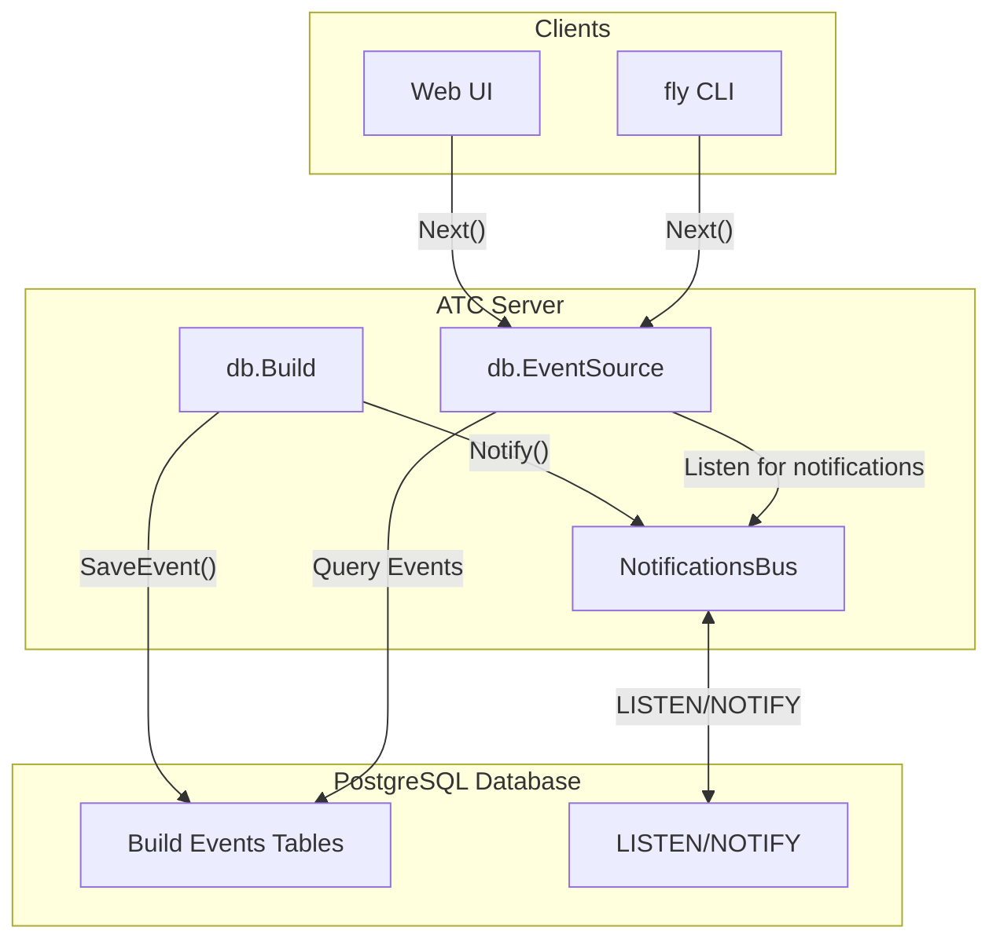
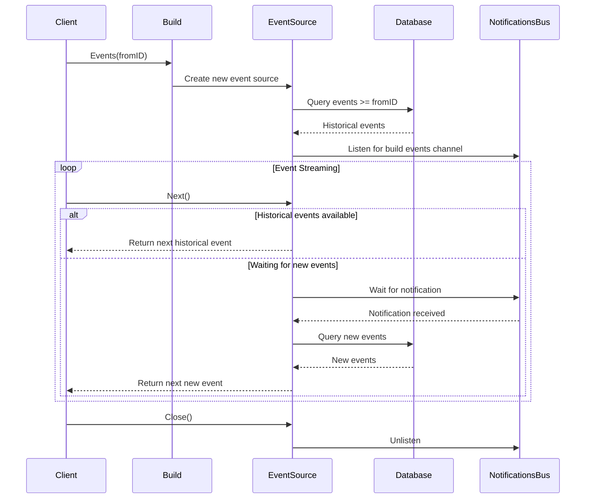

# Build Events

<details>
<summary>Relevant source files</summary>

The following files were used as context for generating this wiki page:

- [.github/workflows/codeql-analysis.yml](https://github.com/concourse/concourse/blob/301f8064/.github/workflows/codeql-analysis.yml)
- [atc/atccmd/command.go](https://github.com/concourse/concourse/blob/301f8064/atc/atccmd/command.go)
- [atc/db/build.go](https://github.com/concourse/concourse/blob/301f8064/atc/db/build.go)
- [atc/db/build_being_watched_marker.go](https://github.com/concourse/concourse/blob/301f8064/atc/db/build_being_watched_marker.go)
- [atc/db/build_being_watched_marker_test.go](https://github.com/concourse/concourse/blob/301f8064/atc/db/build_being_watched_marker_test.go)
- [atc/db/build_event_source.go](https://github.com/concourse/concourse/blob/301f8064/atc/db/build_event_source.go)
- [atc/db/build_test.go](https://github.com/concourse/concourse/blob/301f8064/atc/db/build_test.go)
- [atc/db/connection_tracker.go](https://github.com/concourse/concourse/blob/301f8064/atc/db/connection_tracker.go)
- [atc/db/dbfakes/fake_build.go](https://github.com/concourse/concourse/blob/301f8064/atc/db/dbfakes/fake_build.go)
- [atc/db/dbfakes/fake_executor.go](https://github.com/concourse/concourse/blob/301f8064/atc/db/dbfakes/fake_executor.go)
- [atc/db/dbfakes/fake_job.go](https://github.com/concourse/concourse/blob/301f8064/atc/db/dbfakes/fake_job.go)
- [atc/db/dbfakes/fake_listener.go](https://github.com/concourse/concourse/blob/301f8064/atc/db/dbfakes/fake_listener.go)
- [atc/db/dbfakes/fake_pipeline.go](https://github.com/concourse/concourse/blob/301f8064/atc/db/dbfakes/fake_pipeline.go)
- [atc/db/dbfakes/fake_team.go](https://github.com/concourse/concourse/blob/301f8064/atc/db/dbfakes/fake_team.go)
- [atc/db/dbfakes/fake_tx.go](https://github.com/concourse/concourse/blob/301f8064/atc/db/dbfakes/fake_tx.go)
- [atc/db/job.go](https://github.com/concourse/concourse/blob/301f8064/atc/db/job.go)
- [atc/db/job_factory.go](https://github.com/concourse/concourse/blob/301f8064/atc/db/job_factory.go)
- [atc/db/job_factory_test.go](https://github.com/concourse/concourse/blob/301f8064/atc/db/job_factory_test.go)
- [atc/db/job_test.go](https://github.com/concourse/concourse/blob/301f8064/atc/db/job_test.go)
- [atc/db/keepalive_dialer.go](https://github.com/concourse/concourse/blob/301f8064/atc/db/keepalive_dialer.go)
- [atc/db/listener.go](https://github.com/concourse/concourse/blob/301f8064/atc/db/listener.go)
- [atc/db/listener_test.go](https://github.com/concourse/concourse/blob/301f8064/atc/db/listener_test.go)
- [atc/db/migration/migrations/1653924132_int_to_bigint.down.sql](https://github.com/concourse/concourse/blob/301f8064/atc/db/migration/migrations/1653924132_int_to_bigint.down.sql)
- [atc/db/migration/migrations/1653924132_int_to_bigint.up.sql](https://github.com/concourse/concourse/blob/301f8064/atc/db/migration/migrations/1653924132_int_to_bigint.up.sql)
- [atc/db/notifications_bus.go](https://github.com/concourse/concourse/blob/301f8064/atc/db/notifications_bus.go)
- [atc/db/notifications_bus_test.go](https://github.com/concourse/concourse/blob/301f8064/atc/db/notifications_bus_test.go)
- [atc/db/open.go](https://github.com/concourse/concourse/blob/301f8064/atc/db/open.go)
- [atc/db/pipeline.go](https://github.com/concourse/concourse/blob/301f8064/atc/db/pipeline.go)
- [atc/db/pipeline_test.go](https://github.com/concourse/concourse/blob/301f8064/atc/db/pipeline_test.go)
- [atc/db/team.go](https://github.com/concourse/concourse/blob/301f8064/atc/db/team.go)
- [atc/db/team_test.go](https://github.com/concourse/concourse/blob/301f8064/atc/db/team_test.go)
- [atc/scheduler/build.go](https://github.com/concourse/concourse/blob/301f8064/atc/scheduler/build.go)
- [atc/scheduler/buildstarter.go](https://github.com/concourse/concourse/blob/301f8064/atc/scheduler/buildstarter.go)
- [atc/scheduler/buildstarter_test.go](https://github.com/concourse/concourse/blob/301f8064/atc/scheduler/buildstarter_test.go)
- [atc/scheduler/runner.go](https://github.com/concourse/concourse/blob/301f8064/atc/scheduler/runner.go)
- [atc/scheduler/runner_test.go](https://github.com/concourse/concourse/blob/301f8064/atc/scheduler/runner_test.go)
- [atc/scheduler/scheduler.go](https://github.com/concourse/concourse/blob/301f8064/atc/scheduler/scheduler.go)
- [atc/scheduler/scheduler_test.go](https://github.com/concourse/concourse/blob/301f8064/atc/scheduler/scheduler_test.go)
- [atc/scheduler/schedulerfakes/fake_build_planner.go](https://github.com/concourse/concourse/blob/301f8064/atc/scheduler/schedulerfakes/fake_build_planner.go)
- [atc/scheduler/schedulerfakes/fake_build_scheduler.go](https://github.com/concourse/concourse/blob/301f8064/atc/scheduler/schedulerfakes/fake_build_scheduler.go)
- [atc/scheduler/schedulerfakes/fake_build_starter.go](https://github.com/concourse/concourse/blob/301f8064/atc/scheduler/schedulerfakes/fake_build_starter.go)
- [go.mod](https://github.com/concourse/concourse/blob/301f8064/go.mod)
- [go.sum](https://github.com/concourse/concourse/blob/301f8064/go.sum)

</details>


Build Events are the fundamental mechanism for streaming real-time logs and status updates during build execution in Concourse. This system powers the real-time logs displayed in the web UI and enables clients like the `fly` CLI to stream build progress information.

For information about the Notifications System that underlies the build events mechanism, see [Notifications System](#2.2).

## Overview

The Build Events system provides a mechanism for:
1. Recording events that occur during build execution
2. Storing these events persistently in the database
3. Streaming these events to clients in real-time
4. Enabling historical playback of build execution



Sources: `atc/db/build.go`, `atc/db/build_event_source.go`, `atc/db/notifications_bus.go`

## Event Storage

Build events are stored in team-specific database tables. When a team is created, Concourse creates a separate `team_build_events_{team_id}` table for each team. This partitioning strategy allows for efficient querying of build events by team.

Each build has its own event sequence counter, which starts at 0 for each build and increments for each event. This sequence number is used to ensure events are streamed in the correct order.

The `Build` interface exposes methods for recording and accessing these events:

```go
// Save an event for this build
SaveEvent(event atc.Event) error

// Get a stream of events, starting from the given event ID (0 for all events)
Events(from uint) (EventSource, error)
```

When a build saves an event, it:
1. Serializes the event to JSON
2. Saves it to the appropriate team's build events table with the next sequence number
3. Sends a notification through the NotificationsBus to alert any listeners that a new event is available

Sources: `atc/db/build.go`, `atc/db/build_test.go`

## Event Types

Concourse uses a variety of event types to represent different occurrences during build execution:

| Event Type | Description |
|------------|-------------|
| `Status` | Indicates a change in build status (started, succeeded, failed, etc.) |
| `Log` | Represents a line of output from a build step |
| `Initialize` | Indicates a step is being initialized |
| `StartTask` | Signals that a task step has started |
| `FinishTask` | Signals that a task step has completed |
| `StartGet` | Signals that a get step has started |
| `FinishGet` | Signals that a get step has completed |
| `StartPut` | Signals that a put step has started |
| `FinishPut` | Signals that a put step has completed |
| `Error` | Represents an error that occurred during build execution |

Sources: `atc/event/events.go`

## Event Streaming Mechanism

The event streaming mechanism is implemented using the `EventSource` interface:

```go
type EventSource interface {
    Next() (atc.Event, error)
    Close() error
}
```

When a client calls `Build.Events(fromID)`, it receives an `EventSource` that will stream events starting from the specified ID. The implementation of this interface, `buildEventSource`, fetches historical events from the database and listens for real-time notifications of new events.



The `buildEventSource` implementation works as follows:

1. It initially queries the database for events with sequence numbers greater than or equal to `fromID`
2. It fetches these events in batches and returns them one by one in response to `Next()` calls
3. When it runs out of historical events, it waits for notifications that new events are available
4. When a notification is received, it queries the database for new events and continues streaming
5. If the build completes and all events have been consumed, it returns `ErrEndOfBuildEventStream`

Sources: `atc/db/build_event_source.go`

## Internal Implementation Details

The implementation uses a PostgreSQL notification channel named `build_{build_id}` for each build. When a build saves an event, it sends a notification on this channel. The `buildEventSource` listens on this channel and, when a notification is received, queries for new events.

The `buildEventSource` maintains two states:
1. **Catching Up Mode**: When it's fetching and returning historical events from the database
2. **Following Mode**: When it's waiting for and returning new events in real-time

The NotificationsBus implementation uses PostgreSQL's LISTEN/NOTIFY feature to efficiently propagate these notifications. It maintains a connection to the database dedicated to listening for notifications and uses an internal queue to buffer notifications.

Sources: `atc/db/build_event_source.go`, `atc/db/notifications_bus.go`

## Usage in Concourse

### Web UI Usage

The Concourse Web UI uses build events to display real-time logs and update the status of builds as they execute. When you view a build page, the UI establishes an EventSource connection to the server and continuously processes events as they arrive, updating the displayed status and logs.

### Fly CLI Usage

The `fly` CLI uses build events when you execute commands like `fly -t <target> watch -j <job>/<build>`. It establishes an EventSource connection and prints the events to the terminal, allowing you to follow build execution in real-time.

### Programmatic Usage

Here's an example of how to programmatically stream events from a build:

```go
eventSource, err := build.Events(0) // Start from the first event
if err != nil {
    // Handle error
}
defer eventSource.Close()

for {
    event, err := eventSource.Next()
    if err != nil {
        if err == db.ErrEndOfBuildEventStream {
            // End of stream, build is complete
            break
        }
        // Handle other errors
        break
    }
    
    // Process the event based on its type
    switch e := event.(type) {
    case event.Status:
        fmt.Println("Build status changed to:", e.Status)
    case event.Log:
        fmt.Println("Log:", e.Payload)
    // Handle other event types...
    }
}
```

Sources: `atc/db/build.go`, `atc/db/build_test.go`

## Performance Considerations

The build events system is designed to be efficient and scalable:

1. **Database Partitioning**: Events are stored in team-specific tables to improve query performance
2. **Batched Fetching**: Events are fetched from the database in batches to reduce query overhead
3. **PostgreSQL LISTEN/NOTIFY**: Efficiently propagates notifications without polling
4. **Event Cleanup**: Old build events are cleaned up by the garbage collector based on configured retention policies
5. **Notification Bus Queue Size**: Configurable via the `--db-notification-bus-queue-size` flag (default: 10,000)

When a client disconnects from the event stream, the server cleans up the associated resources, including stopping listening for notifications for that build.

Sources: `atc/atccmd/command.go`, `atc/db/notifications_bus.go`

## Summary

The Build Events system forms the backbone of Concourse's real-time monitoring capabilities. It provides a robust mechanism for recording, storing, and streaming events that occur during build execution, enabling both real-time monitoring and historical playback of builds.

The system uses a combination of database storage and the PostgreSQL LISTEN/NOTIFY feature to efficiently stream events to clients, powering both the Web UI's real-time logs and the `fly` CLI's monitoring capabilities.