# Web UI

<details>
<summary>Relevant source files</summary>

The following files were used as context for generating this wiki page:

- [package.json](https://github.com/concourse/concourse/blob/301f8064/package.json)
- [web/assets/css/dashboard.less](https://github.com/concourse/concourse/blob/301f8064/web/assets/css/dashboard.less)
- [web/elm/benchmarks/Benchmarks.elm](https://github.com/concourse/concourse/blob/301f8064/web/elm/benchmarks/Benchmarks.elm)
- [web/elm/benchmarks/benchmark.js](https://github.com/concourse/concourse/blob/301f8064/web/elm/benchmarks/benchmark.js)
- [web/elm/elm.json](https://github.com/concourse/concourse/blob/301f8064/web/elm/elm.json)
- [web/elm/src/Build/Build.elm](https://github.com/concourse/concourse/blob/301f8064/web/elm/src/Build/Build.elm)
- [web/elm/src/Build/Header/Header.elm](https://github.com/concourse/concourse/blob/301f8064/web/elm/src/Build/Header/Header.elm)
- [web/elm/src/Build/Header/Models.elm](https://github.com/concourse/concourse/blob/301f8064/web/elm/src/Build/Header/Models.elm)
- [web/elm/src/Build/Header/Views.elm](https://github.com/concourse/concourse/blob/301f8064/web/elm/src/Build/Header/Views.elm)
- [web/elm/src/Build/Models.elm](https://github.com/concourse/concourse/blob/301f8064/web/elm/src/Build/Models.elm)
- [web/elm/src/Build/Output/Models.elm](https://github.com/concourse/concourse/blob/301f8064/web/elm/src/Build/Output/Models.elm)
- [web/elm/src/Build/Output/Output.elm](https://github.com/concourse/concourse/blob/301f8064/web/elm/src/Build/Output/Output.elm)
- [web/elm/src/Build/Shortcuts.elm](https://github.com/concourse/concourse/blob/301f8064/web/elm/src/Build/Shortcuts.elm)
- [web/elm/src/Build/StepTree/Models.elm](https://github.com/concourse/concourse/blob/301f8064/web/elm/src/Build/StepTree/Models.elm)
- [web/elm/src/Build/StepTree/StepTree.elm](https://github.com/concourse/concourse/blob/301f8064/web/elm/src/Build/StepTree/StepTree.elm)
- [web/elm/src/Build/Styles.elm](https://github.com/concourse/concourse/blob/301f8064/web/elm/src/Build/Styles.elm)
- [web/elm/src/Colors.elm](https://github.com/concourse/concourse/blob/301f8064/web/elm/src/Colors.elm)
- [web/elm/src/Concourse.elm](https://github.com/concourse/concourse/blob/301f8064/web/elm/src/Concourse.elm)
- [web/elm/src/Concourse/BuildEvents.elm](https://github.com/concourse/concourse/blob/301f8064/web/elm/src/Concourse/BuildEvents.elm)
- [web/elm/src/Dashboard/Dashboard.elm](https://github.com/concourse/concourse/blob/301f8064/web/elm/src/Dashboard/Dashboard.elm)
- [web/elm/src/Dashboard/Filter.elm](https://github.com/concourse/concourse/blob/301f8064/web/elm/src/Dashboard/Filter.elm)
- [web/elm/src/Dashboard/Footer.elm](https://github.com/concourse/concourse/blob/301f8064/web/elm/src/Dashboard/Footer.elm)
- [web/elm/src/Dashboard/Group.elm](https://github.com/concourse/concourse/blob/301f8064/web/elm/src/Dashboard/Group.elm)
- [web/elm/src/Dashboard/Group/Models.elm](https://github.com/concourse/concourse/blob/301f8064/web/elm/src/Dashboard/Group/Models.elm)
- [web/elm/src/Dashboard/Models.elm](https://github.com/concourse/concourse/blob/301f8064/web/elm/src/Dashboard/Models.elm)
- [web/elm/src/Dashboard/Pipeline.elm](https://github.com/concourse/concourse/blob/301f8064/web/elm/src/Dashboard/Pipeline.elm)
- [web/elm/src/Dashboard/SearchBar.elm](https://github.com/concourse/concourse/blob/301f8064/web/elm/src/Dashboard/SearchBar.elm)
- [web/elm/src/Dashboard/Styles.elm](https://github.com/concourse/concourse/blob/301f8064/web/elm/src/Dashboard/Styles.elm)
- [web/elm/src/FlySuccess/FlySuccess.elm](https://github.com/concourse/concourse/blob/301f8064/web/elm/src/FlySuccess/FlySuccess.elm)
- [web/elm/src/FlySuccess/Models.elm](https://github.com/concourse/concourse/blob/301f8064/web/elm/src/FlySuccess/Models.elm)
- [web/elm/src/FlySuccess/Styles.elm](https://github.com/concourse/concourse/blob/301f8064/web/elm/src/FlySuccess/Styles.elm)
- [web/elm/src/FlySuccess/Text.elm](https://github.com/concourse/concourse/blob/301f8064/web/elm/src/FlySuccess/Text.elm)
- [web/elm/src/Job/Job.elm](https://github.com/concourse/concourse/blob/301f8064/web/elm/src/Job/Job.elm)
- [web/elm/src/NotFound/NotFound.elm](https://github.com/concourse/concourse/blob/301f8064/web/elm/src/NotFound/NotFound.elm)
- [web/elm/src/Pipeline/Pipeline.elm](https://github.com/concourse/concourse/blob/301f8064/web/elm/src/Pipeline/Pipeline.elm)
- [web/elm/src/Resource/Models.elm](https://github.com/concourse/concourse/blob/301f8064/web/elm/src/Resource/Models.elm)
- [web/elm/src/Resource/Resource.elm](https://github.com/concourse/concourse/blob/301f8064/web/elm/src/Resource/Resource.elm)
- [web/elm/src/Resource/Styles.elm](https://github.com/concourse/concourse/blob/301f8064/web/elm/src/Resource/Styles.elm)
- [web/elm/src/Views/CommentBar.elm](https://github.com/concourse/concourse/blob/301f8064/web/elm/src/Views/CommentBar.elm)
- [web/elm/src/Views/Styles.elm](https://github.com/concourse/concourse/blob/301f8064/web/elm/src/Views/Styles.elm)
- [web/elm/src/Views/TopBar.elm](https://github.com/concourse/concourse/blob/301f8064/web/elm/src/Views/TopBar.elm)
- [web/elm/tests/Build/HeaderTests.elm](https://github.com/concourse/concourse/blob/301f8064/web/elm/tests/Build/HeaderTests.elm)
- [web/elm/tests/BuildStepTests.elm](https://github.com/concourse/concourse/blob/301f8064/web/elm/tests/BuildStepTests.elm)
- [web/elm/tests/BuildTests.elm](https://github.com/concourse/concourse/blob/301f8064/web/elm/tests/BuildTests.elm)
- [web/elm/tests/Common.elm](https://github.com/concourse/concourse/blob/301f8064/web/elm/tests/Common.elm)
- [web/elm/tests/DashboardSearchBarTests.elm](https://github.com/concourse/concourse/blob/301f8064/web/elm/tests/DashboardSearchBarTests.elm)
- [web/elm/tests/DashboardTests.elm](https://github.com/concourse/concourse/blob/301f8064/web/elm/tests/DashboardTests.elm)
- [web/elm/tests/Data.elm](https://github.com/concourse/concourse/blob/301f8064/web/elm/tests/Data.elm)
- [web/elm/tests/FlySuccessFeature.elm](https://github.com/concourse/concourse/blob/301f8064/web/elm/tests/FlySuccessFeature.elm)
- [web/elm/tests/FlySuccessTests.elm](https://github.com/concourse/concourse/blob/301f8064/web/elm/tests/FlySuccessTests.elm)
- [web/elm/tests/JobTests.elm](https://github.com/concourse/concourse/blob/301f8064/web/elm/tests/JobTests.elm)
- [web/elm/tests/PipelineCardTests.elm](https://github.com/concourse/concourse/blob/301f8064/web/elm/tests/PipelineCardTests.elm)
- [web/elm/tests/PipelineTests.elm](https://github.com/concourse/concourse/blob/301f8064/web/elm/tests/PipelineTests.elm)
- [web/elm/tests/ResourceTests.elm](https://github.com/concourse/concourse/blob/301f8064/web/elm/tests/ResourceTests.elm)
- [web/elm/tests/StepTreeTests.elm](https://github.com/concourse/concourse/blob/301f8064/web/elm/tests/StepTreeTests.elm)
- [web/elm/tests/SubPageTests.elm](https://github.com/concourse/concourse/blob/301f8064/web/elm/tests/SubPageTests.elm)
- [web/elm/tests/TopBarTests.elm](https://github.com/concourse/concourse/blob/301f8064/web/elm/tests/TopBarTests.elm)
- [web/elm/tests/WelcomeCardTests.elm](https://github.com/concourse/concourse/blob/301f8064/web/elm/tests/WelcomeCardTests.elm)
- [web/wats/fixtures/smoke-pipeline.yml](https://github.com/concourse/concourse/blob/301f8064/web/wats/fixtures/smoke-pipeline.yml)
- [web/wats/fixtures/smoke-task.yml](https://github.com/concourse/concourse/blob/301f8064/web/wats/fixtures/smoke-task.yml)
- [web/wats/fixtures/some-input/message](https://github.com/concourse/concourse/blob/301f8064/web/wats/fixtures/some-input/message)
- [web/wats/helpers/fly.js](https://github.com/concourse/concourse/blob/301f8064/web/wats/helpers/fly.js)
- [web/wats/helpers/palette.js](https://github.com/concourse/concourse/blob/301f8064/web/wats/helpers/palette.js)
- [web/wats/helpers/suite.js](https://github.com/concourse/concourse/blob/301f8064/web/wats/helpers/suite.js)
- [web/wats/helpers/web.js](https://github.com/concourse/concourse/blob/301f8064/web/wats/helpers/web.js)
- [web/wats/package-lock.json](https://github.com/concourse/concourse/blob/301f8064/web/wats/package-lock.json)
- [web/wats/package.json](https://github.com/concourse/concourse/blob/301f8064/web/wats/package.json)
- [web/wats/test/build.js](https://github.com/concourse/concourse/blob/301f8064/web/wats/test/build.js)
- [web/wats/test/dashboard.js](https://github.com/concourse/concourse/blob/301f8064/web/wats/test/dashboard.js)
- [web/wats/test/login.js](https://github.com/concourse/concourse/blob/301f8064/web/wats/test/login.js)
- [web/wats/test/resource.js](https://github.com/concourse/concourse/blob/301f8064/web/wats/test/resource.js)
- [web/wats/test/smoke.js](https://github.com/concourse/concourse/blob/301f8064/web/wats/test/smoke.js)
- [web/wats/yarn.lock](https://github.com/concourse/concourse/blob/301f8064/web/wats/yarn.lock)
- [webpack.config.js](https://github.com/concourse/concourse/blob/301f8064/webpack.config.js)
- [yarn.lock](https://github.com/concourse/concourse/blob/301f8064/yarn.lock)

</details>


The Web UI is Concourse CI's frontend interface that allows users to interact with pipelines, builds, jobs, and resources through a browser. Built using Elm for frontend logic and Less for styling, it provides a responsive and interactive single-page application for monitoring and controlling Concourse resources.

For information about the CLI interface, see [Flying Concourse](#Concourse CLI).

## Architecture Overview

The Web UI follows the Elm Architecture pattern (Model-View-Update) with a component-based structure:

```mermaid
graph TB
    User["User"] --> WebUI["Web UI (Main.elm)"]
    
    WebUI --> Router["Routes.elm"]
    Router --> Pages["Page Modules"]
    
    subgraph "Pages"
        Dashboard["Dashboard.Dashboard"]
        Build["Build.Build"]
        Pipeline["Pipeline.Pipeline"]
        Resource["Resource.Resource"]
        Job["Job.Job"]
    end
    
    subgraph "Core Models"
        Concourse["Concourse.elm"]
        Models["Application.Models"]
    end
    
    subgraph "Message System"
        Msgs["Message.Message"]
        Effects["Message.Effects"]
        Callbacks["Message.Callback"]
        Subs["Message.Subscription"]
    end
    
    subgraph "Shared UI"
        TopBar["Views.TopBar"]
        SideBar["SideBar.SideBar"]
        Icons["Views.Icon"]
        Spinner["Views.Spinner"]
        CommonStyles["Views.Styles"]
    end
    
    Pages --> "Core Models"
    Pages --> "Message System"
    Pages --> "Shared UI"
    
    Dashboard --> API["Concourse API"]
    Build --> API
    Pipeline --> API
    Resource --> API
    Job --> API
```

Sources: 
- [web/elm/src/Dashboard/Dashboard.elm](https://github.com/concourse/concourse/blob/301f8064/web/elm/src/Dashboard/Dashboard.elm)
- [web/elm/src/Build/Build.elm](https://github.com/concourse/concourse/blob/301f8064/web/elm/src/Build/Build.elm)
- [web/elm/src/Pipeline/Pipeline.elm](https://github.com/concourse/concourse/blob/301f8064/web/elm/src/Pipeline/Pipeline.elm)
- [web/elm/src/Resource/Resource.elm](https://github.com/concourse/concourse/blob/301f8064/web/elm/src/Resource/Resource.elm)
- [web/elm/src/Job/Job.elm](https://github.com/concourse/concourse/blob/301f8064/web/elm/src/Job/Job.elm)

## Technology Stack

- **Frontend Framework**: Elm 0.19.1
- **Styling**: Less CSS preprocessor
- **Build Tools**: Webpack, Yarn
- **Testing**: Elm Test, Puppeteer (Web Acceptance Tests - WATs)

Sources:
- [package.json](https://github.com/concourse/concourse/blob/301f8064/package.json)
- [web/wats/package.json](https://github.com/concourse/concourse/blob/301f8064/web/wats/package.json)

## Data Flow

The UI follows a unidirectional data flow pattern that's typical of Elm applications:

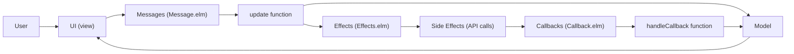

Sources:
- [web/elm/src/Build/Build.elm:677-685](https://github.com/concourse/concourse/blob/301f8064/web/elm/src/Build/Build.elm#L677-L685)
- [web/elm/src/Dashboard/Dashboard.elm:677-679](https://github.com/concourse/concourse/blob/301f8064/web/elm/src/Dashboard/Dashboard.elm#L677-L679)

## Key Components

### Dashboard

The Dashboard is the main entry point showing all pipelines organized by team:

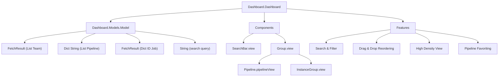

Key features:
- Team grouping with collapsible sections
- Pipeline cards showing status and job previews
- Search and filtering by name, team, or status
- High-density mode for viewing many pipelines
- Drag-and-drop for reordering pipelines
- Pipeline favoriting for quick access

Sources:
- [web/elm/src/Dashboard/Dashboard.elm](https://github.com/concourse/concourse/blob/301f8064/web/elm/src/Dashboard/Dashboard.elm)
- [web/elm/src/Dashboard/Pipeline.elm](https://github.com/concourse/concourse/blob/301f8064/web/elm/src/Dashboard/Pipeline.elm)
- [web/elm/src/Dashboard/Styles.elm](https://github.com/concourse/concourse/blob/301f8064/web/elm/src/Dashboard/Styles.elm)
- [web/elm/src/Dashboard/Group.elm](https://github.com/concourse/concourse/blob/301f8064/web/elm/src/Dashboard/Group.elm)

### Build View

The Build view shows details of a specific build, including real-time logs:

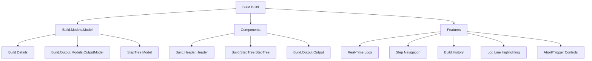

Key features:
- Hierarchical step tree showing execution status
- Real-time streaming logs with ANSI color support
- Build history navigation
- Log line highlighting via URL fragments
- Build abort and trigger controls

Sources:
- [web/elm/src/Build/Build.elm](https://github.com/concourse/concourse/blob/301f8064/web/elm/src/Build/Build.elm)
- [web/elm/src/Build/StepTree/StepTree.elm](https://github.com/concourse/concourse/blob/301f8064/web/elm/src/Build/StepTree/StepTree.elm)
- [web/elm/src/Build/Models.elm](https://github.com/concourse/concourse/blob/301f8064/web/elm/src/Build/Models.elm)
- [web/elm/src/Build/Styles.elm](https://github.com/concourse/concourse/blob/301f8064/web/elm/src/Build/Styles.elm)

### Resource View

The Resource view shows details of a specific resource, including versions:

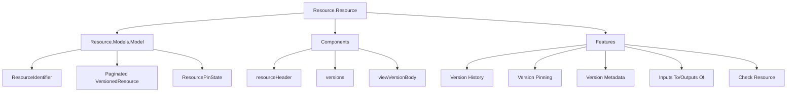

Key features:
- Version history with pagination
- Version metadata display
- Version pinning with comments
- Build input/output relationships
- Manual resource checking

Sources:
- [web/elm/src/Resource/Resource.elm](https://github.com/concourse/concourse/blob/301f8064/web/elm/src/Resource/Resource.elm)
- [web/elm/src/Resource/Models.elm](https://github.com/concourse/concourse/blob/301f8064/web/elm/src/Resource/Models.elm)
- [web/elm/src/Resource/Styles.elm](https://github.com/concourse/concourse/blob/301f8064/web/elm/src/Resource/Styles.elm)

### Pipeline View

The Pipeline view shows a visualization of jobs and resources:

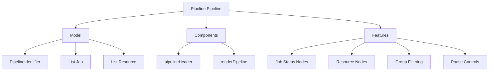

Key features:
- Visual graph of jobs and resources
- Job status indicators
- Resource version indicators
- Pipeline group filtering
- Pause/unpause controls

Sources:
- [web/elm/src/Pipeline/Pipeline.elm](https://github.com/concourse/concourse/blob/301f8064/web/elm/src/Pipeline/Pipeline.elm)
- [web/elm/tests/PipelineTests.elm](https://github.com/concourse/concourse/blob/301f8064/web/elm/tests/PipelineTests.elm)
- [web/elm/src/Pipeline/Styles.elm](https://github.com/concourse/concourse/blob/301f8064/web/elm/src/Pipeline/Styles.elm)

### Job View

The Job view shows details of a specific job and its build history:

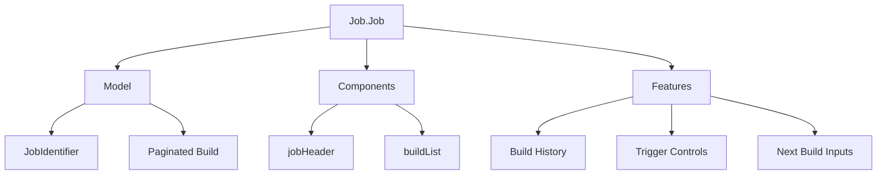

Key features:
- Build history timeline
- Build status indicators
- Manual trigger controls
- Next build input preview

Sources:
- [web/elm/src/Job/Job.elm](https://github.com/concourse/concourse/blob/301f8064/web/elm/src/Job/Job.elm)
- [web/elm/tests/JobTests.elm](https://github.com/concourse/concourse/blob/301f8064/web/elm/tests/JobTests.elm)

## Shared Components

### TopBar

The top navigation bar present in all views:

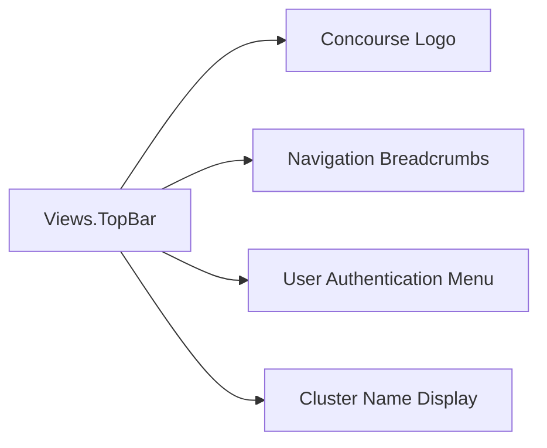

Sources:
- [web/elm/tests/TopBarTests.elm](https://github.com/concourse/concourse/blob/301f8064/web/elm/tests/TopBarTests.elm)

### SideBar

The side navigation panel that provides quick access to pipelines:

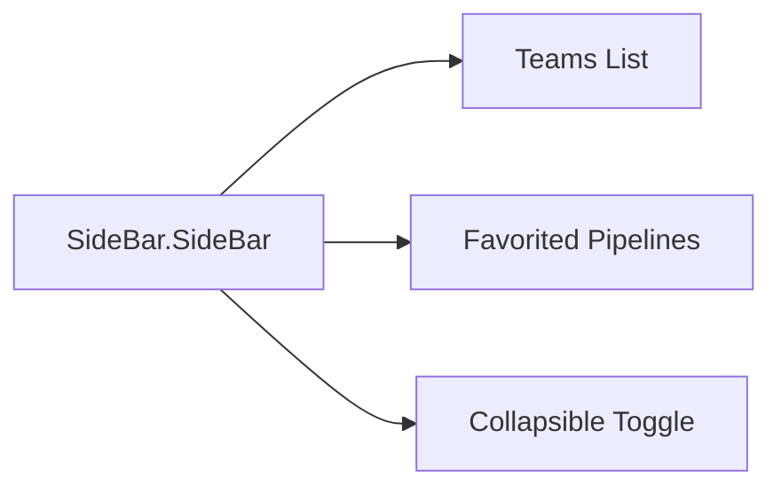

Sources:
- [web/elm/src/SideBar/SideBar.elm](https://github.com/concourse/concourse/blob/301f8064/web/elm/src/SideBar/SideBar.elm)

### Search and Filtering

The dashboard search functionality:

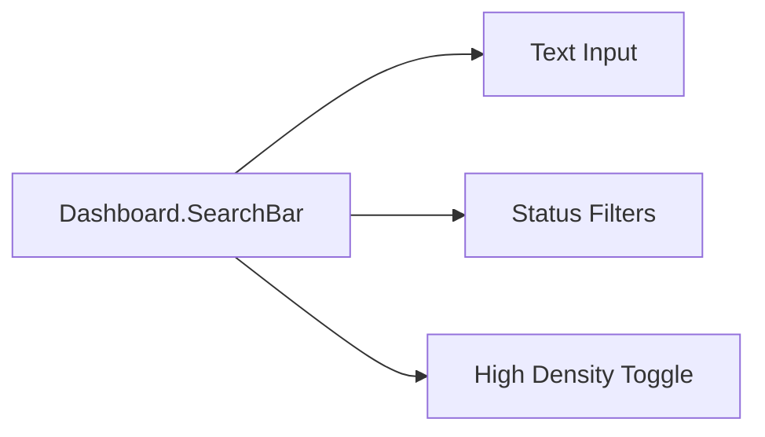

Sources:
- [web/elm/src/Dashboard/SearchBar.elm](https://github.com/concourse/concourse/blob/301f8064/web/elm/src/Dashboard/SearchBar.elm)

## CSS and Styling

The UI uses Less CSS preprocessor with modular styling components:

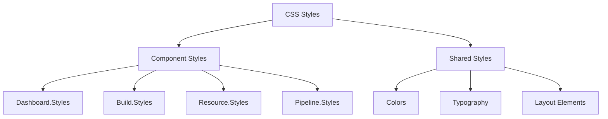

Sources:
- [web/assets/css/dashboard.less](https://github.com/concourse/concourse/blob/301f8064/web/assets/css/dashboard.less)
- [web/elm/src/Dashboard/Styles.elm](https://github.com/concourse/concourse/blob/301f8064/web/elm/src/Dashboard/Styles.elm)
- [web/elm/src/Build/Styles.elm](https://github.com/concourse/concourse/blob/301f8064/web/elm/src/Build/Styles.elm)
- [web/elm/src/Resource/Styles.elm](https://github.com/concourse/concourse/blob/301f8064/web/elm/src/Resource/Styles.elm)

## Testing

The UI is tested through:

1. **Elm Unit Tests**: Testing UI components in isolation
2. **Web Acceptance Tests (WATs)**: End-to-end testing with Puppeteer

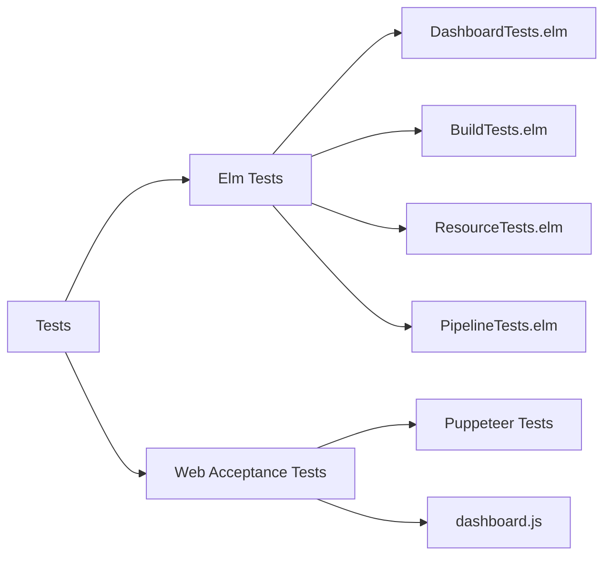

Sources:
- [web/elm/tests/DashboardTests.elm](https://github.com/concourse/concourse/blob/301f8064/web/elm/tests/DashboardTests.elm)
- [web/elm/tests/BuildTests.elm](https://github.com/concourse/concourse/blob/301f8064/web/elm/tests/BuildTests.elm)
- [web/elm/tests/ResourceTests.elm](https://github.com/concourse/concourse/blob/301f8064/web/elm/tests/ResourceTests.elm)
- [web/elm/tests/PipelineTests.elm](https://github.com/concourse/concourse/blob/301f8064/web/elm/tests/PipelineTests.elm)
- [web/wats/test/dashboard.js](https://github.com/concourse/concourse/blob/301f8064/web/wats/test/dashboard.js)

## Build Process

The frontend is built using:

1. **Elm Compiler**: Compiles Elm to JavaScript
2. **Webpack**: Bundles JavaScript and assets
3. **Less**: Compiles CSS
4. **Yarn**: Manages dependencies

The build commands are defined in package.json:

| Command | Description |
|---------|-------------|
| `build` | Builds all components (Less, Elm, JS) |
| `build-less` | Compiles Less CSS |
| `build-elm` | Compiles Elm to JavaScript |
| `build-js` | Bundles JavaScript with webpack |
| `build-debug` | Builds with debug options |
| `test` | Runs Elm tests |

Sources:
- [package.json:34-45](https://github.com/concourse/concourse/blob/301f8064/package.json#L34-L45)

## User Interface Features

### Dashboard View

The dashboard is designed to provide a quick overview of all pipelines:

- **Pipeline Cards**: Colored status indicators show health at a glance
- **Job Preview**: Mini-visualization of job statuses within each pipeline
- **Team Grouping**: Pipelines organized by team with collapsible sections
- **Instance Groups**: Support for pipeline instances with variables
- **Resource Errors**: Visual indicators for failing resource checks

### Build View

The build view focuses on debugging and monitoring build execution:

- **Step Tree**: Hierarchical view of build execution steps
- **Expandable Steps**: Click to reveal nested steps and logs
- **ANSI Color Support**: Colorized build logs
- **Auto-scroll**: Follows log output for active builds
- **Line Highlighting**: URL fragments can highlight specific log lines
- **Build History**: Navigate through job build history

### Resource View

The resource view helps manage resource versions:

- **Version History**: Shows all versions with pagination
- **Version Pinning**: Pin specific versions for consistency
- **Metadata Display**: Shows resource version metadata
- **Inputs/Outputs**: Shows builds that used or produced versions
- **Check Resource**: Manually trigger resource checks
- **Causality**: Optional visualization of resource version relationships

Sources:
- [web/elm/src/Dashboard/Dashboard.elm](https://github.com/concourse/concourse/blob/301f8064/web/elm/src/Dashboard/Dashboard.elm)
- [web/elm/src/Build/Build.elm](https://github.com/concourse/concourse/blob/301f8064/web/elm/src/Build/Build.elm)
- [web/elm/src/Resource/Resource.elm](https://github.com/concourse/concourse/blob/301f8064/web/elm/src/Resource/Resource.elm)
- [web/elm/src/Pipeline/Pipeline.elm](https://github.com/concourse/concourse/blob/301f8064/web/elm/src/Pipeline/Pipeline.elm)