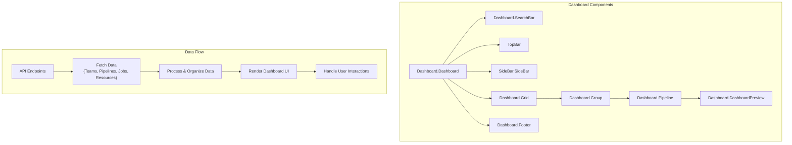
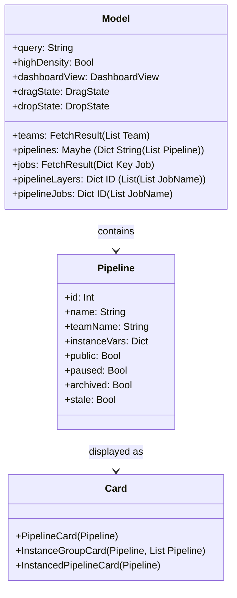
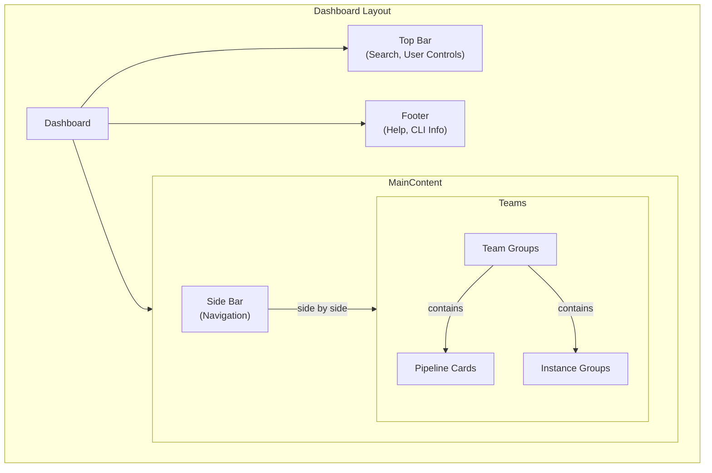
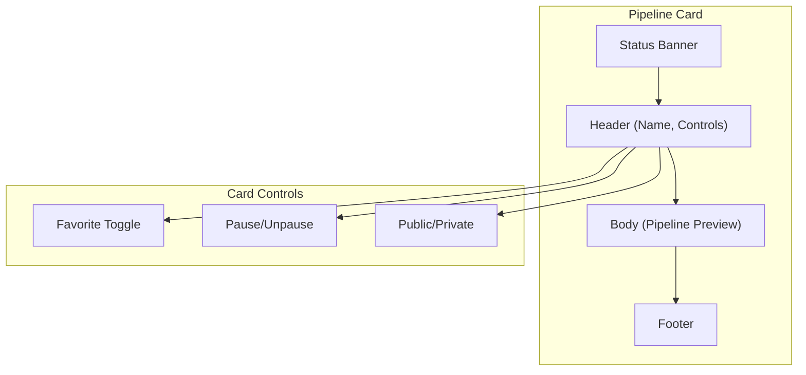
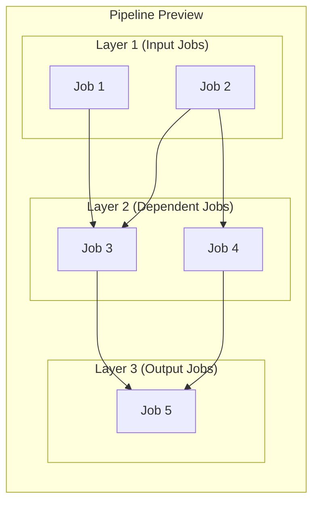

# Dashboard

Relevant source files

The following files were used as context for generating this wiki page:

- [web/assets/css/dashboard.less](https://github.com/concourse/concourse/blob/301f8064/web/assets/css/dashboard.less)
- [web/elm/benchmarks/Benchmarks.elm](https://github.com/concourse/concourse/blob/301f8064/web/elm/benchmarks/Benchmarks.elm)
- [web/elm/src/Build/Build.elm](https://github.com/concourse/concourse/blob/301f8064/web/elm/src/Build/Build.elm)
- [web/elm/src/Build/Header/Header.elm](https://github.com/concourse/concourse/blob/301f8064/web/elm/src/Build/Header/Header.elm)
- [web/elm/src/Build/Header/Models.elm](https://github.com/concourse/concourse/blob/301f8064/web/elm/src/Build/Header/Models.elm)
- [web/elm/src/Build/Header/Views.elm](https://github.com/concourse/concourse/blob/301f8064/web/elm/src/Build/Header/Views.elm)
- [web/elm/src/Build/Models.elm](https://github.com/concourse/concourse/blob/301f8064/web/elm/src/Build/Models.elm)
- [web/elm/src/Build/Output/Models.elm](https://github.com/concourse/concourse/blob/301f8064/web/elm/src/Build/Output/Models.elm)
- [web/elm/src/Build/Output/Output.elm](https://github.com/concourse/concourse/blob/301f8064/web/elm/src/Build/Output/Output.elm)
- [web/elm/src/Build/Shortcuts.elm](https://github.com/concourse/concourse/blob/301f8064/web/elm/src/Build/Shortcuts.elm)
- [web/elm/src/Build/StepTree/Models.elm](https://github.com/concourse/concourse/blob/301f8064/web/elm/src/Build/StepTree/Models.elm)
- [web/elm/src/Build/StepTree/StepTree.elm](https://github.com/concourse/concourse/blob/301f8064/web/elm/src/Build/StepTree/StepTree.elm)
- [web/elm/src/Build/Styles.elm](https://github.com/concourse/concourse/blob/301f8064/web/elm/src/Build/Styles.elm)
- [web/elm/src/Colors.elm](https://github.com/concourse/concourse/blob/301f8064/web/elm/src/Colors.elm)
- [web/elm/src/Concourse.elm](https://github.com/concourse/concourse/blob/301f8064/web/elm/src/Concourse.elm)
- [web/elm/src/Concourse/BuildEvents.elm](https://github.com/concourse/concourse/blob/301f8064/web/elm/src/Concourse/BuildEvents.elm)
- [web/elm/src/Dashboard/Dashboard.elm](https://github.com/concourse/concourse/blob/301f8064/web/elm/src/Dashboard/Dashboard.elm)
- [web/elm/src/Dashboard/Filter.elm](https://github.com/concourse/concourse/blob/301f8064/web/elm/src/Dashboard/Filter.elm)
- [web/elm/src/Dashboard/Footer.elm](https://github.com/concourse/concourse/blob/301f8064/web/elm/src/Dashboard/Footer.elm)
- [web/elm/src/Dashboard/Group.elm](https://github.com/concourse/concourse/blob/301f8064/web/elm/src/Dashboard/Group.elm)
- [web/elm/src/Dashboard/Group/Models.elm](https://github.com/concourse/concourse/blob/301f8064/web/elm/src/Dashboard/Group/Models.elm)
- [web/elm/src/Dashboard/Models.elm](https://github.com/concourse/concourse/blob/301f8064/web/elm/src/Dashboard/Models.elm)
- [web/elm/src/Dashboard/Pipeline.elm](https://github.com/concourse/concourse/blob/301f8064/web/elm/src/Dashboard/Pipeline.elm)
- [web/elm/src/Dashboard/SearchBar.elm](https://github.com/concourse/concourse/blob/301f8064/web/elm/src/Dashboard/SearchBar.elm)
- [web/elm/src/Dashboard/Styles.elm](https://github.com/concourse/concourse/blob/301f8064/web/elm/src/Dashboard/Styles.elm)
- [web/elm/src/FlySuccess/FlySuccess.elm](https://github.com/concourse/concourse/blob/301f8064/web/elm/src/FlySuccess/FlySuccess.elm)
- [web/elm/src/FlySuccess/Models.elm](https://github.com/concourse/concourse/blob/301f8064/web/elm/src/FlySuccess/Models.elm)
- [web/elm/src/FlySuccess/Styles.elm](https://github.com/concourse/concourse/blob/301f8064/web/elm/src/FlySuccess/Styles.elm)
- [web/elm/src/FlySuccess/Text.elm](https://github.com/concourse/concourse/blob/301f8064/web/elm/src/FlySuccess/Text.elm)
- [web/elm/src/Job/Job.elm](https://github.com/concourse/concourse/blob/301f8064/web/elm/src/Job/Job.elm)
- [web/elm/src/NotFound/NotFound.elm](https://github.com/concourse/concourse/blob/301f8064/web/elm/src/NotFound/NotFound.elm)
- [web/elm/src/Pipeline/Pipeline.elm](https://github.com/concourse/concourse/blob/301f8064/web/elm/src/Pipeline/Pipeline.elm)
- [web/elm/src/Resource/Models.elm](https://github.com/concourse/concourse/blob/301f8064/web/elm/src/Resource/Models.elm)
- [web/elm/src/Resource/Resource.elm](https://github.com/concourse/concourse/blob/301f8064/web/elm/src/Resource/Resource.elm)
- [web/elm/src/Resource/Styles.elm](https://github.com/concourse/concourse/blob/301f8064/web/elm/src/Resource/Styles.elm)
- [web/elm/src/Views/CommentBar.elm](https://github.com/concourse/concourse/blob/301f8064/web/elm/src/Views/CommentBar.elm)
- [web/elm/src/Views/Styles.elm](https://github.com/concourse/concourse/blob/301f8064/web/elm/src/Views/Styles.elm)
- [web/elm/src/Views/TopBar.elm](https://github.com/concourse/concourse/blob/301f8064/web/elm/src/Views/TopBar.elm)
- [web/elm/tests/Build/HeaderTests.elm](https://github.com/concourse/concourse/blob/301f8064/web/elm/tests/Build/HeaderTests.elm)
- [web/elm/tests/BuildStepTests.elm](https://github.com/concourse/concourse/blob/301f8064/web/elm/tests/BuildStepTests.elm)
- [web/elm/tests/BuildTests.elm](https://github.com/concourse/concourse/blob/301f8064/web/elm/tests/BuildTests.elm)
- [web/elm/tests/Common.elm](https://github.com/concourse/concourse/blob/301f8064/web/elm/tests/Common.elm)
- [web/elm/tests/DashboardSearchBarTests.elm](https://github.com/concourse/concourse/blob/301f8064/web/elm/tests/DashboardSearchBarTests.elm)
- [web/elm/tests/DashboardTests.elm](https://github.com/concourse/concourse/blob/301f8064/web/elm/tests/DashboardTests.elm)
- [web/elm/tests/Data.elm](https://github.com/concourse/concourse/blob/301f8064/web/elm/tests/Data.elm)
- [web/elm/tests/FlySuccessFeature.elm](https://github.com/concourse/concourse/blob/301f8064/web/elm/tests/FlySuccessFeature.elm)
- [web/elm/tests/FlySuccessTests.elm](https://github.com/concourse/concourse/blob/301f8064/web/elm/tests/FlySuccessTests.elm)
- [web/elm/tests/JobTests.elm](https://github.com/concourse/concourse/blob/301f8064/web/elm/tests/JobTests.elm)
- [web/elm/tests/PipelineCardTests.elm](https://github.com/concourse/concourse/blob/301f8064/web/elm/tests/PipelineCardTests.elm)
- [web/elm/tests/PipelineTests.elm](https://github.com/concourse/concourse/blob/301f8064/web/elm/tests/PipelineTests.elm)
- [web/elm/tests/ResourceTests.elm](https://github.com/concourse/concourse/blob/301f8064/web/elm/tests/ResourceTests.elm)
- [web/elm/tests/StepTreeTests.elm](https://github.com/concourse/concourse/blob/301f8064/web/elm/tests/StepTreeTests.elm)
- [web/elm/tests/SubPageTests.elm](https://github.com/concourse/concourse/blob/301f8064/web/elm/tests/SubPageTests.elm)
- [web/elm/tests/TopBarTests.elm](https://github.com/concourse/concourse/blob/301f8064/web/elm/tests/TopBarTests.elm)
- [web/elm/tests/WelcomeCardTests.elm](https://github.com/concourse/concourse/blob/301f8064/web/elm/tests/WelcomeCardTests.elm)

The Dashboard is the main landing page of Concourse CI, providing a comprehensive view of all pipelines across teams. It visualizes pipeline statuses, allows for organization and navigation of pipelines, and provides easy access to key pipeline operations.

For information about pipeline details and configuration, see [Pipeline Execution](#4).

## Dashboard Architecture

The Dashboard consists of several key components working together to display and manage pipelines. The system follows a component-based architecture with clear separation between data fetching, state management, and rendering.

Sources:
- [web/elm/src/Dashboard/Dashboard.elm:1-110](https://github.com/concourse/concourse/blob/301f8064/web/elm/src/Dashboard/Dashboard.elm#L1-L110)
- [web/elm/src/Dashboard/Dashboard.elm:111-220](https://github.com/concourse/concourse/blob/301f8064/web/elm/src/Dashboard/Dashboard.elm#L111-L220)

The Dashboard initializes by fetching all teams, pipelines, jobs, and resources from the API. It then organizes this data into team groups and pipeline cards, applying any filtering or sorting based on the user's view preferences.

### Core Data Structure

The Dashboard maintains several key data structures to power its visualization:

Sources:
- [web/elm/src/Dashboard/Dashboard.elm:33-44](https://github.com/concourse/concourse/blob/301f8064/web/elm/src/Dashboard/Dashboard.elm#L33-L44)
- [web/elm/src/Dashboard/Group/Models.elm](https://github.com/concourse/concourse/blob/301f8064/web/elm/src/Dashboard/Group/Models.elm)
- [web/elm/src/Dashboard/Models.elm](https://github.com/concourse/concourse/blob/301f8064/web/elm/src/Dashboard/Models.elm)

## Dashboard Views and Layouts

The Dashboard supports multiple view modes to accommodate different user needs:

1. **Normal View**: Standard view with detailed pipeline cards
2. **High-Density View**: Compact view showing more pipelines at once
3. **View All Pipelines**: Shows both active and archived pipelines
4. **View Non-Archived Pipelines**: Default view showing only active pipelines

### Normal View

In normal view, pipelines are organized into team groups, each with a header showing the team name. Pipeline cards show detailed information including:

- Pipeline name and status
- Pause/unpause controls
- Visibility controls (public/private)
- Favorite toggle
- Pipeline preview showing job status

The layout uses a responsive grid to efficiently organize pipelines within available screen space.

Sources:
- [web/elm/src/Dashboard/Dashboard.elm:850-874](https://github.com/concourse/concourse/blob/301f8064/web/elm/src/Dashboard/Dashboard.elm#L850-L874)
- [web/elm/src/Dashboard/Styles.elm:94-122](https://github.com/concourse/concourse/blob/301f8064/web/elm/src/Dashboard/Styles.elm#L94-L122)

### High-Density View

High-density view displays pipelines in a more compact format, allowing many more pipelines to be visible at once. Each pipeline is shown as a small card with:

- Color-coded status indicator
- Pipeline name
- Minimal controls

The high-density view is particularly useful for installations with many pipelines.

Sources:
- [web/elm/src/Dashboard/Dashboard.elm:472-487](https://github.com/concourse/concourse/blob/301f8064/web/elm/src/Dashboard/Dashboard.elm#L472-L487)
- [web/elm/src/Dashboard/Styles.elm:362-448](https://github.com/concourse/concourse/blob/301f8064/web/elm/src/Dashboard/Styles.elm#L362-L448)
- [web/elm/tests/DashboardTests.elm:435-455](https://github.com/concourse/concourse/blob/301f8064/web/elm/tests/DashboardTests.elm#L435-L455)

Sources:
- [web/elm/src/Dashboard/Dashboard.elm:852-874](https://github.com/concourse/concourse/blob/301f8064/web/elm/src/Dashboard/Dashboard.elm#L852-L874)
- [web/elm/tests/DashboardTests.elm:460-472](https://github.com/concourse/concourse/blob/301f8064/web/elm/tests/DashboardTests.elm#L460-L472)

## Pipeline Cards

Pipeline cards are the fundamental UI element of the Dashboard, representing individual pipelines with their current status.

### Card Components

Each pipeline card consists of:

1. **Banner**: Color-coded status indicator (success, failure, etc.)
2. **Header**: Pipeline name and controls
3. **Body**: Pipeline preview showing job status
4. **Footer**: Additional metadata

Sources:
- [web/elm/src/Dashboard/Pipeline.elm:69-117](https://github.com/concourse/concourse/blob/301f8064/web/elm/src/Dashboard/Pipeline.elm#L69-L117)
- [web/elm/src/Dashboard/Styles.elm:125-208](https://github.com/concourse/concourse/blob/301f8064/web/elm/src/Dashboard/Styles.elm#L125-L208)

### Status Representation

Pipeline status is visually represented through color-coding:

- **Green**: All jobs successful
- **Red**: One or more jobs failed
- **Orange/Amber**: One or more jobs errored
- **Blue**: Pipeline paused
- **Gray**: No jobs or idle state
- **Animated (Stripes)**: Pipeline has running jobs

The status is displayed most prominently in the card's banner and affects the entire card's appearance in high-density view.

Sources:
- [web/elm/tests/PipelineCardTests.elm:93-199](https://github.com/concourse/concourse/blob/301f8064/web/elm/tests/PipelineCardTests.elm#L93-L199)
- [web/elm/src/Dashboard/Pipeline.elm:118-167](https://github.com/concourse/concourse/blob/301f8064/web/elm/src/Dashboard/Pipeline.elm#L118-L167)

### Pipeline Preview

Each pipeline card contains a preview showing the status of individual jobs within the pipeline. Jobs are arranged in layers representing their dependencies:

Sources:
- [web/elm/src/Dashboard/DashboardPreview.elm](https://github.com/concourse/concourse/blob/301f8064/web/elm/src/Dashboard/DashboardPreview.elm)
- [web/elm/src/Dashboard/Pipeline.elm:256-296](https://github.com/concourse/concourse/blob/301f8064/web/elm/src/Dashboard/Pipeline.elm#L256-L296)

## Pipeline Instance Groups

Pipeline instances (pipelines with instance variables) can be grouped together for easier management. Instance groups are represented as cards with:

- Group name
- Instance count
- Preview of all instance statuses
- Expandable view showing individual instances

Sources:
- [web/elm/src/Dashboard/Group.elm:109-118](https://github.com/concourse/concourse/blob/301f8064/web/elm/src/Dashboard/Group.elm#L109-L118)
- [web/elm/src/Dashboard/InstanceGroup.elm](https://github.com/concourse/concourse/blob/301f8064/web/elm/src/Dashboard/InstanceGroup.elm)
- [web/elm/src/Dashboard/Styles.elm:282-332](https://github.com/concourse/concourse/blob/301f8064/web/elm/src/Dashboard/Styles.elm#L282-L332)

## Data Loading and Refresh

The Dashboard automatically loads and refreshes data to keep pipeline statuses current.

### Initial Loading

On page load, the Dashboard fetches:
1. All teams
2. All pipelines
3. All jobs 
4. All resources

This data is used to construct the initial view.

Sources:
- [web/elm/src/Dashboard/Dashboard.elm:105-147](https://github.com/concourse/concourse/blob/301f8064/web/elm/src/Dashboard/Dashboard.elm#L105-L147)
- [web/elm/tests/DashboardTests.elm:148-196](https://github.com/concourse/concourse/blob/301f8064/web/elm/tests/DashboardTests.elm#L148-L196)

### Auto-Refresh

The Dashboard subscribes to clock ticks and periodically refreshes its data:
- Every 5 seconds for most data
- Every 1 second for time-sensitive displays

This keeps the UI current without requiring manual refresh.

Sources:
- [web/elm/src/Dashboard/Dashboard.elm:836-845](https://github.com/concourse/concourse/blob/301f8064/web/elm/src/Dashboard/Dashboard.elm#L836-L845)
- [web/elm/src/Dashboard/Dashboard.elm:512-569](https://github.com/concourse/concourse/blob/301f8064/web/elm/src/Dashboard/Dashboard.elm#L512-L569)

### Error Handling

The Dashboard handles various API errors:
- Unauthorized responses (401) redirect to login
- Service unavailable responses (503) are retried
- Other failures show a "turbulence" screen

Sources:
- [web/elm/tests/DashboardTests.elm:196-365](https://github.com/concourse/concourse/blob/301f8064/web/elm/tests/DashboardTests.elm#L196-L365)

## Search and Filtering

The Dashboard includes robust search and filtering capabilities:

- Text search for pipeline names
- Team filtering
- Status filtering
- Archived pipeline filtering

The search bar in the top navigation offers real-time filtering as you type.

Sources:
- [web/elm/src/Dashboard/SearchBar.elm](https://github.com/concourse/concourse/blob/301f8064/web/elm/src/Dashboard/SearchBar.elm)
- [web/elm/src/Dashboard/Filter.elm](https://github.com/concourse/concourse/blob/301f8064/web/elm/src/Dashboard/Filter.elm)
- [web/elm/tests/TopBarTests.elm:86-104](https://github.com/concourse/concourse/blob/301f8064/web/elm/tests/TopBarTests.elm#L86-L104)

## User Interactions

### Pipeline Organization

Pipelines can be organized using drag and drop:
- Reorder pipelines within a team
- Organize instance groups

The Dashboard handles the UI updates and makes API calls to persist the new order.

Sources:
- [web/elm/src/Dashboard/Dashboard.elm:682-783](https://github.com/concourse/concourse/blob/301f8064/web/elm/src/Dashboard/Dashboard.elm#L682-L783)
- [web/elm/src/Dashboard/Drag.elm](https://github.com/concourse/concourse/blob/301f8064/web/elm/src/Dashboard/Drag.elm)

### Pipeline Controls

From the Dashboard, users can:
- Pause/unpause pipelines
- Make pipelines public/private
- Favorite pipelines for quick access
- Navigate to pipeline details

These controls are available directly on pipeline cards.

Sources:
- [web/elm/src/Dashboard/Dashboard.elm:784-833](https://github.com/concourse/concourse/blob/301f8064/web/elm/src/Dashboard/Dashboard.elm#L784-L833)
- [web/elm/src/Dashboard/Pipeline.elm:301-464](https://github.com/concourse/concourse/blob/301f8064/web/elm/src/Dashboard/Pipeline.elm#L301-L464)

## Top Bar and Navigation

The Dashboard top bar provides:
- Cluster name and branding
- Search functionality
- View mode toggles (high-density, show archived)
- User authentication controls

The top bar remains fixed while scrolling for easy access to these controls.

Sources:
- [web/elm/src/Dashboard/Dashboard.elm:1072-1106](https://github.com/concourse/concourse/blob/301f8064/web/elm/src/Dashboard/Dashboard.elm#L1072-L1106)
- [web/elm/tests/TopBarTests.elm:149-190](https://github.com/concourse/concourse/blob/301f8064/web/elm/tests/TopBarTests.elm#L149-L190)

## Responsiveness and Accessibility

The Dashboard is designed to be responsive, adapting to different screen sizes:
- Mobile view with optimized layouts
- Desktop view with more detailed information
- High-density view for large installations

Accessibility features include keyboard navigation, ARIA attributes, and focus management.

Sources:
- [web/elm/tests/DashboardTests.elm:370-408](https://github.com/concourse/concourse/blob/301f8064/web/elm/tests/DashboardTests.elm#L370-L408)
- [web/elm/src/Dashboard/Dashboard.elm:455-486](https://github.com/concourse/concourse/blob/301f8064/web/elm/src/Dashboard/Dashboard.elm#L455-L486)

## Implementation Details

### State Management

The Dashboard uses the Elm architecture for state management:
- Model: Contains all UI and data state
- Update: Handles messages and state transitions
- View: Renders the UI based on current state

Each component follows this pattern, with nested components receiving only the data they need.

Sources:
- [web/elm/src/Dashboard/Dashboard.elm:677-833](https://github.com/concourse/concourse/blob/301f8064/web/elm/src/Dashboard/Dashboard.elm#L677-L833)
- [web/elm/src/Dashboard/Models.elm](https://github.com/concourse/concourse/blob/301f8064/web/elm/src/Dashboard/Models.elm)

### Performance Optimizations

Several optimizations ensure the Dashboard remains performant:
- Lazy loading of pipeline data
- Caching of fetched data
- Request buffering to prevent API overload
- Efficient rendering with HTML keyed nodes

Sources:
- [web/elm/src/Dashboard/Dashboard.elm:178-232](https://github.com/concourse/concourse/blob/301f8064/web/elm/src/Dashboard/Dashboard.elm#L178-L232)
- [web/elm/src/Dashboard/RequestBuffer.elm](https://github.com/concourse/concourse/blob/301f8064/web/elm/src/Dashboard/RequestBuffer.elm)

## Related Pages

For more detailed information about specific components:
- [Pipeline Execution](#4): Details on how pipelines are configured and run
- [Worker System](#5): Information about the execution environment