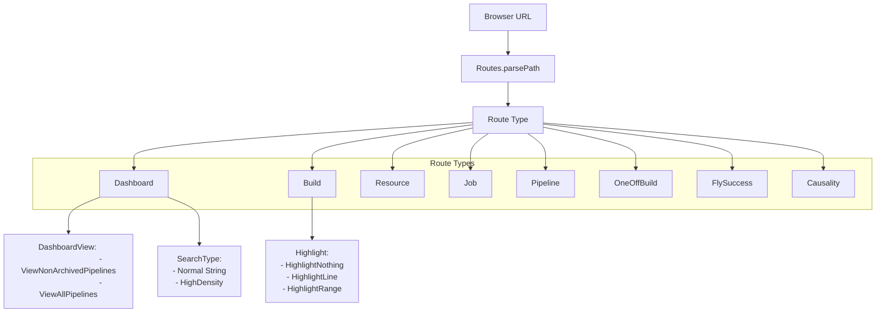
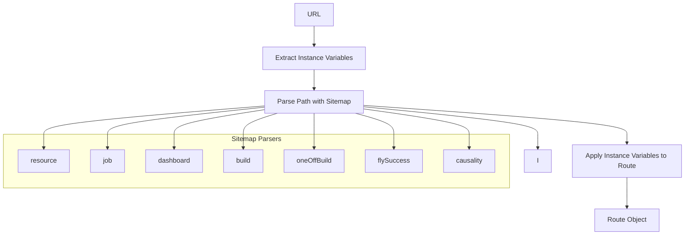
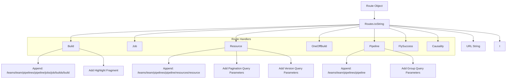
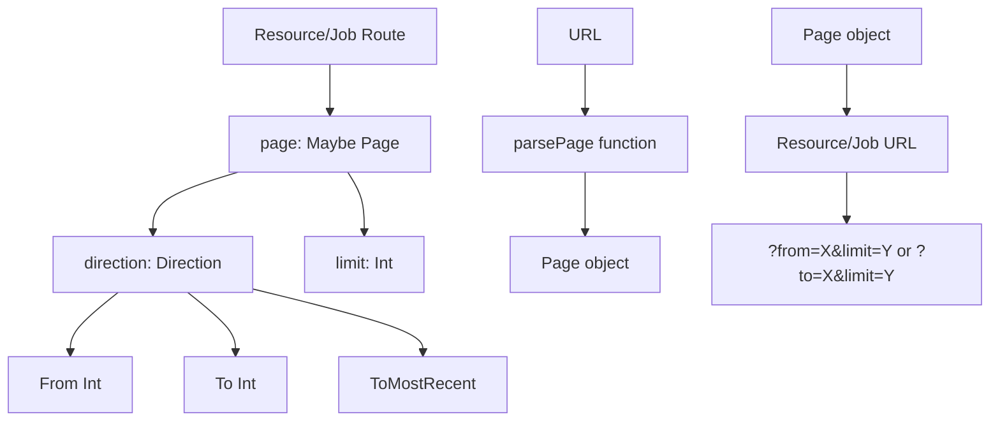

# Routing and Navigation

<details>
<summary>Relevant source files</summary>

The following files were used as context for generating this wiki page:

- [web/assets/css/build.less](https://github.com/concourse/concourse/blob/301f8064/web/assets/css/build.less)
- [web/assets/css/login.less](https://github.com/concourse/concourse/blob/301f8064/web/assets/css/login.less)
- [web/elm/src/Concourse/Pagination.elm](https://github.com/concourse/concourse/blob/301f8064/web/elm/src/Concourse/Pagination.elm)
- [web/elm/src/Routes.elm](https://github.com/concourse/concourse/blob/301f8064/web/elm/src/Routes.elm)
- [web/elm/tests/RoutesTests.elm](https://github.com/concourse/concourse/blob/301f8064/web/elm/tests/RoutesTests.elm)

</details>


## Purpose and Scope

This document describes the routing and navigation system in the Concourse web UI, which is responsible for parsing URLs, generating routes, and enabling navigation between different pages of the application. This page specifically focuses on the Elm-based frontend routing mechanism and how it integrates with the overall UI architecture. For information about the Dashboard UI components, see [Dashboard](#3.1), and for information about effects and API interactions, see [Sidebar and Effects](#3.3).

## Route Structure

The Concourse web UI uses a type-based routing system to represent different pages and their parameters.

### Route Types

The core of the routing system is the `Route` type which defines all possible pages in the application:



Sources: [web/elm/src/Routes.elm:51-60](https://github.com/concourse/concourse/blob/301f8064/web/elm/src/Routes.elm#L51-L60), [web/elm/src/Routes.elm:63-70](https://github.com/concourse/concourse/blob/301f8064/web/elm/src/Routes.elm#L63-L70), [web/elm/src/Routes.elm:88-92](https://github.com/concourse/concourse/blob/301f8064/web/elm/src/Routes.elm#L88-L92)

Each route type corresponds to a specific page in the application and contains all the necessary parameters for rendering that page. For example, the `Build` route includes the build identifier and a highlight parameter for pinpointing specific lines in the build output.

The main route types are:

| Route Type | Description | URL Pattern |
|------------|-------------|------------|
| Dashboard | Main dashboard view | `/` or `/hd` |
| Build | Pipeline build view | `/teams/{team}/pipelines/{pipeline}/jobs/{job}/builds/{build}` |
| Resource | Resource view | `/teams/{team}/pipelines/{pipeline}/resources/{resource}` |
| Job | Job view | `/teams/{team}/pipelines/{pipeline}/jobs/{job}` |
| Pipeline | Pipeline view | `/teams/{team}/pipelines/{pipeline}` |
| OneOffBuild | One-off build view | `/builds/{id}` |
| FlySuccess | Fly CLI success page | `/fly_success` |
| Causality | Resource version causality view | `/teams/{team}/pipelines/{pipeline}/resources/{resource}/causality/{id}/upstream` |

Sources: [web/elm/src/Routes.elm:107-341](https://github.com/concourse/concourse/blob/301f8064/web/elm/src/Routes.elm#L107-L341)

## URL Parsing

### Parsing Process

The `parsePath` function is the main entry point for converting a URL into a `Route`. It extracts instance variables from the URL query string and then uses the Elm URL parser to match the URL path against route patterns.



Sources: [web/elm/src/Routes.elm:580-594](https://github.com/concourse/concourse/blob/301f8064/web/elm/src/Routes.elm#L580-L594), [web/elm/src/Routes.elm:468-479](https://github.com/concourse/concourse/blob/301f8064/web/elm/src/Routes.elm#L468-L479)

### Parsing Instance Variables

Instance variables are extracted from the URL query string parameters that start with `vars.`. They are then parsed into a hierarchical structure using the `DotNotation` parser.

```
Example URL: /teams/team/pipelines/pipeline?vars.foo=bar&vars.baz.qux=123
Parsed vars: { "foo": "bar", "baz": { "qux": 123 } }
```

Sources: [web/elm/src/Routes.elm:583-592](https://github.com/concourse/concourse/blob/301f8064/web/elm/src/Routes.elm#L583-L592)

### Parsing Highlights

The `Highlight` type is used to highlight specific lines in build output. It's parsed from the URL fragment (the part after `#`):

| Fragment | Highlight Type |
|----------|---------------|
| `#L{stepID}:{line}` | Highlight a single line |
| `#L{stepID}:{line1}:{line2}` | Highlight a range of lines |

Sources: [web/elm/src/Routes.elm:423-453](https://github.com/concourse/concourse/blob/301f8064/web/elm/src/Routes.elm#L423-L453)

## URL Generation

The `toString` function converts a `Route` back to a URL string. This is essential for generating links and redirecting users within the application.



Sources: [web/elm/src/Routes.elm:482-577](https://github.com/concourse/concourse/blob/301f8064/web/elm/src/Routes.elm#L482-L577)

### Query Parameter Generation

Different route types generate different query parameters:

- Dashboard routes may include search parameters and view type
- Resource routes include pagination and version filter parameters
- Pipeline routes include group parameters and instance variables

Sources: [web/elm/src/Routes.elm:640-648](https://github.com/concourse/concourse/blob/301f8064/web/elm/src/Routes.elm#L640-L648), [web/elm/src/Routes.elm:514](https://github.com/concourse/concourse/blob/301f8064/web/elm/src/Routes.elm#L514)

## Navigation System

The routing system works in conjunction with the Elm Architecture's navigation capabilities:

1. User clicks a link or submits a form
2. The URL changes
3. The `parsePath` function converts the URL to a `Route`
4. The application updates its state based on the new route
5. The view is re-rendered to reflect the new state

### Route Utilities

The codebase provides several utility functions to simplify route creation:

- `buildRoute`: Creates a Build route from a build ID and name
- `jobRoute`: Creates a Job route from a Job object
- `resourceRoute`: Creates a Resource route from a resource identifier
- `pipelineRoute`: Creates a Pipeline route from a pipeline identifier

Sources: [web/elm/src/Routes.elm:348-402](https://github.com/concourse/concourse/blob/301f8064/web/elm/src/Routes.elm#L348-L402)

## Pagination Integration

The routing system integrates with pagination for resources and jobs through the `Page` type in the `Concourse.Pagination` module.



Sources: [web/elm/src/Routes.elm:156-173](https://github.com/concourse/concourse/blob/301f8064/web/elm/src/Routes.elm#L156-L173), [web/elm/src/Concourse/Pagination.elm:31-40](https://github.com/concourse/concourse/blob/301f8064/web/elm/src/Concourse/Pagination.elm#L31-L40)

### Pagination Parameters

When parsing URLs, the system looks for:
- `from`: The starting point for forward pagination
- `to`: The starting point for backward pagination
- `limit`: The number of items per page

When generating URLs, these parameters are added as query parameters.

Sources: [web/elm/src/Routes.elm:193-200](https://github.com/concourse/concourse/blob/301f8064/web/elm/src/Routes.elm#L193-L200), [web/elm/src/Routes.elm:495](https://github.com/concourse/concourse/blob/301f8064/web/elm/src/Routes.elm#L495)

## Route Testing

The routing system is thoroughly tested to ensure proper URL parsing and generation:

1. Dashboard routes with different search queries and views
2. Pipeline routes with instance variables
3. Resource routes with version filters
4. Build routes with highlight parameters

These tests verify that a URL parsed into a `Route` and then converted back to a URL maintains its semantic meaning.

Sources: [web/elm/tests/RoutesTests.elm:10-299](https://github.com/concourse/concourse/blob/301f8064/web/elm/tests/RoutesTests.elm#L10-L299)

## Practical Examples

### Creating a Link to a Build

```elm
buildRoute : Int -> String -> Maybe Concourse.JobIdentifier -> Route
buildRoute id name jobId =
    case jobId of
        Just j ->
            Build
                { id =
                    { teamName = j.teamName
                    , pipelineName = j.pipelineName
                    , pipelineInstanceVars = j.pipelineInstanceVars
                    , jobName = j.jobName
                    , buildName = name
                    }
                , highlight = HighlightNothing
                , groups = []
                }

        Nothing ->
            OneOffBuild { id = id, highlight = HighlightNothing }
```

This creates either a Build route or OneOffBuild route depending on whether the build is part of a job.

Sources: [web/elm/src/Routes.elm:348-365](https://github.com/concourse/concourse/blob/301f8064/web/elm/src/Routes.elm#L348-L365)

### Creating a Link to a Resource with Version

```elm
resourceRoute : Concourse.ResourceIdentifier -> Maybe Concourse.Version -> Route
resourceRoute r v =
    Resource
        { id =
            { teamName = r.teamName
            , pipelineName = r.pipelineName
            , pipelineInstanceVars = r.pipelineInstanceVars
            , resourceName = r.resourceName
            }
        , page = Nothing
        , version = v
        , groups = []
        }
```

This creates a Resource route optionally filtered to a specific version.

Sources: [web/elm/src/Routes.elm:382-394](https://github.com/concourse/concourse/blob/301f8064/web/elm/src/Routes.elm#L382-L394)

### Handling Highlighted Build Output

When a user clicks on a line number in the build output, a highlight route is generated:

```elm
showHighlight : Highlight -> String
showHighlight hl =
    case hl of
        HighlightNothing ->
            ""

        HighlightLine id line ->
            "#L" ++ id ++ ":" ++ String.fromInt line

        HighlightRange id line1 line2 ->
            "#L"
                ++ id
                ++ ":"
                ++ String.fromInt line1
                ++ ":"
                ++ String.fromInt line2
```

This generates a fragment that is appended to the URL, which is then parsed when the page loads to highlight the specified lines.