# Sidebar and Effects

Relevant source files

The following files were used as context for generating this wiki page:

- [web/elm/src/Application/Application.elm](https://github.com/concourse/concourse/blob/301f8064/web/elm/src/Application/Application.elm)
- [web/elm/src/Message/Callback.elm](https://github.com/concourse/concourse/blob/301f8064/web/elm/src/Message/Callback.elm)
- [web/elm/src/Message/Effects.elm](https://github.com/concourse/concourse/blob/301f8064/web/elm/src/Message/Effects.elm)
- [web/elm/src/Message/Message.elm](https://github.com/concourse/concourse/blob/301f8064/web/elm/src/Message/Message.elm)
- [web/elm/src/SideBar/Pipeline.elm](https://github.com/concourse/concourse/blob/301f8064/web/elm/src/SideBar/Pipeline.elm)
- [web/elm/src/SideBar/SideBar.elm](https://github.com/concourse/concourse/blob/301f8064/web/elm/src/SideBar/SideBar.elm)
- [web/elm/src/SideBar/Styles.elm](https://github.com/concourse/concourse/blob/301f8064/web/elm/src/SideBar/Styles.elm)
- [web/elm/src/SideBar/Team.elm](https://github.com/concourse/concourse/blob/301f8064/web/elm/src/SideBar/Team.elm)
- [web/elm/src/SideBar/Views.elm](https://github.com/concourse/concourse/blob/301f8064/web/elm/src/SideBar/Views.elm)
- [web/elm/src/SubPage/SubPage.elm](https://github.com/concourse/concourse/blob/301f8064/web/elm/src/SubPage/SubPage.elm)
- [web/elm/tests/SideBar/PipelineTests.elm](https://github.com/concourse/concourse/blob/301f8064/web/elm/tests/SideBar/PipelineTests.elm)
- [web/elm/tests/SideBar/TeamTests.elm](https://github.com/concourse/concourse/blob/301f8064/web/elm/tests/SideBar/TeamTests.elm)
- [web/elm/tests/SideBarFeature.elm](https://github.com/concourse/concourse/blob/301f8064/web/elm/tests/SideBarFeature.elm)

This page documents the Sidebar UI component and the Effects system in the Concourse CI codebase. The Sidebar provides navigation between teams and pipelines, while the Effects system manages side effects like API calls, DOM manipulation, and state persistence. For dashboard-specific UI components, see [Dashboard](#3.1).

## Overview

The Sidebar is a collapsible navigation panel that displays teams and their pipelines, allowing users to quickly navigate between different parts of the application. It supports favoriting pipelines, expanding/collapsing teams, and resizing.

The Effects system provides a centralized way to handle side effects in the Elm application, including API calls, navigation, local storage interactions, and DOM manipulations.

Sources: [web/elm/src/SideBar/SideBar.elm](https://github.com/concourse/concourse/blob/301f8064/web/elm/src/SideBar/SideBar.elm), [web/elm/src/Message/Effects.elm](https://github.com/concourse/concourse/blob/301f8064/web/elm/src/Message/Effects.elm)

## Sidebar Component Architecture

The Sidebar is composed of several key components:

### Component Structure
- **SideBar Icon**: Toggles the sidebar visibility
- **Team Headers**: Display team names and expand/collapse controls
- **Pipeline Items**: Link to individual pipelines with favoriting ability
- **Instance Groups**: Groups of related pipeline instances
- **Favorites Section**: Contains favorited pipelines across all teams
- **Resize Handle**: Allows adjusting the sidebar width

```mermaid
classDiagram
    class Model {
        expandedTeamsInAllPipelines: Set String
        collapsedTeamsInFavorites: Set String
        pipelines: WebData (List Pipeline)
        sideBarState: SideBarState
        draggingSideBar: Bool
        screenSize: ScreenSize
        route: Route
    }
    
    class SideBarState {
        isOpen: Bool
        width: Float
    }
    
    class Team {
        name: String
        isExpanded: Bool
        listItems: List TeamListItem
    }
    
    class TeamListItem {
        <<enumeration>>
        PipelineListItem(Pipeline)
        InstanceGroupListItem(InstanceGroup)
    }
    
    class Pipeline {
        icon: Icon
        name: String
        background: Background
        href: String
        domID: DomID
        starIcon: StarIcon
    }
    
    class InstanceGroup {
        name: String
        background: Background
        badge: Badge
        starIcon: StarIcon
    }
    
    Model --> SideBarState
    Model --> "*" Team
    Team --> "*" TeamListItem
    TeamListItem --> Pipeline
    TeamListItem --> InstanceGroup
```

Sources: [web/elm/src/SideBar/SideBar.elm:46-60](https://github.com/concourse/concourse/blob/301f8064/web/elm/src/SideBar/SideBar.elm#L46-L60), [web/elm/src/SideBar/Views.elm:22-36](https://github.com/concourse/concourse/blob/301f8064/web/elm/src/SideBar/Views.elm#L22-L36), [web/elm/src/SideBar/Views.elm:66-68](https://github.com/concourse/concourse/blob/301f8064/web/elm/src/SideBar/Views.elm#L66-L68), [web/elm/src/SideBar/Views.elm:76-92](https://github.com/concourse/concourse/blob/301f8064/web/elm/src/SideBar/Views.elm#L76-L92)

### State Management

The sidebar maintains several pieces of state:
- Whether it's open or closed (`sideBarState.isOpen`)
- Its width in pixels (`sideBarState.width`)
- Which teams are expanded in the "All Pipelines" section (`expandedTeamsInAllPipelines`)
- Which teams are collapsed in the "Favorites" section (`collapsedTeamsInFavorites`)
- Whether the resize handle is being dragged (`draggingSideBar`)

The state is persisted in local storage, allowing it to be restored when the user returns to the application.

Sources: [web/elm/src/SideBar/SideBar.elm:71-124](https://github.com/concourse/concourse/blob/301f8064/web/elm/src/SideBar/SideBar.elm#L71-L124), [web/elm/src/SideBar/SideBar.elm:186-216](https://github.com/concourse/concourse/blob/301f8064/web/elm/src/SideBar/SideBar.elm#L186-L216)

### Pipeline Organization

Pipelines are organized by team and can be displayed in two sections:

1. **All Pipelines**: Shows all visible pipelines organized by team
2. **Favorites**: Shows only favorited pipelines organized by team

Each pipeline can be in one of three forms:
- **Regular Pipeline**: A standard pipeline
- **Instanced Pipeline**: A pipeline with instance variables
- **Instance Group**: A group of related pipeline instances

Sources: [web/elm/src/SideBar/SideBar.elm:343-385](https://github.com/concourse/concourse/blob/301f8064/web/elm/src/SideBar/SideBar.elm#L343-L385), [web/elm/src/SideBar/SideBar.elm:388-457](https://github.com/concourse/concourse/blob/301f8064/web/elm/src/SideBar/SideBar.elm#L388-L457), [web/elm/src/SideBar/Team.elm:22-26](https://github.com/concourse/concourse/blob/301f8064/web/elm/src/SideBar/Team.elm#L22-L26)

### Interaction Handling

The sidebar handles various user interactions through the Elm message system:

- **Click SideBarIcon**: Toggles sidebar visibility
- **Click SideBarTeam**: Expands/collapses team pipeline list
- **Click SideBarResizeHandle**: Initiates sidebar width dragging
- **Hover**: Gets viewport information for tooltips

These interactions generate messages that are processed by the `update` function, which may produce effects like saving state or updating the DOM.

Sources: [web/elm/src/SideBar/SideBar.elm:71-124](https://github.com/concourse/concourse/blob/301f8064/web/elm/src/SideBar/SideBar.elm#L71-L124), [web/elm/src/Message/Message.elm:110-121](https://github.com/concourse/concourse/blob/301f8064/web/elm/src/Message/Message.elm#L110-L121)

## Effects System

The Effects system manages side effects in the application through a well-defined interface.

### Effect Types

The `Effect` type in `Message.Effects` defines all possible side effects in the application:

- Fetching data from API (jobs, pipelines, teams, etc.)
- Navigation (changing routes, external links)
- DOM manipulation (focusing elements, scrolling)
- Local storage (saving/loading state)
- Rendering (pipeline visualizations, icons)

Sources: [web/elm/src/Message/Effects.elm:122-209](https://github.com/concourse/concourse/blob/301f8064/web/elm/src/Message/Effects.elm#L122-L209), [web/elm/src/Message/Callback.elm:21-65](https://github.com/concourse/concourse/blob/301f8064/web/elm/src/Message/Callback.elm#L21-L65)

### Running Effects

The `runEffect` function translates an `Effect` into a command that produces a `Callback`:

Sources: [web/elm/src/Message/Effects.elm:215-738](https://github.com/concourse/concourse/blob/301f8064/web/elm/src/Message/Effects.elm#L215-L738)

## Sidebar and Effects Integration

The sidebar uses effects for various operations:

1. **State Persistence**: When the sidebar state changes, effects save it to local storage
2. **Viewport Information**: Effects fetch DOM element positions for tooltips
3. **Resource Loading**: Effects fetch pipelines and teams from the API
4. **Favoriting**: Effects save favorited pipelines to local storage

Sources: [web/elm/src/SideBar/SideBar.elm:71-124](https://github.com/concourse/concourse/blob/301f8064/web/elm/src/SideBar/SideBar.elm#L71-L124), [web/elm/src/Application/Application.elm:251-259](https://github.com/concourse/concourse/blob/301f8064/web/elm/src/Application/Application.elm#L251-L259)

## Sidebar Display Logic

The sidebar's visibility depends on several factors:

1. **SideBarState**: The `isOpen` flag in `sideBarState`
2. **Pipeline Visibility**: At least one visible pipeline must exist
3. **Screen Size**: Not visible on mobile screens

A pipeline is considered visible if it's not archived or if it's favorited by the user.

Sources: [web/elm/src/SideBar/SideBar.elm:221-250](https://github.com/concourse/concourse/blob/301f8064/web/elm/src/SideBar/SideBar.elm#L221-L250), [web/elm/src/SideBar/SideBar.elm:517-525](https://github.com/concourse/concourse/blob/301f8064/web/elm/src/SideBar/SideBar.elm#L517-L525)

## Tooltip Handling

The sidebar provides tooltips for various elements:

- **Team Names**: Show the full team name
- **Pipeline Names**: Show the full pipeline name or instance variables
- **Instance Group Names**: Show the full group name
- **Sidebar Icon**: Show "hide sidebar", "show sidebar", or "no visible pipelines"

Tooltips are positioned based on the element's location and provide additional context for truncated text.

Sources: [web/elm/src/SideBar/SideBar.elm:253-340](https://github.com/concourse/concourse/blob/301f8064/web/elm/src/SideBar/SideBar.elm#L253-L340)

## Styling and UI Elements

The sidebar uses a consistent styling system defined in `SideBar.Styles`:

| UI Element | Styling |
|------------|---------|
| SideBar | Fixed width, vertical scrolling, light background |
| Team Header | Horizontal layout, centered content, expandable |
| Pipeline Item | Horizontal layout, icon + name + star |
| Resize Handle | Vertical draggable area, cursor: col-resize |

The styling includes:
- Background colors for different states (normal, hovered, active)
- Text colors and weights
- Spacing and padding
- Icon styles for different states

Sources: [web/elm/src/SideBar/Styles.elm:62-73](https://github.com/concourse/concourse/blob/301f8064/web/elm/src/SideBar/Styles.elm#L62-L73), [web/elm/src/SideBar/Styles.elm:107-119](https://github.com/concourse/concourse/blob/301f8064/web/elm/src/SideBar/Styles.elm#L107-L119), [web/elm/src/SideBar/Styles.elm:292-298](https://github.com/concourse/concourse/blob/301f8064/web/elm/src/SideBar/Styles.elm#L292-L298)

## Common Workflow Examples

### Opening/Closing the Sidebar

1. User clicks the sidebar icon in the top bar
2. `Click SideBarIcon` message is generated
3. `SideBar.update` toggles `sideBarState.isOpen`
4. `SaveSideBarState` effect is created
5. Effect is executed, saving state to local storage
6. View function either displays or hides the sidebar

### Resizing the Sidebar

1. User presses the resize handle
2. `Click SideBarResizeHandle` message is generated
3. `draggingSideBar` is set to true
4. Mouse movement events update `sideBarState.width`
5. On mouse up, `SaveSideBarState` effect is created
6. Width is clamped between 100px and 600px

### Team Expansion/Collapse

1. User clicks a team header
2. `Click (SideBarTeam section teamName)` message is generated
3. For All Pipelines section, team is toggled in `expandedTeamsInAllPipelines`
4. For Favorites section, team is toggled in `collapsedTeamsInFavorites`
5. Expanded teams show their pipelines, collapsed teams hide them

### Pipeline Favoriting

1. User clicks a pipeline's star icon
2. `Click (SideBarPipelineFavoritedIcon id)` message is generated
3. Pipeline ID is toggled in `favoritedPipelines` set
4. `SaveFavoritedPipelines` effect is created
5. Favorited pipelines appear in the Favorites section

Sources: [web/elm/src/SideBar/SideBar.elm:71-124](https://github.com/concourse/concourse/blob/301f8064/web/elm/src/SideBar/SideBar.elm#L71-L124), [web/elm/tests/SideBarFeature.elm:303-316](https://github.com/concourse/concourse/blob/301f8064/web/elm/tests/SideBarFeature.elm#L303-L316)

## Implementation Details

### Message Types

The sidebar uses several message types defined in `Message.Message`:

- **DomID**: Identifies DOM elements like `SideBarIcon`, `SideBarTeam`, `SideBarPipeline`
- **PipelinesSection**: Distinguishes between `FavoritesSection` and `AllPipelinesSection`
- **Message**: Represents user actions like `Click` and `Hover`

Sources: [web/elm/src/Message/Message.elm:52-120](https://github.com/concourse/concourse/blob/301f8064/web/elm/src/Message/Message.elm#L52-L120), [web/elm/src/Message/Message.elm:127-129](https://github.com/concourse/concourse/blob/301f8064/web/elm/src/Message/Message.elm#L127-L129)

### Effects and Ports

The Effects system uses Elm ports to communicate with JavaScript:

Relevant ports include:
- `renderSvgIcon`: Renders SVG icons
- `pinTeamNames`: Manages sticky headers
- `scrollToId`: Scrolls to specific elements
- `openEventStream`: Opens event streams for real-time updates

Sources: [web/elm/src/Message/Effects.elm:57-96](https://github.com/concourse/concourse/blob/301f8064/web/elm/src/Message/Effects.elm#L57-L96), [web/elm/src/Message/Effects.elm:973-1016](https://github.com/concourse/concourse/blob/301f8064/web/elm/src/Message/Effects.elm#L973-L1016)

### Testing

The sidebar is extensively tested with both unit and functional tests:

- `SideBarFeature.elm`: Tests sidebar behavior and interactions
- `SideBar/PipelineTests.elm`: Tests pipeline rendering
- `SideBar/TeamTests.elm`: Tests team rendering

These tests ensure the sidebar behaves correctly in various scenarios, including:
- Visibility conditions
- Expansion/collapse
- Favoriting
- Resizing
- Styling and appearance