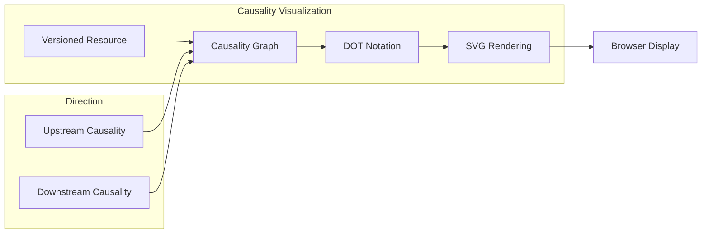
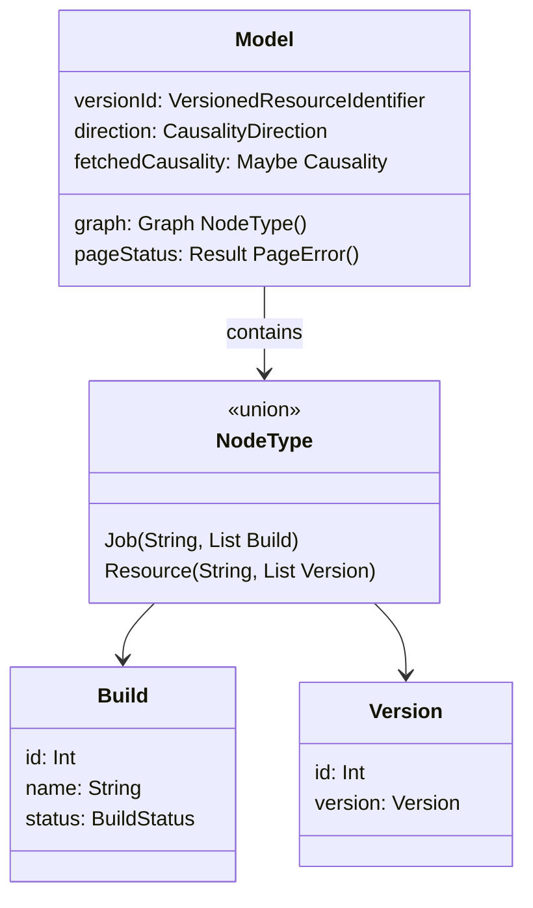
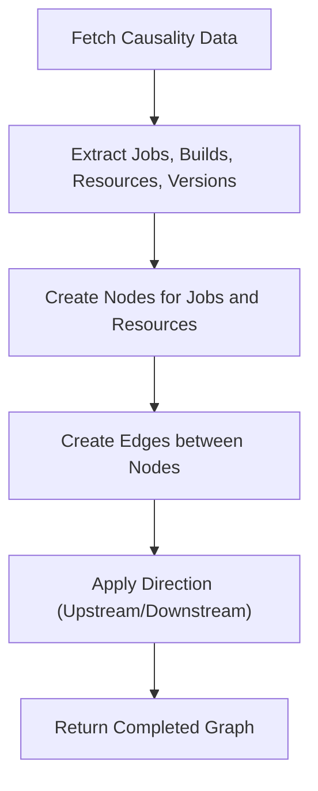
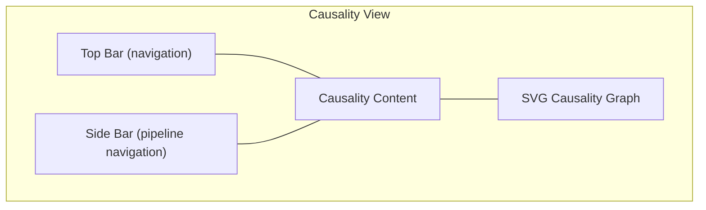

# Build Visualization

<details>
<summary>Relevant source files</summary>

The following files were used as context for generating this wiki page:

- [web/assets/css/_vars.less](https://github.com/concourse/concourse/blob/301f8064/web/assets/css/_vars.less)
- [web/assets/css/buttons.less](https://github.com/concourse/concourse/blob/301f8064/web/assets/css/buttons.less)
- [web/assets/css/colors.less](https://github.com/concourse/concourse/blob/301f8064/web/assets/css/colors.less)
- [web/assets/css/job.less](https://github.com/concourse/concourse/blob/301f8064/web/assets/css/job.less)
- [web/assets/css/layout.less](https://github.com/concourse/concourse/blob/301f8064/web/assets/css/layout.less)
- [web/assets/css/main.less](https://github.com/concourse/concourse/blob/301f8064/web/assets/css/main.less)
- [web/assets/css/modules.less](https://github.com/concourse/concourse/blob/301f8064/web/assets/css/modules.less)
- [web/assets/css/pagination.less](https://github.com/concourse/concourse/blob/301f8064/web/assets/css/pagination.less)
- [web/assets/css/production.less](https://github.com/concourse/concourse/blob/301f8064/web/assets/css/production.less)
- [web/assets/css/svg.less](https://github.com/concourse/concourse/blob/301f8064/web/assets/css/svg.less)
- [web/assets/css/turbulence.less](https://github.com/concourse/concourse/blob/301f8064/web/assets/css/turbulence.less)
- [web/assets/css/utils.less](https://github.com/concourse/concourse/blob/301f8064/web/assets/css/utils.less)
- [web/elm/src/Causality/Causality.elm](https://github.com/concourse/concourse/blob/301f8064/web/elm/src/Causality/Causality.elm)
- [web/elm/tests/CausalityTest.elm](https://github.com/concourse/concourse/blob/301f8064/web/elm/tests/CausalityTest.elm)

</details>


This page documents the build causality visualization system in Concourse CI. The system provides a graphical representation of the relationships between resource versions and builds, allowing users to trace how resources flow through pipelines in both upstream and downstream directions. For information about the general UI components, see [Web UI](#3).

## Overview

The build visualization system creates a causality graph that shows the relationships between builds and resource versions. This visualization helps users understand:

- Which resource versions triggered which builds
- Which builds produced which resource versions
- How resources flow through the pipeline chain



Sources: [web/elm/src/Causality/Causality.elm:62-80](https://github.com/concourse/concourse/blob/301f8064/web/elm/src/Causality/Causality.elm#L62-L80)

## Causality Types and Data Model

The build visualization system deals with two primary entity types: resource versions and builds. These are represented in the causality graph as nodes with connections between them.

### Core Data Types



Sources: [web/elm/src/Causality/Causality.elm:309-325](https://github.com/concourse/concourse/blob/301f8064/web/elm/src/Causality/Causality.elm#L309-L325), [web/elm/src/Causality/Causality.elm:67-79](https://github.com/concourse/concourse/blob/301f8064/web/elm/src/Causality/Causality.elm#L67-L79)

### Causality Directions

The system supports two causality directions:

1. **Downstream Causality**: Shows what a resource version influenced (what builds used it and what resource versions those builds produced)
2. **Upstream Causality**: Shows what influenced a resource version (what builds produced it and what resource versions those builds used)

## Graph Construction

The causality graph is constructed from data fetched from the server. The graph is a directed graph where:

- Nodes represent either jobs (with their builds) or resources (with their versions)
- Edges represent the flow of resources (used as inputs or produced as outputs by builds)

### Graph Construction Process



Sources: [web/elm/src/Causality/Causality.elm:327-426](https://github.com/concourse/concourse/blob/301f8064/web/elm/src/Causality/Causality.elm#L327-L426)

The `constructGraph` function takes the causality data and direction as inputs and produces a graph structure. It:

1. Extracts builds and resource versions from the causality data
2. Creates nodes for jobs and resources
3. Establishes connections between them based on build inputs and outputs
4. Adjusts the edge direction based on whether it's upstream or downstream causality

## Graph Visualization

The graph is visualized using the DOT language, a standard graph description language used by GraphViz. The system converts the internal graph structure to DOT notation which is then rendered as an SVG.

### DOT Notation Generation

The system generates DOT notation with:
- Node attributes for jobs and resources
- Edge attributes for connections
- HTML-like labels with build information and resource version details
- Links to builds and resource versions

Sources: [web/elm/src/Causality/Causality.elm:451-579](https://github.com/concourse/concourse/blob/301f8064/web/elm/src/Causality/Causality.elm#L451-L579)

### Visual Styling

The causality graph employs distinct visual styling:

- Job nodes are rectangular
- Resource nodes are rounded rectangles
- Build status is indicated by colors
- Versions are displayed with their key-value pairs

Sources: [web/assets/css/svg.less:8-14](https://github.com/concourse/concourse/blob/301f8064/web/assets/css/svg.less#L8-L14), [web/assets/css/colors.less:28-54](https://github.com/concourse/concourse/blob/301f8064/web/assets/css/colors.less#L28-L54)

## User Interface

The causality visualization is presented in a dedicated view that includes:

- The SVG causality graph
- Navigation elements (breadcrumbs, sidebar)
- Error messages for special cases

### Layout



Sources: [web/elm/src/Causality/Causality.elm:232-262](https://github.com/concourse/concourse/blob/301f8064/web/elm/src/Causality/Causality.elm#L232-L262), [web/assets/css/production.less:294-299](https://github.com/concourse/concourse/blob/301f8064/web/assets/css/production.less#L294-L299)

## Error Handling

The system handles several error cases gracefully:

1. **Too Many Nodes**: When the graph contains more than 5000 builds or 25000 resource versions, it displays an error message suggesting to try a less popular resource version.

2. **No Causality**: When a resource version has no causality (wasn't used in any builds), it displays a message suggesting to try a more popular resource version.

3. **Not Found/Unauthorized**: When the requested resource version doesn't exist or the user doesn't have permission to view it.

Sources: [web/elm/src/Causality/Causality.elm:265-306](https://github.com/concourse/concourse/blob/301f8064/web/elm/src/Causality/Causality.elm#L265-L306), [web/elm/src/Causality/Causality.elm:142-165](https://github.com/concourse/concourse/blob/301f8064/web/elm/src/Causality/Causality.elm#L142-L165)

## Interaction with Other Components

The build visualization integrates with other Concourse components:

- It uses the general navigation and layout components
- It links to build and resource pages
- It accesses the Concourse API to fetch causality data

```mermaid
graph TD
    subgraph "Concourse Components"
        CausalityViz["Causality Visualization"]
        TopBar["Top Bar Component"]
        SideBar["Side Bar Component"]
        API["Concourse API"]
        BuildPage["Build Page"]
        ResourcePage["Resource Page"]
    end
    
    API --> CausalityViz: "Provides causality data"
    CausalityViz --> TopBar: "Includes for navigation"
    CausalityViz --> SideBar: "Includes for pipeline context"
    CausalityViz --> BuildPage: "Links to relevant builds"
    CausalityViz --> ResourcePage: "Links to resource versions"
```

Sources: [web/elm/src/Causality/Causality.elm:232-262](https://github.com/concourse/concourse/blob/301f8064/web/elm/src/Causality/Causality.elm#L232-L262)

## Example Use Cases

The causality visualization is particularly useful for:

1. **Debugging Build Failures**: Trace which resource version caused a build to fail.
2. **Tracking Resource Flow**: See how a resource version propagates through a pipeline.
3. **Understanding Pipeline Dependencies**: Visualize the connections between different jobs and resources.
4. **Auditing**: Track the provenance of a resource version to understand its origins.