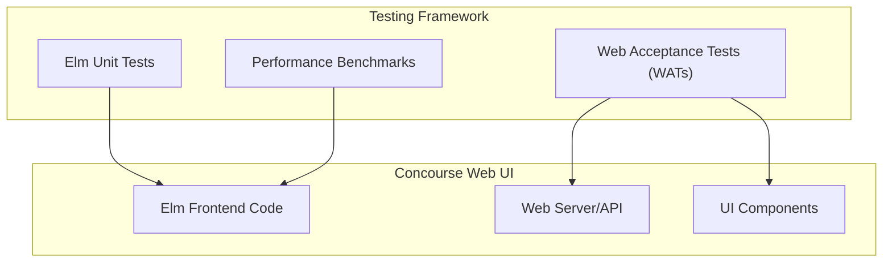
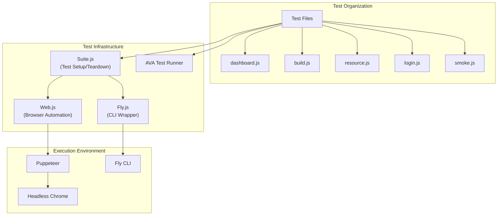
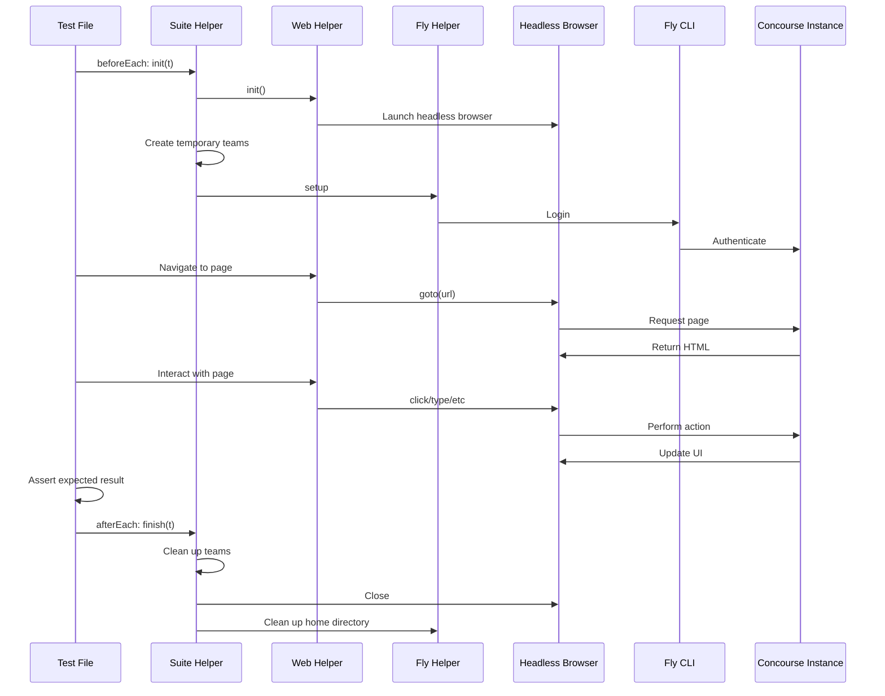
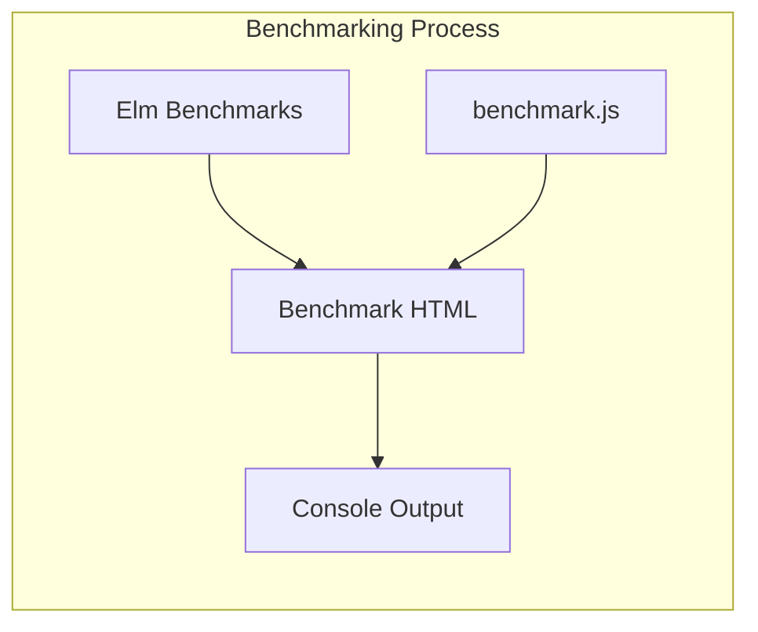

# Testing

<details>
<summary>Relevant source files</summary>

The following files were used as context for generating this wiki page:

- [package.json](https://github.com/concourse/concourse/blob/301f8064/package.json)
- [web/elm/benchmarks/benchmark.js](https://github.com/concourse/concourse/blob/301f8064/web/elm/benchmarks/benchmark.js)
- [web/elm/elm.json](https://github.com/concourse/concourse/blob/301f8064/web/elm/elm.json)
- [web/wats/fixtures/smoke-pipeline.yml](https://github.com/concourse/concourse/blob/301f8064/web/wats/fixtures/smoke-pipeline.yml)
- [web/wats/fixtures/smoke-task.yml](https://github.com/concourse/concourse/blob/301f8064/web/wats/fixtures/smoke-task.yml)
- [web/wats/fixtures/some-input/message](https://github.com/concourse/concourse/blob/301f8064/web/wats/fixtures/some-input/message)
- [web/wats/helpers/fly.js](https://github.com/concourse/concourse/blob/301f8064/web/wats/helpers/fly.js)
- [web/wats/helpers/palette.js](https://github.com/concourse/concourse/blob/301f8064/web/wats/helpers/palette.js)
- [web/wats/helpers/suite.js](https://github.com/concourse/concourse/blob/301f8064/web/wats/helpers/suite.js)
- [web/wats/helpers/web.js](https://github.com/concourse/concourse/blob/301f8064/web/wats/helpers/web.js)
- [web/wats/package-lock.json](https://github.com/concourse/concourse/blob/301f8064/web/wats/package-lock.json)
- [web/wats/package.json](https://github.com/concourse/concourse/blob/301f8064/web/wats/package.json)
- [web/wats/test/build.js](https://github.com/concourse/concourse/blob/301f8064/web/wats/test/build.js)
- [web/wats/test/dashboard.js](https://github.com/concourse/concourse/blob/301f8064/web/wats/test/dashboard.js)
- [web/wats/test/login.js](https://github.com/concourse/concourse/blob/301f8064/web/wats/test/login.js)
- [web/wats/test/resource.js](https://github.com/concourse/concourse/blob/301f8064/web/wats/test/resource.js)
- [web/wats/test/smoke.js](https://github.com/concourse/concourse/blob/301f8064/web/wats/test/smoke.js)
- [web/wats/yarn.lock](https://github.com/concourse/concourse/blob/301f8064/web/wats/yarn.lock)
- [webpack.config.js](https://github.com/concourse/concourse/blob/301f8064/webpack.config.js)
- [yarn.lock](https://github.com/concourse/concourse/blob/301f8064/yarn.lock)

</details>


This page documents the testing frameworks and methodologies used in Concourse CI's web interface, with a focus on Web Acceptance Tests (WATs). WATs are end-to-end tests that verify the functionality of the Concourse web UI by automating browser interactions and validating expected behaviors.

## Testing Types in Concourse UI



Sources: [web/elm/elm.json:43-49](https://github.com/concourse/concourse/blob/301f8064/web/elm/elm.json#L43-L49), [package.json:40](https://github.com/concourse/concourse/blob/301f8064/package.json#L40), [web/wats/package.json:14-17](https://github.com/concourse/concourse/blob/301f8064/web/wats/package.json#L14-L17)

## Web Acceptance Tests (WATs) Architecture

WATs are built using Puppeteer for browser automation and AVA as the test runner. The tests simulate real user interactions with the Concourse web interface and verify the expected outcomes.



Sources: [web/wats/package.json:5-14](https://github.com/concourse/concourse/blob/301f8064/web/wats/package.json#L5-L14), [web/wats/helpers/suite.js](https://github.com/concourse/concourse/blob/301f8064/web/wats/helpers/suite.js), [web/wats/helpers/web.js](https://github.com/concourse/concourse/blob/301f8064/web/wats/helpers/web.js), [web/wats/helpers/fly.js](https://github.com/concourse/concourse/blob/301f8064/web/wats/helpers/fly.js)

## Test Suite Structure

Each WAT test typically follows a consistent structure:



Sources: [web/wats/test/dashboard.js:9-20](https://github.com/concourse/concourse/blob/301f8064/web/wats/test/dashboard.js#L9-L20), [web/wats/test/build.js:7-18](https://github.com/concourse/concourse/blob/301f8064/web/wats/test/build.js#L7-L18), [web/wats/helpers/suite.js:24-32](https://github.com/concourse/concourse/blob/301f8064/web/wats/helpers/suite.js#L24-L32)

## Key Testing Components

### Suite Helper

The `Suite` class in `suite.js` handles test initialization and cleanup:

- Creates temporary teams for isolation
- Initializes the Fly CLI wrapper
- Sets up the browser environment
- Handles proper test teardown

```javascript
async init(t) {
  await this.newTeam(this.adminUsername, this.teamName);
  await this.newTeam(this.guestUsername, this.guestTeamName);
  await this.fly.init();
  await this.web.init();
  await this.web.login(t);
  
  this.succeeded = false;
}
```

Sources: [web/wats/helpers/suite.js:24-32](https://github.com/concourse/concourse/blob/301f8064/web/wats/helpers/suite.js#L24-L32)

### Web Helper

The `Web` class in `web.js` provides methods for browser interaction:

- Browser initialization with Puppeteer
- Navigation helpers
- Element selection and interaction
- Text and color verification
- Login automation

```javascript
async waitForText(text) {
  return this.page.waitForFunction((text) => {
    return document.body.innerText.indexOf(text) !== -1
  }, {
    polling: 100,
    timeout: 90000
  }, text)
    .catch(_ => {})
}

async clickAndWait(clickSelector, waitSelector) {
  await this.page.waitForSelector(clickSelector);
  await this.page.click(clickSelector);
  await this.page.waitForSelector(waitSelector, {timeout: 90000});
}
```

Sources: [web/wats/helpers/web.js:40-93](https://github.com/concourse/concourse/blob/301f8064/web/wats/helpers/web.js#L40-L93)

### Fly Helper

The `Fly` class in `fly.js` provides methods for interacting with the Concourse CLI:

- Pipeline configuration
- Resource checking
- Job triggering
- Team management

```javascript
run(command) {
  return this._run(`fly -t ${this.target} ${command}`);
}

loginAs(teamName) {
  return this.run(`login -c ${this.url} -n ${teamName} -u ${this.username} -p ${this.password}`);
}
```

Sources: [web/wats/helpers/fly.js:33-51](https://github.com/concourse/concourse/blob/301f8064/web/wats/helpers/fly.js#L33-L51)

## Example Tests

### Dashboard Tests

Tests for the dashboard functionality include:

- Verifying team visibility based on authentication
- Checking pipeline display order
- Testing auto-refresh functionality
- Validating cluster name display

```javascript
test('shows pipelines in their correct order', async t => {
  let pipelineOrder = ['first', 'second', 'third', 'fourth', 'fifth'];

  for (var i = 0; i < pipelineOrder.length; i++) {
    let name = pipelineOrder[i];
    await t.context.fly.run(`set-pipeline -n -p ${name} -c fixtures/states-pipeline.yml`);
  }

  await t.context.web.page.goto(t.context.web.route('/'));
  // ... verify pipeline order
});
```

Sources: [web/wats/test/dashboard.js:54-76](https://github.com/concourse/concourse/blob/301f8064/web/wats/test/dashboard.js#L54-L76)

### Build Tests

Tests for the build view include:

- Verifying hook execution (abort hooks)
- Testing build navigation
- Validating build status updates

```javascript
test('shows abort hooks', async t => {
  await t.context.fly.run('set-pipeline -n -p some-pipeline -c fixtures/hooks-pipeline.yml');
  await t.context.fly.run('unpause-pipeline -p some-pipeline');
  
  await t.context.fly.run('trigger-job -j some-pipeline/on_abort');
  
  // ... test abort hook behavior
});
```

Sources: [web/wats/test/build.js:20-46](https://github.com/concourse/concourse/blob/301f8064/web/wats/test/build.js#L20-L46)

### Resource Tests

Tests for resource management include:

- Pinning and unpinning resource versions
- Resource state visualization
- Resource check triggering

```javascript
test('can unpin from top bar when pinned version is not in the versions list', async t => {
  await setupPipeline(t);
  await pinVersion(t);
  await resetVersionsList(t);
  await unpinVersionUsingTopBar(t);
  await reloadPageAndCheckResourceIsStillNotPinned(t);
  t.pass();
});
```

Sources: [web/wats/test/resource.js:22-29](https://github.com/concourse/concourse/blob/301f8064/web/wats/test/resource.js#L22-L29)

## Login Testing

User authentication testing covers:

- Authentication flow with fly CLI
- Browser-based authentication
- Security aspects like password autocomplete prevention

```javascript
test('can fly login with browser and reuse same browser without CSRF issues', async t => {
  let flyPromise = t.context.fly.spawn(`login -c ${t.context.url}`);
  flyPromise.childProcess.stdout.on('data', async data => {
    // ... process login URL and complete login flow
  });
  // ... verify successful login
});
```

Sources: [web/wats/test/login.js:34-62](https://github.com/concourse/concourse/blob/301f8064/web/wats/test/login.js#L34-L62)

## Benchmarking

In addition to functional tests, Concourse has performance benchmarks for the Elm frontend code:



The benchmarking system:
- Uses Elm's benchmark library to measure performance
- Compiles benchmarks to HTML
- Uses Puppeteer to load and run the benchmarks
- Reports results to the console

```javascript
async run() {
  await this.web.init();
  await this.web.page.goto(this.url);
  await this.web.waitForText('Benchmark Report');
  const bodyHandle = await this.web.page.$('body > div > div');
  const html = await this.web.page.evaluate(body => body.innerText, bodyHandle);
  console.log(html);
}
```

Sources: [web/elm/benchmarks/benchmark.js:9-21](https://github.com/concourse/concourse/blob/301f8064/web/elm/benchmarks/benchmark.js#L9-L21), [package.json:45](https://github.com/concourse/concourse/blob/301f8064/package.json#L45)

## Running Tests

To run the Web Acceptance Tests:

```bash
cd web/wats
yarn test
```

The tests are configured to run serially with a 5-minute timeout per test:

```json
"scripts": {
  "test": "ava --serial"
},
"ava": {
  "timeout": "5m"
}
```

Sources: [web/wats/package.json:16-28](https://github.com/concourse/concourse/blob/301f8064/web/wats/package.json#L16-L28)

## Test Environment Configuration

Tests use environment variables for configuration:

| Variable | Description | Default |
|----------|-------------|---------|
| ATC_URL | URL of the Concourse server | http://localhost:8080 |
| ATC_ADMIN_USERNAME | Admin username | test |
| ATC_ADMIN_PASSWORD | Admin password | test |
| ATC_GUEST_USERNAME | Guest username | guest |
| ATC_GUEST_PASSWORD | Guest password | guest |

Sources: [web/wats/helpers/suite.js:9-14](https://github.com/concourse/concourse/blob/301f8064/web/wats/helpers/suite.js#L9-L14), [web/wats/test/login.js:7-10](https://github.com/concourse/concourse/blob/301f8064/web/wats/test/login.js#L7-L10)