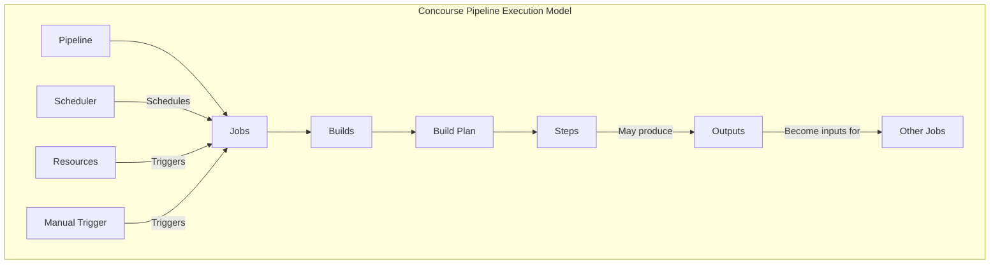
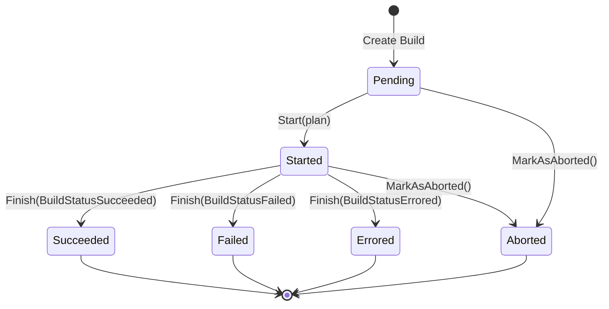
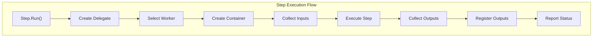
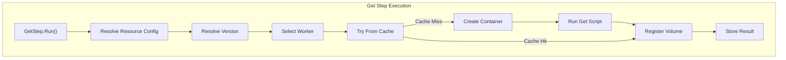
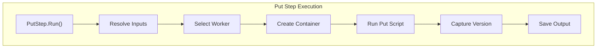
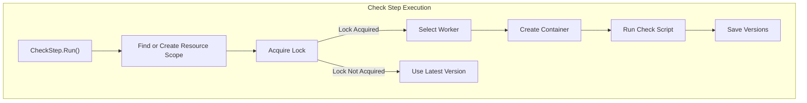
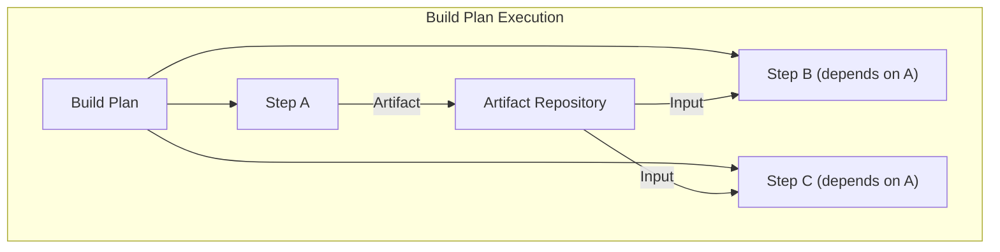
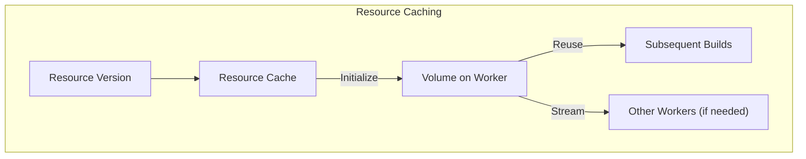
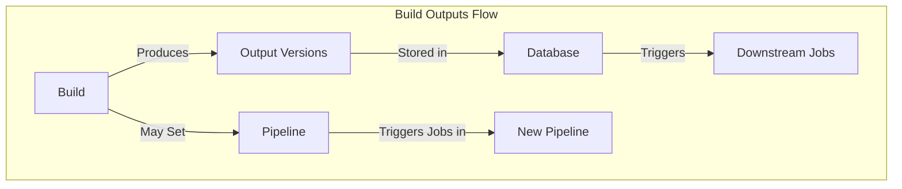

# Pipeline Execution

Relevant source files

The following files were used as context for generating this wiki page:

- [atc/db/build.go](https://github.com/concourse/concourse/blob/301f8064/atc/db/build.go)
- [atc/db/build_test.go](https://github.com/concourse/concourse/blob/301f8064/atc/db/build_test.go)
- [atc/db/dbfakes/fake_build.go](https://github.com/concourse/concourse/blob/301f8064/atc/db/dbfakes/fake_build.go)
- [atc/db/dbfakes/fake_job.go](https://github.com/concourse/concourse/blob/301f8064/atc/db/dbfakes/fake_job.go)
- [atc/db/dbfakes/fake_pipeline.go](https://github.com/concourse/concourse/blob/301f8064/atc/db/dbfakes/fake_pipeline.go)
- [atc/db/dbfakes/fake_team.go](https://github.com/concourse/concourse/blob/301f8064/atc/db/dbfakes/fake_team.go)
- [atc/db/job.go](https://github.com/concourse/concourse/blob/301f8064/atc/db/job.go)
- [atc/db/job_factory.go](https://github.com/concourse/concourse/blob/301f8064/atc/db/job_factory.go)
- [atc/db/job_factory_test.go](https://github.com/concourse/concourse/blob/301f8064/atc/db/job_factory_test.go)
- [atc/db/job_test.go](https://github.com/concourse/concourse/blob/301f8064/atc/db/job_test.go)
- [atc/db/pipeline.go](https://github.com/concourse/concourse/blob/301f8064/atc/db/pipeline.go)
- [atc/db/pipeline_test.go](https://github.com/concourse/concourse/blob/301f8064/atc/db/pipeline_test.go)
- [atc/db/team.go](https://github.com/concourse/concourse/blob/301f8064/atc/db/team.go)
- [atc/db/team_test.go](https://github.com/concourse/concourse/blob/301f8064/atc/db/team_test.go)
- [atc/exec/build_step_delegate.go](https://github.com/concourse/concourse/blob/301f8064/atc/exec/build_step_delegate.go)
- [atc/exec/check_step.go](https://github.com/concourse/concourse/blob/301f8064/atc/exec/check_step.go)
- [atc/exec/check_step_test.go](https://github.com/concourse/concourse/blob/301f8064/atc/exec/check_step_test.go)
- [atc/exec/execfakes/fake_build_step_delegate.go](https://github.com/concourse/concourse/blob/301f8064/atc/exec/execfakes/fake_build_step_delegate.go)
- [atc/exec/execfakes/fake_check_delegate.go](https://github.com/concourse/concourse/blob/301f8064/atc/exec/execfakes/fake_check_delegate.go)
- [atc/exec/execfakes/fake_get_delegate.go](https://github.com/concourse/concourse/blob/301f8064/atc/exec/execfakes/fake_get_delegate.go)
- [atc/exec/execfakes/fake_put_delegate.go](https://github.com/concourse/concourse/blob/301f8064/atc/exec/execfakes/fake_put_delegate.go)
- [atc/exec/execfakes/fake_set_pipeline_step_delegate.go](https://github.com/concourse/concourse/blob/301f8064/atc/exec/execfakes/fake_set_pipeline_step_delegate.go)
- [atc/exec/execfakes/fake_task_delegate.go](https://github.com/concourse/concourse/blob/301f8064/atc/exec/execfakes/fake_task_delegate.go)
- [atc/exec/get_step.go](https://github.com/concourse/concourse/blob/301f8064/atc/exec/get_step.go)
- [atc/exec/get_step_test.go](https://github.com/concourse/concourse/blob/301f8064/atc/exec/get_step_test.go)
- [atc/exec/put_inputs.go](https://github.com/concourse/concourse/blob/301f8064/atc/exec/put_inputs.go)
- [atc/exec/put_step.go](https://github.com/concourse/concourse/blob/301f8064/atc/exec/put_step.go)
- [atc/exec/put_step_test.go](https://github.com/concourse/concourse/blob/301f8064/atc/exec/put_step_test.go)
- [atc/exec/task_step.go](https://github.com/concourse/concourse/blob/301f8064/atc/exec/task_step.go)
- [atc/exec/task_step_test.go](https://github.com/concourse/concourse/blob/301f8064/atc/exec/task_step_test.go)
- [atc/scheduler/build.go](https://github.com/concourse/concourse/blob/301f8064/atc/scheduler/build.go)
- [atc/scheduler/buildstarter.go](https://github.com/concourse/concourse/blob/301f8064/atc/scheduler/buildstarter.go)
- [atc/scheduler/buildstarter_test.go](https://github.com/concourse/concourse/blob/301f8064/atc/scheduler/buildstarter_test.go)
- [atc/scheduler/runner.go](https://github.com/concourse/concourse/blob/301f8064/atc/scheduler/runner.go)
- [atc/scheduler/runner_test.go](https://github.com/concourse/concourse/blob/301f8064/atc/scheduler/runner_test.go)
- [atc/scheduler/scheduler.go](https://github.com/concourse/concourse/blob/301f8064/atc/scheduler/scheduler.go)
- [atc/scheduler/scheduler_test.go](https://github.com/concourse/concourse/blob/301f8064/atc/scheduler/scheduler_test.go)
- [atc/scheduler/schedulerfakes/fake_build_planner.go](https://github.com/concourse/concourse/blob/301f8064/atc/scheduler/schedulerfakes/fake_build_planner.go)
- [atc/scheduler/schedulerfakes/fake_build_scheduler.go](https://github.com/concourse/concourse/blob/301f8064/atc/scheduler/schedulerfakes/fake_build_scheduler.go)
- [atc/scheduler/schedulerfakes/fake_build_starter.go](https://github.com/concourse/concourse/blob/301f8064/atc/scheduler/schedulerfakes/fake_build_starter.go)

This page provides an overview of how pipelines, jobs, builds, and steps are executed in Concourse CI. It covers the execution model, build lifecycle, and the process of executing individual steps. For information about the scheduler specifically, see [Scheduler](#4.1), and for details on build execution internals, see [Build Execution](#4.2).

## Pipeline Execution Model

In Concourse, pipeline execution follows a structured model where resources and jobs form the nodes of a dependency graph, and their connections form the edges. Understanding this model helps in troubleshooting pipeline issues and explaining Concourse's behavior.

At the top level, a **Pipeline** contains multiple **Jobs** and **Resources**. Jobs can have multiple **Builds** (instances of job execution). Each build has a **Plan** consisting of multiple **Steps**. Steps can be of different types (`get`, `put`, `task`, `check`) and can consume or produce resources.

Sources: [atc/db/pipeline.go:54-127](https://github.com/concourse/concourse/blob/301f8064/atc/db/pipeline.go#L54-L127), [atc/db/job.go:58-112](https://github.com/concourse/concourse/blob/301f8064/atc/db/job.go#L58-L112), [atc/db/build.go:120-221](https://github.com/concourse/concourse/blob/301f8064/atc/db/build.go#L120-L221)

## Build Lifecycle

Builds are the execution instances of jobs. They go through specific states during their lifecycle:

The build states are defined in the codebase as:

| Build Status | Description |
|--------------|-------------|
| `BuildStatusPending` | Build is created but not yet started |
| `BuildStatusStarted` | Build is actively running |
| `BuildStatusSucceeded` | Build completed successfully |
| `BuildStatusFailed` | Build completed but one or more steps failed |
| `BuildStatusErrored` | Build encountered an error during execution |
| `BuildStatusAborted` | Build was manually aborted |

Each build is tracked in the database with an ID, name, job reference, team reference, start/end times, and its execution plan.

Sources: [atc/db/build.go:54-67](https://github.com/concourse/concourse/blob/301f8064/atc/db/build.go#L54-L67), [atc/db/build.go:528-615](https://github.com/concourse/concourse/blob/301f8064/atc/db/build.go#L528-L615), [atc/db/build.go:610-815](https://github.com/concourse/concourse/blob/301f8064/atc/db/build.go#L610-L815)

## Build Creation

Builds can be created through several mechanisms:

1. **Scheduled builds**: Created automatically by the scheduler when a job's inputs are satisfied
2. **Manual builds**: Created by users through the web UI or `fly trigger-job`
3. **Rerun builds**: Created as a rerun of a previous build via `fly rerun-build`

When a build is created, it starts in the `Pending` state and waits to be picked up by the scheduler's build starter component. 

For a job build, the system will:
1. Check if the job is paused
2. Check if the job's pipeline is paused
3. Check if the job has reached its maximum concurrent builds limit
4. Check if the job's inputs are ready

Only if all these checks pass will the build transition to the `Started` state and begin execution.

Sources: [atc/db/job.go:683-750](https://github.com/concourse/concourse/blob/301f8064/atc/db/job.go#L683-L750), [atc/db/pipeline.go:274-316](https://github.com/concourse/concourse/blob/301f8064/atc/db/pipeline.go#L274-L316), [atc/db/build.go:528-608](https://github.com/concourse/concourse/blob/301f8064/atc/db/build.go#L528-L608)

## Step Execution

Steps are the individual operations within a build plan. The four primary types of steps are:

1. **Get**: Fetches resources and makes them available to the build
2. **Put**: Outputs resources to external systems
3. **Task**: Runs commands in containers
4. **Check**: Checks for new versions of resources

### General Step Execution Flow

Each step type follows a similar pattern with specific differences:

Sources: [atc/exec/task_step.go:125-150](https://github.com/concourse/concourse/blob/301f8064/atc/exec/task_step.go#L125-L150), [atc/exec/get_step.go:125-136](https://github.com/concourse/concourse/blob/301f8064/atc/exec/get_step.go#L125-L136), [atc/exec/put_step.go:93-104](https://github.com/concourse/concourse/blob/301f8064/atc/exec/put_step.go#L93-L104), [atc/exec/check_step.go:79-99](https://github.com/concourse/concourse/blob/301f8064/atc/exec/check_step.go#L79-L99)

### Task Step Execution

Task steps run commands in containers on workers:

```mermaid
graph TD
    subgraph "Task Step Execution"
        TaskStep["TaskStep.Run()"] --> FetchTaskConfig["Fetch Task Config"]
        FetchTaskConfig --> ResolveImageSpec["Resolve Image Spec"]
        ResolveImageSpec --> SelectWorker["Select Worker"]
        SelectWorker --> FindOrCreateContainer["Find or Create Container"]
        FindOrCreateContainer --> RunProcess["Run Process"]
        RunProcess --> CaptureExitStatus["Capture Exit Status"]
        CaptureExitStatus --> RegisterOutputs["Register Outputs"]
        RegisterOutputs --> |"If Job Build"| RegisterCaches["Register Caches"]
    end
```

A task step's execution includes:
1. Resolving the task configuration (from file or inline)
2. Selecting an appropriate worker
3. Creating a container on that worker
4. Running the task's script
5. Capturing outputs and registering them as artifacts

Sources: [atc/exec/task_step.go:140-336](https://github.com/concourse/concourse/blob/301f8064/atc/exec/task_step.go#L140-L336)

### Get Step Execution

Get steps fetch resources and make them available to the build:

The get step will first try to find the resource version in the resource cache before running a container to fetch it. This optimization helps avoid redundant resource fetches.

Sources: [atc/exec/get_step.go:125-267](https://github.com/concourse/concourse/blob/301f8064/atc/exec/get_step.go#L125-L267)

### Put Step Execution

Put steps upload resources to external systems:

Put steps can be configured to use a subset of the build's artifacts as inputs, or to automatically detect inputs based on the parameters.

Sources: [atc/exec/put_step.go:93-264](https://github.com/concourse/concourse/blob/301f8064/atc/exec/put_step.go#L93-L264)

### Check Step Execution

Check steps determine if new versions of resources are available:

Resource checks are synchronized using locks to prevent multiple checks of the same resource from running concurrently.

Sources: [atc/exec/check_step.go:79-336](https://github.com/concourse/concourse/blob/301f8064/atc/exec/check_step.go#L79-L336)

## Build Plan Execution

A build plan organizes steps in a structured way, defining dependencies and execution order:

The build plan execution includes:
1. Parsing the plan into executable steps
2. Determining step dependencies
3. Executing steps in the correct order
4. Passing artifacts between steps through the artifact repository
5. Handling errors and failures

Builds can also store versioned outputs in the database, which can trigger downstream jobs or be used for future build inputs.

Sources: [atc/db/build.go:528-608](https://github.com/concourse/concourse/blob/301f8064/atc/db/build.go#L528-L608), [atc/db/build.go:610-815](https://github.com/concourse/concourse/blob/301f8064/atc/db/build.go#L610-L815)

## Resource Caching and Volume Management

Concourse optimizes resource fetching through a sophisticated caching system:

When a `get` step is executed, Concourse:
1. Checks if the resource version is already cached on any worker
2. Uses the cached version if available, avoiding redundant fetching
3. If not cached, runs the resource script to fetch it
4. Initializes the fetched content as a reusable volume

This system significantly improves performance for frequently used resources.

Sources: [atc/exec/get_step.go:225-434](https://github.com/concourse/concourse/blob/301f8064/atc/exec/get_step.go#L225-L434)

## Build Outputs and Pipelines

Builds can produce outputs that are stored in the database and used to trigger downstream jobs:

Successful builds can also set pipelines dynamically using the `set_pipeline` step, allowing for pipeline generation at runtime.

Sources: [atc/db/build.go:610-775](https://github.com/concourse/concourse/blob/301f8064/atc/db/build.go#L610-L775)

## Build Completion

When a build completes (succeeds, fails, errors, or is aborted), several important actions occur:

1. The build's end time is recorded
2. A status event is emitted to the event stream
3. For successful builds, outputs are registered in the database
4. Downstream jobs that depend on the build's outputs are notified
5. Job stats are updated (latest completed build, etc.)
6. Any child pipelines set by older builds may be archived

These completion actions ensure that the pipeline graph continues to flow properly and resource versions propagate correctly.

Sources: [atc/db/build.go:610-815](https://github.com/concourse/concourse/blob/301f8064/atc/db/build.go#L610-L815)

## Summary

Pipeline execution in Concourse involves a sophisticated orchestration of multiple components:

1. **Jobs** define what work to do and when to do it
2. **Builds** are instances of jobs being executed
3. **Steps** (`get`, `put`, `task`, `check`) perform the actual work
4. **Resources** connect the pipeline to the outside world
5. **Workers** provide the execution environment for steps
6. **Artifacts** allow data to flow between steps
7. **Resource caching** optimizes repeated resource fetches

Understanding these components and their interactions is crucial for effectively designing, debugging, and optimizing Concourse pipelines.