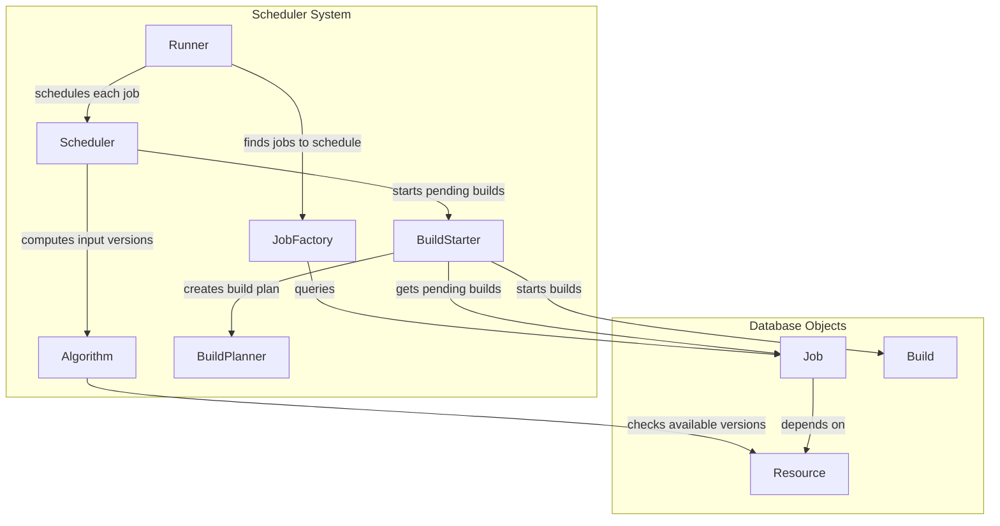
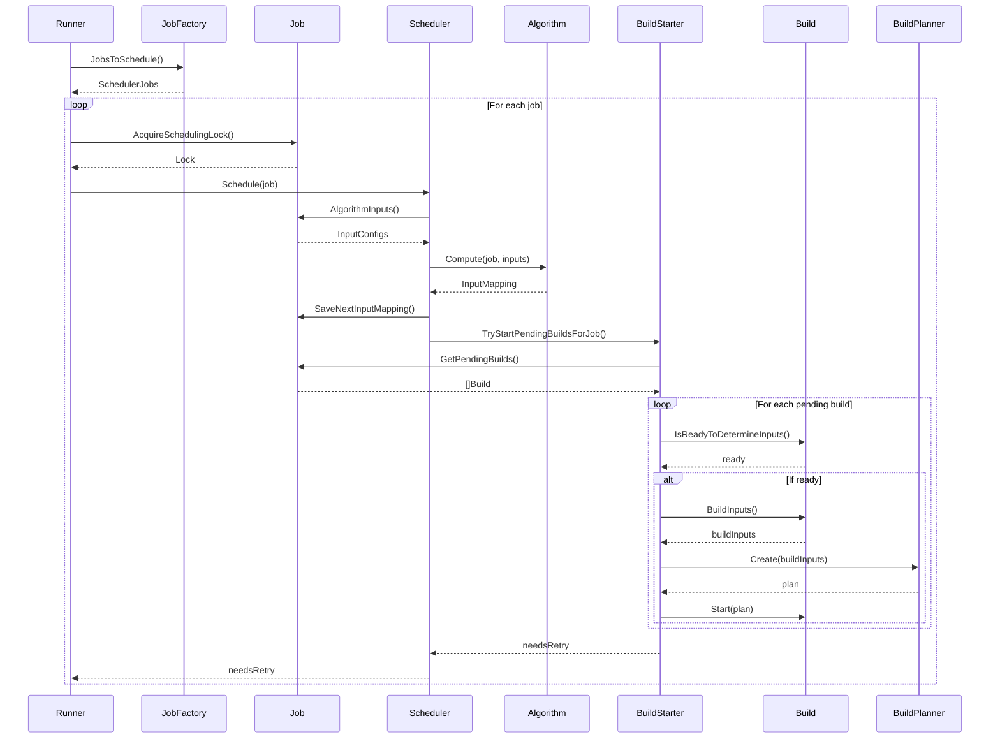
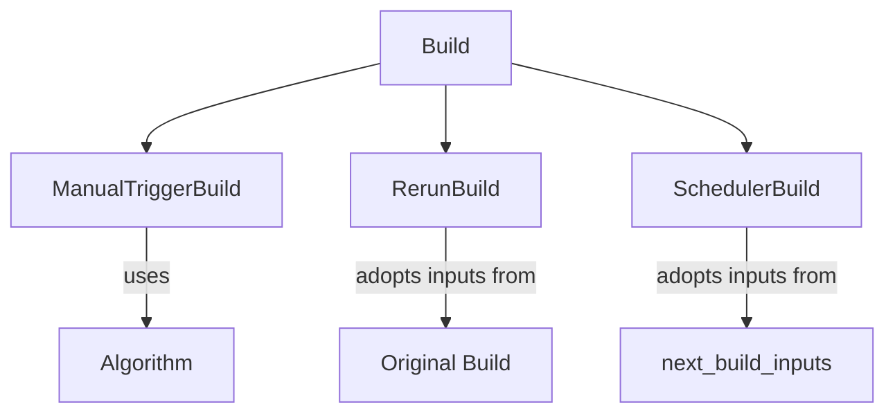
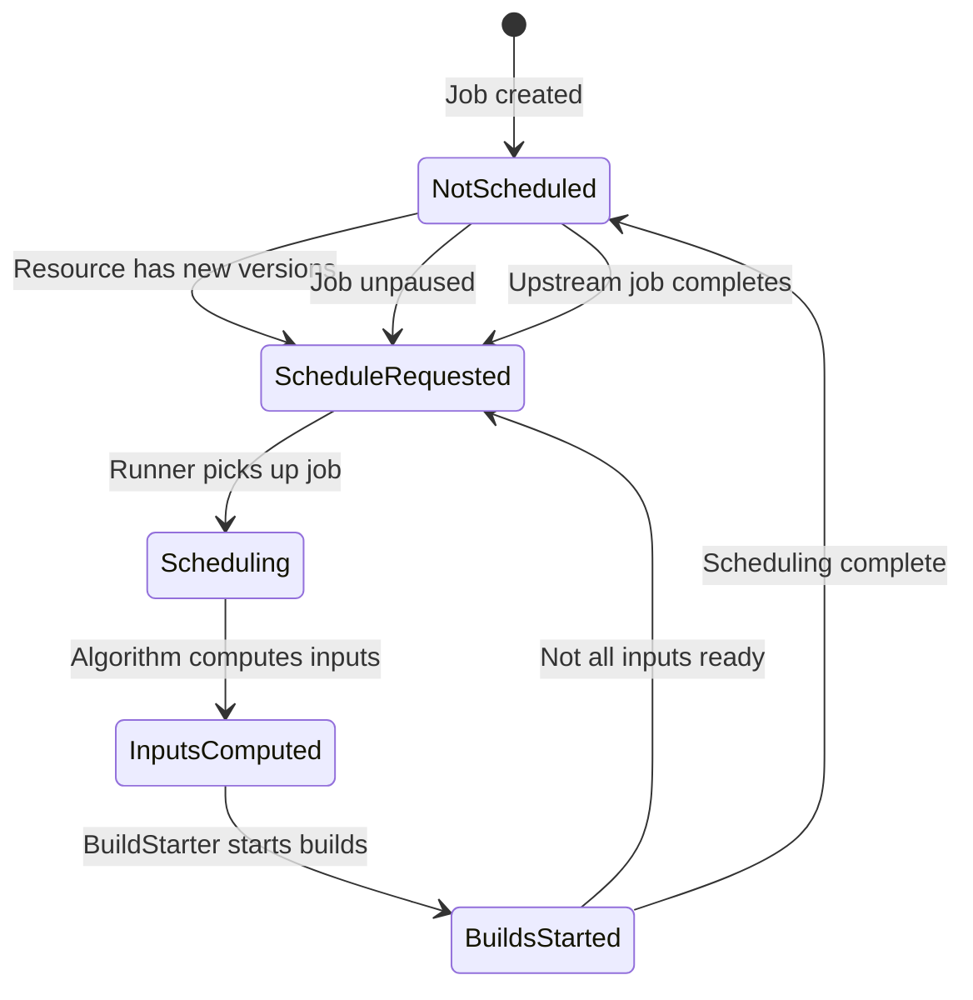

# Scheduler

<details>
<summary>Relevant source files</summary>

The following files were used as context for generating this wiki page:

- [atc/db/build.go](https://github.com/concourse/concourse/blob/301f8064/atc/db/build.go)
- [atc/db/build_test.go](https://github.com/concourse/concourse/blob/301f8064/atc/db/build_test.go)
- [atc/db/dbfakes/fake_build.go](https://github.com/concourse/concourse/blob/301f8064/atc/db/dbfakes/fake_build.go)
- [atc/db/dbfakes/fake_job.go](https://github.com/concourse/concourse/blob/301f8064/atc/db/dbfakes/fake_job.go)
- [atc/db/dbfakes/fake_pipeline.go](https://github.com/concourse/concourse/blob/301f8064/atc/db/dbfakes/fake_pipeline.go)
- [atc/db/dbfakes/fake_team.go](https://github.com/concourse/concourse/blob/301f8064/atc/db/dbfakes/fake_team.go)
- [atc/db/job.go](https://github.com/concourse/concourse/blob/301f8064/atc/db/job.go)
- [atc/db/job_factory.go](https://github.com/concourse/concourse/blob/301f8064/atc/db/job_factory.go)
- [atc/db/job_factory_test.go](https://github.com/concourse/concourse/blob/301f8064/atc/db/job_factory_test.go)
- [atc/db/job_test.go](https://github.com/concourse/concourse/blob/301f8064/atc/db/job_test.go)
- [atc/db/pipeline.go](https://github.com/concourse/concourse/blob/301f8064/atc/db/pipeline.go)
- [atc/db/pipeline_test.go](https://github.com/concourse/concourse/blob/301f8064/atc/db/pipeline_test.go)
- [atc/db/team.go](https://github.com/concourse/concourse/blob/301f8064/atc/db/team.go)
- [atc/db/team_test.go](https://github.com/concourse/concourse/blob/301f8064/atc/db/team_test.go)
- [atc/scheduler/build.go](https://github.com/concourse/concourse/blob/301f8064/atc/scheduler/build.go)
- [atc/scheduler/buildstarter.go](https://github.com/concourse/concourse/blob/301f8064/atc/scheduler/buildstarter.go)
- [atc/scheduler/buildstarter_test.go](https://github.com/concourse/concourse/blob/301f8064/atc/scheduler/buildstarter_test.go)
- [atc/scheduler/runner.go](https://github.com/concourse/concourse/blob/301f8064/atc/scheduler/runner.go)
- [atc/scheduler/runner_test.go](https://github.com/concourse/concourse/blob/301f8064/atc/scheduler/runner_test.go)
- [atc/scheduler/scheduler.go](https://github.com/concourse/concourse/blob/301f8064/atc/scheduler/scheduler.go)
- [atc/scheduler/scheduler_test.go](https://github.com/concourse/concourse/blob/301f8064/atc/scheduler/scheduler_test.go)
- [atc/scheduler/schedulerfakes/fake_build_planner.go](https://github.com/concourse/concourse/blob/301f8064/atc/scheduler/schedulerfakes/fake_build_planner.go)
- [atc/scheduler/schedulerfakes/fake_build_scheduler.go](https://github.com/concourse/concourse/blob/301f8064/atc/scheduler/schedulerfakes/fake_build_scheduler.go)
- [atc/scheduler/schedulerfakes/fake_build_starter.go](https://github.com/concourse/concourse/blob/301f8064/atc/scheduler/schedulerfakes/fake_build_starter.go)

</details>


The Scheduler is a core component of Concourse CI responsible for determining when jobs should run and triggering builds at the appropriate time. It works closely with the database to identify jobs needing attention, computes necessary resource versions for builds, and starts builds when their prerequisites are satisfied.

For information about how builds are executed once they're started, see [Build Execution](#4.2).

## Architecture Overview

The Scheduler system consists of several interrelated components that work together to decide when and how to run jobs.



Sources: [atc/scheduler/scheduler.go:24-27](https://github.com/concourse/concourse/blob/301f8064/atc/scheduler/scheduler.go#L24-L27). [atc/scheduler/runner.go:26-43](https://github.com/concourse/concourse/blob/301f8064/atc/scheduler/runner.go#L26-L43). [atc/scheduler/buildstarter.go:14-46](https://github.com/concourse/concourse/blob/301f8064/atc/scheduler/buildstarter.go#L14-L46)

## Scheduling Process Flow

The following diagram illustrates the sequence of operations involved in the scheduling process:



Sources: [atc/scheduler/runner.go:46-102](https://github.com/concourse/concourse/blob/301f8064/atc/scheduler/runner.go#L46-L102). [atc/scheduler/scheduler.go:29-59](https://github.com/concourse/concourse/blob/301f8064/atc/scheduler/scheduler.go#L29-L59). [atc/scheduler/buildstarter.go:49-96](https://github.com/concourse/concourse/blob/301f8064/atc/scheduler/buildstarter.go#L49-L96)

## Key Components

### Runner

The Runner is the entry point for scheduling, which periodically identifies jobs that need scheduling and creates goroutines to handle them concurrently. It enforces concurrency limits using a channel-based semaphore pattern.

```go
type Runner struct {
    logger     lager.Logger
    jobFactory db.JobFactory
    scheduler  BuildScheduler
    
    guardJobScheduling chan struct{}
    running            *sync.Map
}
```

The Runner ensures that only one instance can schedule a job at a time by acquiring a lock for each job. It manages the lifecycle of scheduling for each job and handles potential panics.

Sources: [atc/scheduler/runner.go:26-43](https://github.com/concourse/concourse/blob/301f8064/atc/scheduler/runner.go#L26-L43). [atc/scheduler/runner.go:46-102](https://github.com/concourse/concourse/blob/301f8064/atc/scheduler/runner.go#L46-L102)

### Scheduler

The Scheduler contains the core logic for scheduling a single job:

1. It computes the necessary resource versions for a job using an Algorithm
2. It saves the computed input mapping for future builds
3. It attempts to start pending builds via the BuildStarter

```go
type Scheduler struct {
    Algorithm    Algorithm
    BuildStarter BuildStarter
}
```

Sources: [atc/scheduler/scheduler.go:24-27](https://github.com/concourse/concourse/blob/301f8064/atc/scheduler/scheduler.go#L24-L27). [atc/scheduler/scheduler.go:29-59](https://github.com/concourse/concourse/blob/301f8064/atc/scheduler/scheduler.go#L29-L59)

### JobFactory

The JobFactory is responsible for finding jobs that need scheduling by querying the database. It constructs `SchedulerJob` objects which bundle a job with its associated resources and resource types:

```go
type SchedulerJob struct {
    Job
    Resources     SchedulerResources
    ResourceTypes atc.ResourceTypes
    Prototypes    atc.Prototypes
}
```

The `JobsToSchedule()` method queries jobs where `schedule_requested` time is newer than `last_scheduled` time, and both the job and its pipeline are active and unpaused.

Sources: [atc/db/job_factory.go:15-24](https://github.com/concourse/concourse/blob/301f8064/atc/db/job_factory.go#L15-L24). [atc/db/job_factory.go:38-46](https://github.com/concourse/concourse/blob/301f8064/atc/db/job_factory.go#L38-L46). [atc/db/job_factory.go:78-223](https://github.com/concourse/concourse/blob/301f8064/atc/db/job_factory.go#L78-L223)

### BuildStarter

The BuildStarter is responsible for starting pending builds for a job:

1. It retrieves all pending builds for a job
2. For each build, it determines if inputs are ready
3. It creates different types of build wrappers based on the build's nature (manual, rerun, or scheduled)
4. For builds ready to start, it creates a build plan and starts the build

The BuildStarter must handle various build scenarios including:
- Manual builds triggered by users
- Reruns of previous builds
- Scheduler-triggered builds

Sources: [atc/scheduler/buildstarter.go:14-46](https://github.com/concourse/concourse/blob/301f8064/atc/scheduler/buildstarter.go#L14-L46). [atc/scheduler/buildstarter.go:49-96](https://github.com/concourse/concourse/blob/301f8064/atc/scheduler/buildstarter.go#L49-L96). [atc/scheduler/buildstarter.go:130-227](https://github.com/concourse/concourse/blob/301f8064/atc/scheduler/buildstarter.go#L130-L227)

### Algorithm

The Algorithm is an interface responsible for computing input mappings for jobs:

```go
type Algorithm interface {
    Compute(
        context.Context,
        db.Job,
        db.InputConfigs,
    ) (db.InputMapping, bool, bool, error)
}
```

It determines which versions of resources should be used for a build based on the job's input configuration and available resource versions. This is a critical part of the pipeline logic, as it implements the "passing of versions" between jobs and ensures resources are properly tracked through the pipeline.

Sources: [atc/scheduler/scheduler.go:15-22](https://github.com/concourse/concourse/blob/301f8064/atc/scheduler/scheduler.go#L15-L22)

## Build Types and Input Determination

The scheduler handles different kinds of builds, each with its own way of determining inputs:



1. **ManualTriggerBuild**: User-triggered builds may need to compute inputs on-the-fly, especially when checking resources hasn't completed yet.

2. **RerunBuild**: Rerun builds adopt the inputs from the original build they're rerunning, using `AdoptRerunInputsAndPipes()`.

3. **SchedulerBuild**: Regular scheduler-triggered builds adopt inputs that were predetermined by the scheduler and stored in the database, using `AdoptInputsAndPipes()`.

Sources: [atc/scheduler/buildstarter.go:98-121](https://github.com/concourse/concourse/blob/301f8064/atc/scheduler/buildstarter.go#L98-L121). [atc/scheduler/build.go:11-84](https://github.com/concourse/concourse/blob/301f8064/atc/scheduler/build.go#L11-L84)

## Database Interaction

The scheduler interacts heavily with the database to track job state, build inputs, and resource versions:

- **Jobs Table**: Tracks job state including whether scheduling is requested and when it was last scheduled
- **Builds Table**: Stores builds with their status, inputs, and outputs
- **Next Build Inputs**: Stores calculated input versions for future builds

When a build is started, it copies its input mapping from the pre-computed "next build inputs" using the `AdoptInputsAndPipes()` method:

```go
// Simplified version of AdoptInputsAndPipes logic
func (b *build) AdoptInputsAndPipes() ([]BuildInput, bool, error) {
    // 1. Check if inputs are determined
    // 2. Delete any existing build inputs
    // 3. Copy inputs from next_build_inputs for this job
    // 4. Mark the build as inputs_ready
}
```

Sources: [atc/db/build.go:1346-1502](https://github.com/concourse/concourse/blob/301f8064/atc/db/build.go#L1346-L1502). [atc/db/job.go:175-227](https://github.com/concourse/concourse/blob/301f8064/atc/db/job.go#L175-L227)

## Job Lifecycle and Scheduling States

Jobs can request scheduling via `RequestSchedule()` in multiple scenarios:

1. When a resource check completes and finds new versions
2. When a job is unpaused
3. When a dependent job completes (downstream jobs)
4. When a build is aborted



When a job completes, it can request scheduling for downstream jobs, ensuring that the pipeline continues to flow:

```go
// When a build finishes successfully
if b.jobID != 0 {
    err = requestScheduleOnDownstreamJobs(tx, b.jobID)
    if err != nil {
        return err
    }
    // ...
}
```

Sources: [atc/db/build.go:776-786](https://github.com/concourse/concourse/blob/301f8064/atc/db/build.go#L776-L786). [atc/db/job.go:175-227](https://github.com/concourse/concourse/blob/301f8064/atc/db/job.go#L175-L227)

## Summary

The Scheduler is a critical component of Concourse that determines when jobs should run by:

1. Finding jobs that need scheduling
2. Computing required resource versions for builds
3. Starting builds when their prerequisites are satisfied
4. Managing the state machine of jobs and builds

It works closely with the database to track job state, build inputs, and resource versions, ensuring that the pipeline flows properly and jobs run with the correct inputs at the right time.