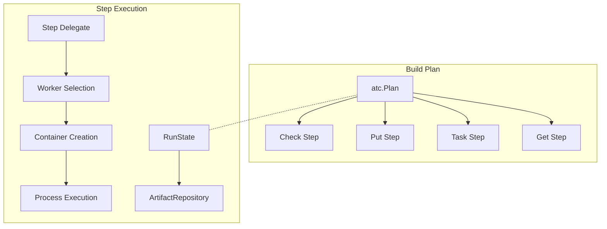
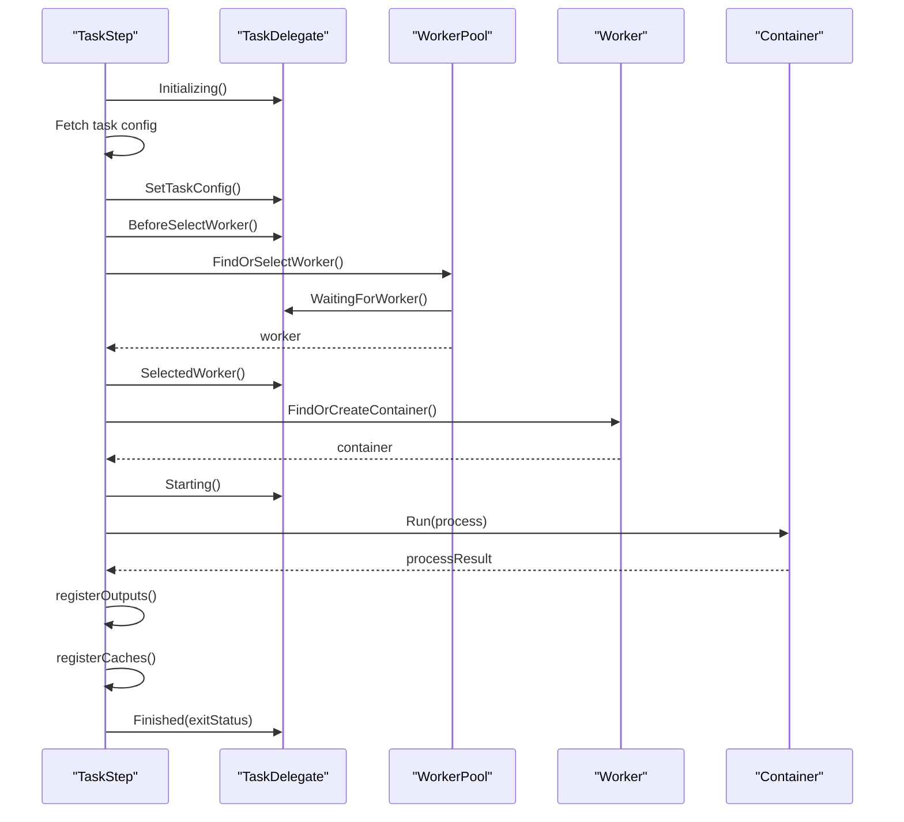
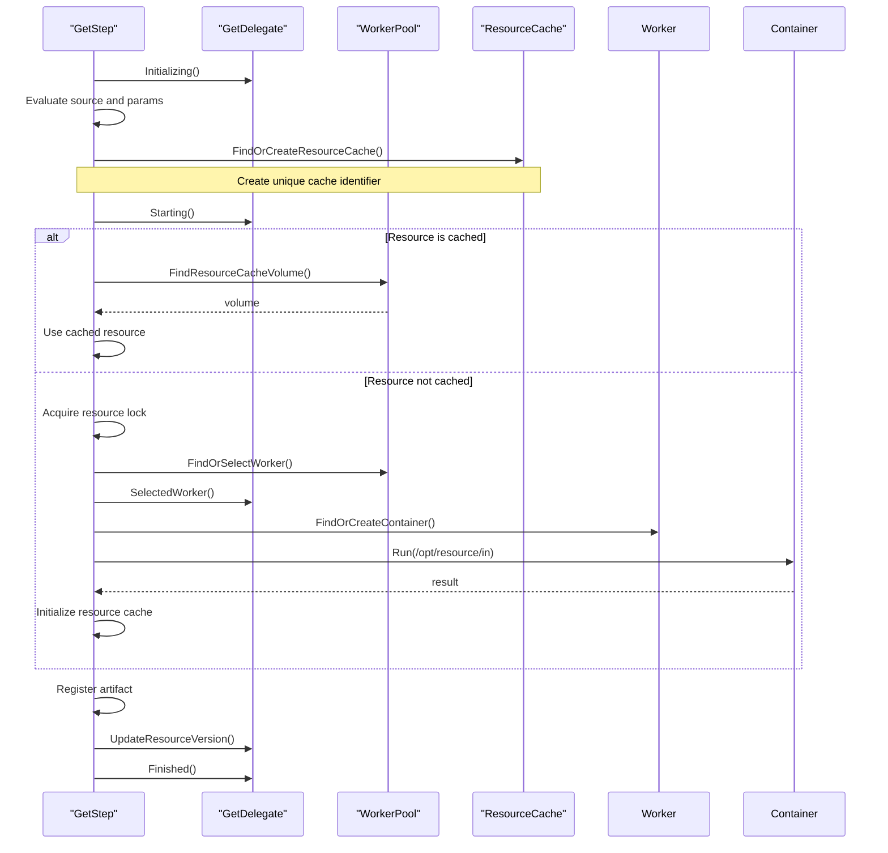
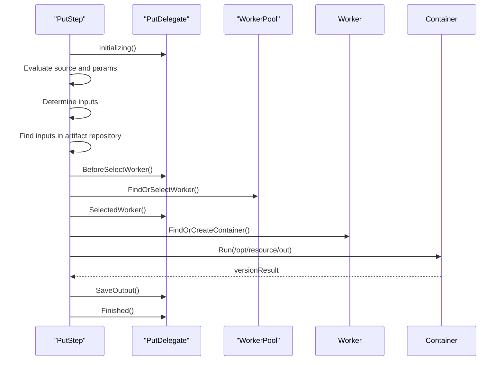
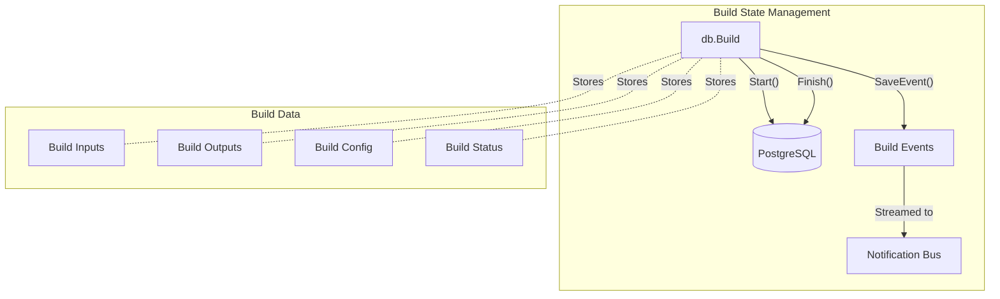
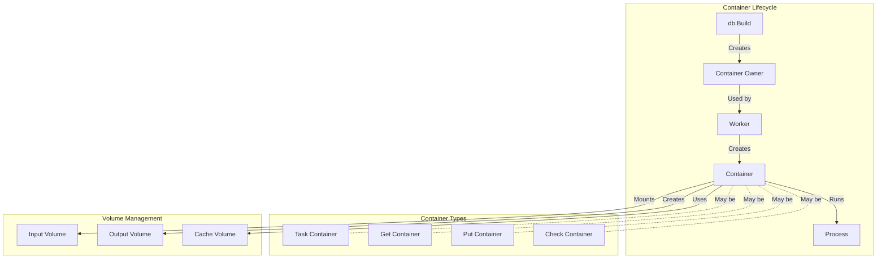
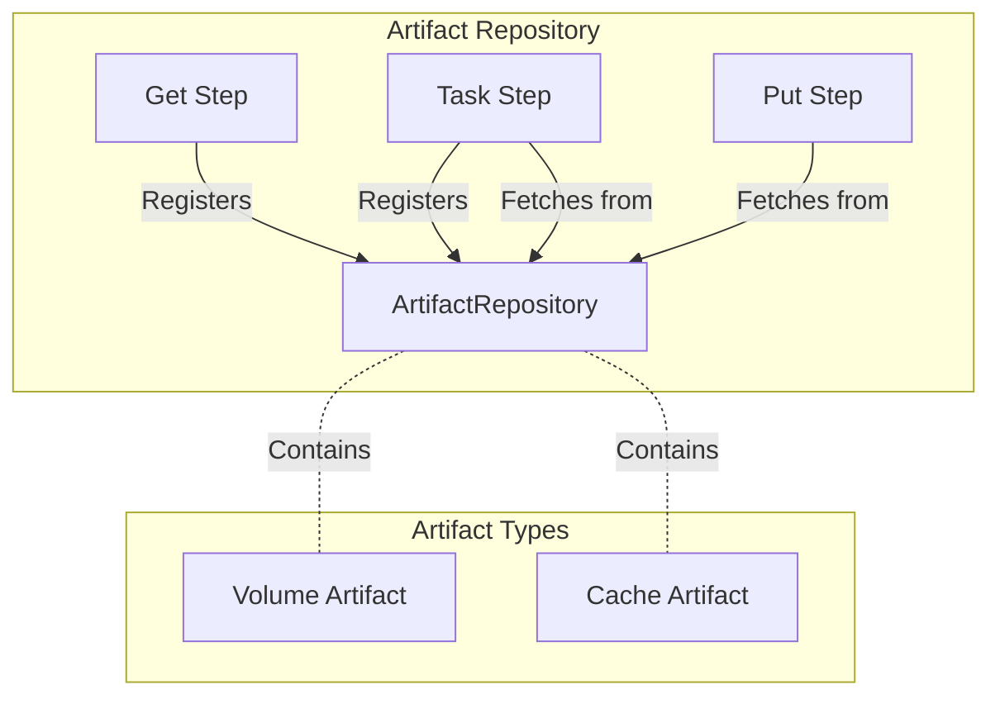
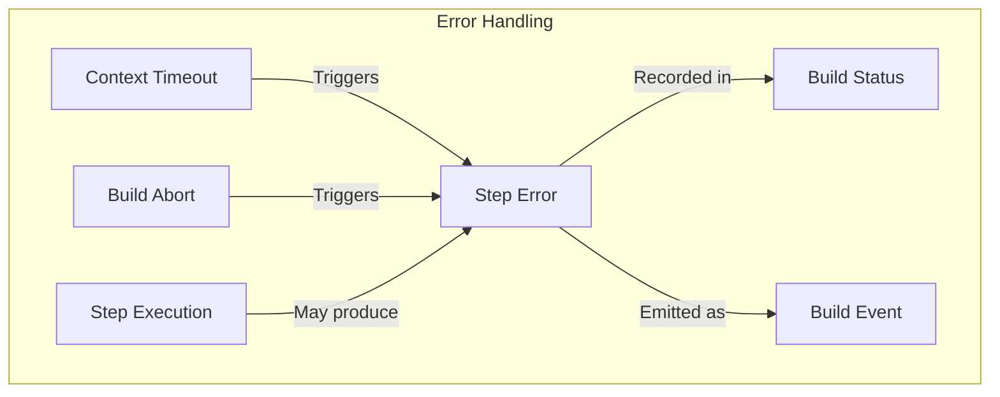
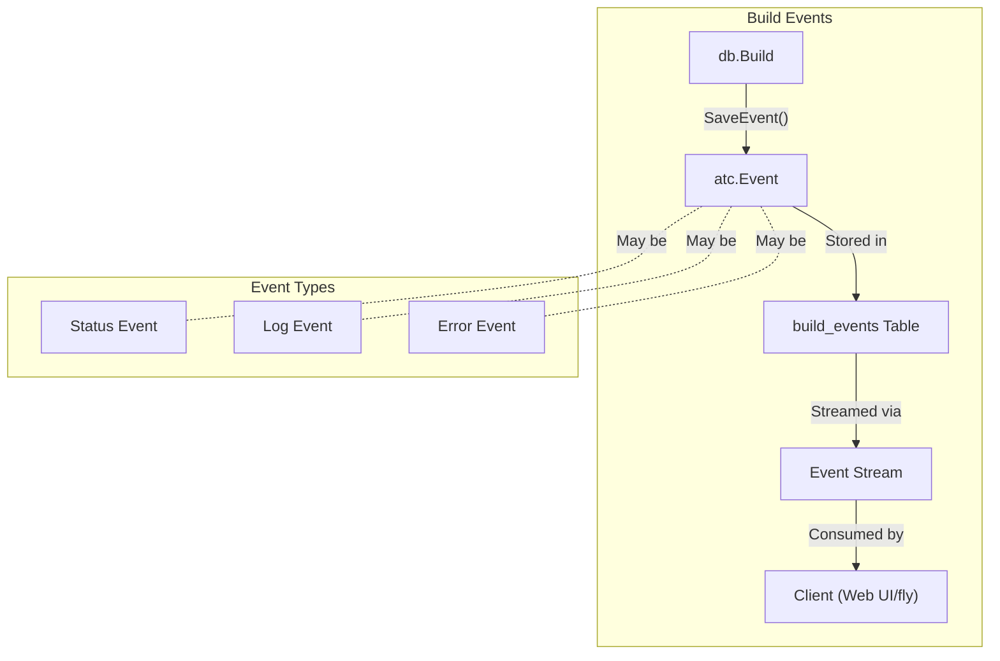

# Build Execution

<details>
<summary>Relevant source files</summary>

The following files were used as context for generating this wiki page:

- [atc/db/build.go](https://github.com/concourse/concourse/blob/301f8064/atc/db/build.go)
- [atc/db/build_test.go](https://github.com/concourse/concourse/blob/301f8064/atc/db/build_test.go)
- [atc/db/dbfakes/fake_build.go](https://github.com/concourse/concourse/blob/301f8064/atc/db/dbfakes/fake_build.go)
- [atc/db/dbfakes/fake_job.go](https://github.com/concourse/concourse/blob/301f8064/atc/db/dbfakes/fake_job.go)
- [atc/db/dbfakes/fake_pipeline.go](https://github.com/concourse/concourse/blob/301f8064/atc/db/dbfakes/fake_pipeline.go)
- [atc/db/dbfakes/fake_team.go](https://github.com/concourse/concourse/blob/301f8064/atc/db/dbfakes/fake_team.go)
- [atc/db/job.go](https://github.com/concourse/concourse/blob/301f8064/atc/db/job.go)
- [atc/db/job_factory.go](https://github.com/concourse/concourse/blob/301f8064/atc/db/job_factory.go)
- [atc/db/job_factory_test.go](https://github.com/concourse/concourse/blob/301f8064/atc/db/job_factory_test.go)
- [atc/db/job_test.go](https://github.com/concourse/concourse/blob/301f8064/atc/db/job_test.go)
- [atc/db/pipeline.go](https://github.com/concourse/concourse/blob/301f8064/atc/db/pipeline.go)
- [atc/db/pipeline_test.go](https://github.com/concourse/concourse/blob/301f8064/atc/db/pipeline_test.go)
- [atc/db/team.go](https://github.com/concourse/concourse/blob/301f8064/atc/db/team.go)
- [atc/db/team_test.go](https://github.com/concourse/concourse/blob/301f8064/atc/db/team_test.go)
- [atc/exec/build_step_delegate.go](https://github.com/concourse/concourse/blob/301f8064/atc/exec/build_step_delegate.go)
- [atc/exec/check_step.go](https://github.com/concourse/concourse/blob/301f8064/atc/exec/check_step.go)
- [atc/exec/check_step_test.go](https://github.com/concourse/concourse/blob/301f8064/atc/exec/check_step_test.go)
- [atc/exec/execfakes/fake_build_step_delegate.go](https://github.com/concourse/concourse/blob/301f8064/atc/exec/execfakes/fake_build_step_delegate.go)
- [atc/exec/execfakes/fake_check_delegate.go](https://github.com/concourse/concourse/blob/301f8064/atc/exec/execfakes/fake_check_delegate.go)
- [atc/exec/execfakes/fake_get_delegate.go](https://github.com/concourse/concourse/blob/301f8064/atc/exec/execfakes/fake_get_delegate.go)
- [atc/exec/execfakes/fake_put_delegate.go](https://github.com/concourse/concourse/blob/301f8064/atc/exec/execfakes/fake_put_delegate.go)
- [atc/exec/execfakes/fake_set_pipeline_step_delegate.go](https://github.com/concourse/concourse/blob/301f8064/atc/exec/execfakes/fake_set_pipeline_step_delegate.go)
- [atc/exec/execfakes/fake_task_delegate.go](https://github.com/concourse/concourse/blob/301f8064/atc/exec/execfakes/fake_task_delegate.go)
- [atc/exec/get_step.go](https://github.com/concourse/concourse/blob/301f8064/atc/exec/get_step.go)
- [atc/exec/get_step_test.go](https://github.com/concourse/concourse/blob/301f8064/atc/exec/get_step_test.go)
- [atc/exec/put_inputs.go](https://github.com/concourse/concourse/blob/301f8064/atc/exec/put_inputs.go)
- [atc/exec/put_step.go](https://github.com/concourse/concourse/blob/301f8064/atc/exec/put_step.go)
- [atc/exec/put_step_test.go](https://github.com/concourse/concourse/blob/301f8064/atc/exec/put_step_test.go)
- [atc/exec/task_step.go](https://github.com/concourse/concourse/blob/301f8064/atc/exec/task_step.go)
- [atc/exec/task_step_test.go](https://github.com/concourse/concourse/blob/301f8064/atc/exec/task_step_test.go)
- [atc/scheduler/build.go](https://github.com/concourse/concourse/blob/301f8064/atc/scheduler/build.go)
- [atc/scheduler/buildstarter.go](https://github.com/concourse/concourse/blob/301f8064/atc/scheduler/buildstarter.go)
- [atc/scheduler/buildstarter_test.go](https://github.com/concourse/concourse/blob/301f8064/atc/scheduler/buildstarter_test.go)
- [atc/scheduler/runner.go](https://github.com/concourse/concourse/blob/301f8064/atc/scheduler/runner.go)
- [atc/scheduler/runner_test.go](https://github.com/concourse/concourse/blob/301f8064/atc/scheduler/runner_test.go)
- [atc/scheduler/scheduler.go](https://github.com/concourse/concourse/blob/301f8064/atc/scheduler/scheduler.go)
- [atc/scheduler/scheduler_test.go](https://github.com/concourse/concourse/blob/301f8064/atc/scheduler/scheduler_test.go)
- [atc/scheduler/schedulerfakes/fake_build_planner.go](https://github.com/concourse/concourse/blob/301f8064/atc/scheduler/schedulerfakes/fake_build_planner.go)
- [atc/scheduler/schedulerfakes/fake_build_scheduler.go](https://github.com/concourse/concourse/blob/301f8064/atc/scheduler/schedulerfakes/fake_build_scheduler.go)
- [atc/scheduler/schedulerfakes/fake_build_starter.go](https://github.com/concourse/concourse/blob/301f8064/atc/scheduler/schedulerfakes/fake_build_starter.go)

</details>


This page documents how builds are executed in Concourse, covering the lifecycle of a build from creation to completion and the execution of individual steps. For information about how builds are scheduled, see [Scheduler](#4.1).

## Build Lifecycle

A build in Concourse represents a single execution of a job or a one-off execution. Every build follows a defined lifecycle with specific states and transitions.

```mermaid
stateDiagram-v2
    direction LR
    [*] --> "Pending"
    "Pending" --> "Started": Start() called
    "Started" --> "Succeeded": Finish(BuildStatusSucceeded)
    "Started" --> "Failed": Finish(BuildStatusFailed)
    "Started" --> "Errored": Finish(BuildStatusErrored)
    "Pending" --> "Aborted": MarkAsAborted()
    "Started" --> "Aborted": MarkAsAborted()
    "Succeeded" --> [*]
    "Failed" --> [*]
    "Errored" --> [*]
    "Aborted" --> [*]
```

The `db.Build` interface has methods that manage this lifecycle, including:

- `Start(plan)`: Transitions a build from pending to started and sets the execution plan
- `Finish(status)`: Completes a build with the given status (succeeded, failed, errored)
- `MarkAsAborted()`: Marks a build as aborted, which can be done at any time

Sources: [atc/db/build.go:528-562](https://github.com/concourse/concourse/blob/301f8064/atc/db/build.go#L528-L562), [atc/db/build.go:610-815](https://github.com/concourse/concourse/blob/301f8064/atc/db/build.go#L610-L815), [atc/db/build.go:872-908](https://github.com/concourse/concourse/blob/301f8064/atc/db/build.go#L872-L908)

## Build Plans and Steps

Each build is driven by a plan that defines the steps to execute. The plan is a tree structure where each node is an operation such as getting a resource, running a task, or putting a resource.



The main step types are:

- **Get Step**: Fetches resources from external sources
- **Task Step**: Executes a command or script in a container
- **Put Step**: Publishes resources to external systems
- **Check Step**: Checks for new versions of resources

Each step implements the `Step` interface, which has a single method:

```go
Run(ctx context.Context, state RunState) (bool, error)
```

Sources: [atc/exec/task_step.go:84-123](https://github.com/concourse/concourse/blob/301f8064/atc/exec/task_step.go#L84-L123), [atc/exec/get_step.go:84-123](https://github.com/concourse/concourse/blob/301f8064/atc/exec/get_step.go#L84-L123), [atc/exec/put_step.go:52-82](https://github.com/concourse/concourse/blob/301f8064/atc/exec/put_step.go#L52-L82), [atc/exec/check_step.go:22-77](https://github.com/concourse/concourse/blob/301f8064/atc/exec/check_step.go#L22-L77)

## Task Step Execution

The Task Step is particularly important as it represents the primary execution capability of Concourse. Let's examine how a Task Step is executed:



Key components in task execution:

1. **Task Configuration**: The task's configuration specifies the image, inputs, outputs, and the command to run
2. **Worker Selection**: A worker is selected based on the task's requirements (platform, tags, etc.)
3. **Container Creation**: A container is created on the worker with the specified image and inputs
4. **Process Execution**: The task's command is executed within the container
5. **Output Registration**: Outputs from the task are registered in the artifact repository

Sources: [atc/exec/task_step.go:140-336](https://github.com/concourse/concourse/blob/301f8064/atc/exec/task_step.go#L140-L336)

## Get Step Execution

The Get Step is responsible for fetching resources from external sources:



The Get Step has an important caching mechanism:
1. It first tries to find the resource in the cache using the resource's source, params, and version
2. If found, it uses the cached volume directly
3. If not found, it executes the resource's `/opt/resource/in` script to fetch the resource
4. It then caches the resulting volume for future use

Sources: [atc/exec/get_step.go:125-366](https://github.com/concourse/concourse/blob/301f8064/atc/exec/get_step.go#L125-L366)

## Put Step Execution

The Put Step publishes resources to external systems:



The Put Step:
1. Determines which artifacts from previous steps to include as inputs
2. Selects a worker and creates a container
3. Runs the resource's `/opt/resource/out` script to publish the resource
4. Saves the resulting version information

Sources: [atc/exec/put_step.go:106-281](https://github.com/concourse/concourse/blob/301f8064/atc/exec/put_step.go#L106-L281)

## Build State Management

Builds maintain their state in the database, which allows Concourse to recover from crashes and to display build information in the UI:



Key aspects of build state management:

1. **Build Creation**: Builds are created with an initial state of `pending`
2. **Start and Finish**: The `Start()` and `Finish()` methods update the build's state in the database
3. **Build Events**: Events are emitted during the build's execution and stored in the database
4. **Notifications**: Events are broadcast via a notification bus for real-time updates
5. **Inputs and Outputs**: Inputs consumed and outputs produced by the build are tracked
6. **Artifacts**: Build artifacts are registered for use by subsequent steps or builds

Sources: [atc/db/build.go:528-622](https://github.com/concourse/concourse/blob/301f8064/atc/db/build.go#L528-L622), [atc/db/build.go:1166-1187](https://github.com/concourse/concourse/blob/301f8064/atc/db/build.go#L1166-L1187), [atc/db/build.go:1345-1344](https://github.com/concourse/concourse/blob/301f8064/atc/db/build.go#L1345-L1344)

## Container Management 

Builds run in containers on workers. The container lifecycle is closely tied to the build execution:



Important aspects of container management:

1. **Container Ownership**: Containers are owned by builds via the `ContainerOwner` interface
2. **Container Types**: Different container types (task, get, put, check) have different behaviors
3. **Volume Mounting**: Inputs are mounted as volumes into containers
4. **Output Volumes**: Outputs from steps are captured as volumes
5. **Cache Volumes**: Task caches are preserved for future builds

Sources: [atc/exec/task_step.go:280-313](https://github.com/concourse/concourse/blob/301f8064/atc/exec/task_step.go#L280-L313), [atc/exec/get_step.go:180-241](https://github.com/concourse/concourse/blob/301f8064/atc/exec/get_step.go#L180-L241)

## Artifact Repository

The Artifact Repository is a key component that enables steps to share data:



The Artifact Repository:
1. Allows steps to register outputs as artifacts
2. Enables subsequent steps to retrieve artifacts by name
3. Tracks whether artifacts are cached or freshly created
4. Maps input/output names to the actual artifacts

Sources: [atc/exec/task_step.go:462-478](https://github.com/concourse/concourse/blob/301f8064/atc/exec/task_step.go#L462-L478), [atc/exec/get_step.go:246-251](https://github.com/concourse/concourse/blob/301f8064/atc/exec/get_step.go#L246-L251)

## Error Handling and Timeouts

Build steps have sophisticated error handling mechanisms:



Key error handling mechanisms:

1. **Timeouts**: Steps can have timeouts, after which they are automatically terminated
2. **Abort Handling**: Builds can be aborted, which terminates all running steps
3. **Error Propagation**: Errors from steps are propagated and tracked
4. **Build Status**: Errors result in appropriate build status (failed, errored)

Sources: [atc/exec/task_step.go:271-276](https://github.com/concourse/concourse/blob/301f8064/atc/exec/task_step.go#L271-L276), [atc/db/build.go:872-908](https://github.com/concourse/concourse/blob/301f8064/atc/db/build.go#L872-L908)

## Build Events

Build events provide real-time information about the progress of a build:



Build events:
1. Are emitted during build execution to track progress
2. Include status changes, logs, and errors
3. Are stored in the database for historical reference
4. Are streamed to clients (web UI, fly CLI) in real-time

Sources: [atc/db/build.go:1166-1187](https://github.com/concourse/concourse/blob/301f8064/atc/db/build.go#L1166-L1187), [atc/db/build.go:1146-1165](https://github.com/concourse/concourse/blob/301f8064/atc/db/build.go#L1146-L1165)

## Summary

Build execution in Concourse involves:

1. Creating and starting a build with a plan
2. Executing steps in the plan (Get, Task, Put, Check)
3. Managing containers and volumes on workers
4. Tracking build state and emitting events
5. Handling errors and timeouts
6. Registering artifacts for sharing between steps

This orchestration enables Concourse to provide a powerful, flexible, and reliable CI/CD platform.